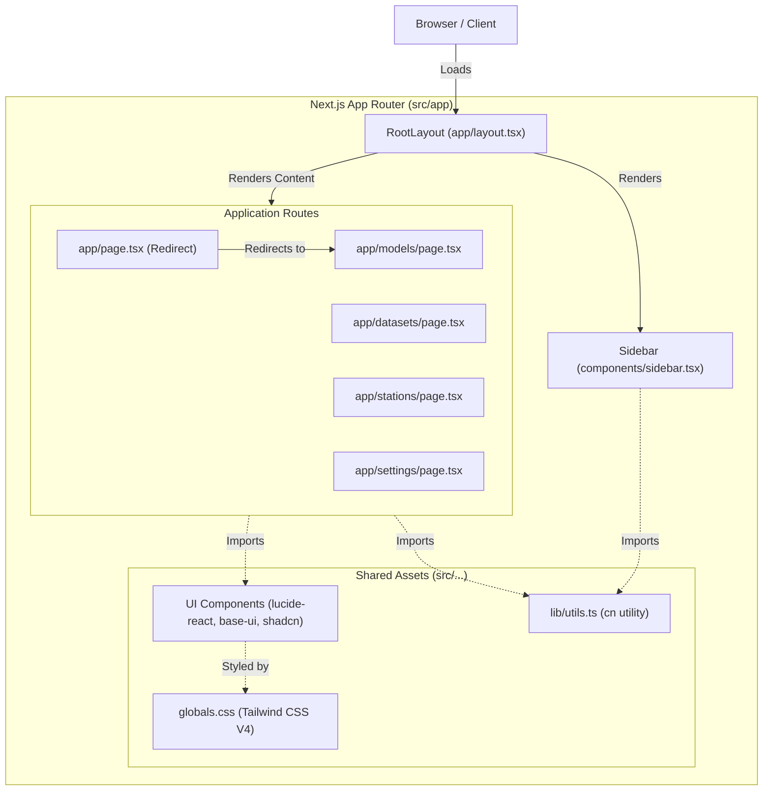

# Project Architecture

Here is the high-level architecture of the `frontend-uc1-horse` Next.js frontend application based on the files in your project.

## Key Architectural Points

- **Framework:** The project is built using **Next.js 16** and **React 19** with the modern **App Router** paradigm (`src/app/` directory).
- **Layout & Navigation:** The application uses a global layout (`app/layout.tsx`) that always renders the main `Sidebar` component (`components/sidebar.tsx`), along with the individual route content.
- **Routes:** The root path (`app/page.tsx`) automatically redirects the user to `/models`. The core views correspond to top-level app directories: `/models`, `/datasets`, `/stations`, and `/settings`.
- **Shared Components:** Reusable UI components are kept inside `src/components/`, heavily relying on `lucide-react` for icons and utility functions like `cn` (from `lib/utils.ts`) for merging tailwind classes.
- **Styling:** The project utilizes **Tailwind CSS v4** with styles aggregated at `app/globals.css`.

Let me know if you need to go deeper into any specific flow or components!