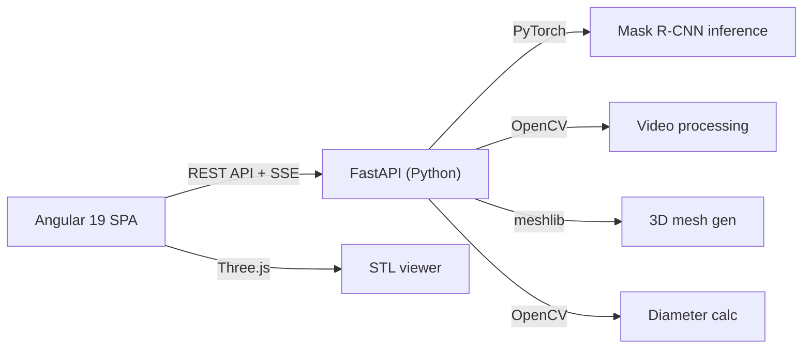
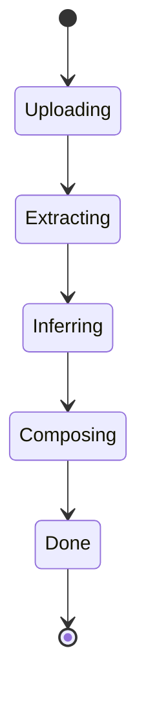

# Angular Web Interface for bitsXlaMarato

## Architecture




Single-user FastAPI backend wrapping the existing Python code. Angular frontend with Angular CLI, standalone components, and Three.js for 3D. Long-running inference uses background tasks with Server-Sent Events (SSE) for progress updates.

## Prerequisites

- **Model weights**: `git lfs pull` in the repo to download `models/maratoNuevo.pt` (~168MB)
- **GPU**: CUDA-capable GPU recommended for inference (falls back to CPU)
- **Node.js 20+** for Angular CLI
- **Python 3.11+** with PyTorch, torchvision, OpenCV, meshlib

## File Structure

```
bitsXlaMarato/web/
  backend/
    app.py                # FastAPI main, CORS, static mount, routes
    services/
      __init__.py
      inference.py        # Refactored inference pipeline (from src/MASKRCNN/inference.py + ImageViewer.py)
      mesh.py             # 3D mesh generation (from get3Dfigure)
      diameter.py         # Diameter measurement (from distanceFinder.py)
    requirements.txt      # fastapi, uvicorn, torch, torchvision, opencv-python, meshlib, Pillow, numpy
  frontend/               # Angular CLI project (ng new)
    src/
      app/
        components/
          upload/          # Video upload with drag-and-drop
          frame-viewer/    # Frame navigation + mask overlay toggle
          three-viewer/    # STL mesh viewer (Three.js)
          diameter/        # Diameter measurement display
          job-status/      # Progress bar during inference
        services/
          api.service.ts   # HTTP client for backend
        app.component.ts   # Main layout shell
        app.routes.ts      # Routes (single page, but organized)
```

## Backend Design

### Refactored from existing code

The existing code in [src/ImageViewer.py](c:\Users\polcg\cuberhaus\bitsXlaMarato\src\ImageViewer.py) and [src/MASKRCNN/inference.py](c:\Users\polcg\cuberhaus\bitsXlaMarato\src\MASKRCNN\inference.py) will be refactored into clean service modules:

`**services/inference.py**` (from `Vid2Frame`, `segment_instance`, `Frame2Vid`):

- `extract_frames(video_path, output_dir, crop_roi)` -- configurable crop instead of hardcoded `[84:380, 54:526]`
- `run_inference(frames_dir, model_path, confidence, output_dir)` -- yields progress `(current_frame, total_frames)` for SSE
- `compose_video(frames_dir, fps, output_path)`
- Model loaded once at startup, kept in memory

`**services/mesh.py**` (from `get3Dfigure` + `create_3d_model`):

- `generate_mesh(masks_dir) -> Path` -- binarize TIFFs, run meshlib, return STL path

`**services/diameter.py**` (from [distanceFinder.py](c:\Users\polcg\cuberhaus\bitsXlaMarato\src\distanceFinder.py)):

- `measure_diameter(mask_path, pixel_scale=0.03378) -> dict` -- returns `{diameter_cm, contour_points, measurement_line}`

### API Endpoints


| Method | Endpoint                      | Description                                     |
| ------ | ----------------------------- | ----------------------------------------------- |
| POST   | `/api/upload`                 | Upload video file, returns `job_id`             |
| GET    | `/api/jobs/{id}/status`       | SSE stream: `{state, progress, total, message}` |
| GET    | `/api/jobs/{id}/frames`       | List original extracted frames                  |
| GET    | `/api/jobs/{id}/frames/{n}`   | Serve original frame image                      |
| GET    | `/api/jobs/{id}/overlays`     | List overlay frames (with mask)                 |
| GET    | `/api/jobs/{id}/overlays/{n}` | Serve overlay frame image                       |
| GET    | `/api/jobs/{id}/masks/{n}`    | Serve raw mask TIFF                             |
| GET    | `/api/jobs/{id}/video`        | Serve output AVI                                |
| POST   | `/api/jobs/{id}/mesh`         | Trigger 3D mesh gen, returns STL path           |
| GET    | `/api/jobs/{id}/mesh.stl`     | Serve STL file                                  |
| GET    | `/api/jobs/{id}/diameter/{n}` | Compute diameter for mask frame `n`             |
| GET    | `/api/status`                 | Server health + GPU availability                |


### Job lifecycle




Jobs stored in an in-memory dict. Each job runs in a background thread. SSE endpoint streams progress updates. Uploaded videos and outputs go to a `jobs/<uuid>/` temp directory.

## Frontend Design (Angular 19)

**Angular CLI** project with standalone components (no NgModules). Key dependencies: `three` and `@types/three` for 3D.

### Components

- `**UploadComponent`**: Drag-and-drop zone + file input. On upload, creates a job and navigates to the viewer. Shows configurable parameters: confidence threshold (default 0.90), crop ROI toggle.
- `**JobStatusComponent`**: Subscribes to SSE. Shows a progress bar with current phase (extracting / inferring frame N of M / composing). Used as an overlay during processing.
- `**FrameViewerComponent`**: Side-by-side or toggle view: original frame vs. overlay (with mask). Slider or arrow keys for frame navigation. Frame counter display. Click a frame to see its diameter measurement.
- `**ThreeViewerComponent**`: Loads `mesh.stl` via Three.js `STLLoader`. OrbitControls for rotation/zoom. Pink mesh color matching the original (`[252, 3, 115]`). Ambient + directional lighting. Fullscreen toggle.
- `**DiameterComponent**`: For a selected mask frame, calls the diameter endpoint. Displays the measurement in cm with a visual overlay line on the mask image.

### Layout

Single-page app with a top toolbar (upload button, job status) and a tabbed main area:

- **Frames** tab: frame viewer with overlay toggle
- **3D Model** tab: Three.js mesh viewer
- **Measurement** tab: diameter analysis per frame

### Styling

Angular Material or a lightweight approach (custom CSS). Dark theme to match medical imaging convention. Responsive layout.

## Key Technical Decisions

- **Crop ROI**: Made configurable via API parameter instead of hardcoded `[84:380, 54:526]` -- the existing `get_prediction` shape guard `(1, 296, 472)` will be relaxed to accept any single-mask output
- **Model loading**: Done once at FastAPI startup via a lifespan event, not per-request
- **SSE over WebSocket**: Simpler for one-way progress updates; no need for bidirectional communication
- **Three.js over Babylon**: Lighter, more common, sufficient for STL viewing
- **Pixel scale**: The hardcoded `0.03378` cm/pixel factor from `distanceFinder.py` will be a configurable parameter in the diameter endpoint

## frontend_technologies_summary.md Entry

New section 8:

- **Tech**: Angular 19 (standalone components) + Three.js
- **Project**: `bitsXlaMarato`
- **Architecture**: SPA with FastAPI backend wrapping PyTorch Mask R-CNN inference pipeline
- **Use Case**: Medical imaging tool for aortic aneurysm detection from ecography videos

