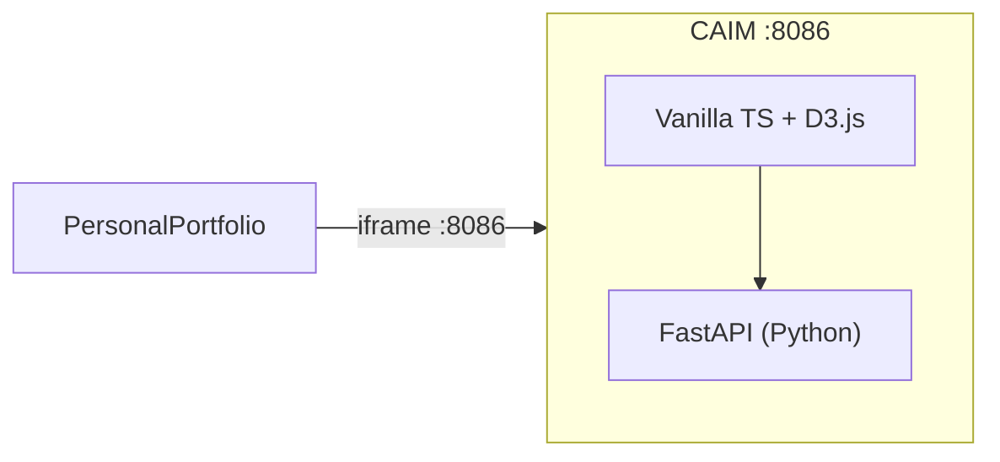

# CAIM Interactive Explorer

## Why Vanilla TypeScript

The portfolio already uses React, Preact, Vue, Angular, Svelte/SvelteKit, Solid.js, Lit, Flutter, Astro. **Vanilla TypeScript (Vite) + D3.js** — no UI framework at all — fills the last major gap and demonstrates that complex interactive apps can be built framework-free. This becomes entry **#13** in `[dev/frontend_technologies_summary.md](dev/frontend_technologies_summary.md)`.

## Architecture

**Port:** `:8086`

## Scope: Two Tabs

### Tab 1 — PageRank Explorer (primary)

Reimplements `[sesio5/PageRank.py](CAIM/sesio5/PageRank.py)` as a clean API.

**Backend endpoints:**

- `GET /api/airports` — return airport list (IATA, name, country, lat/lon from `[airports.txt](CAIM/sesio5/airports.txt)`)
- `GET /api/graph-stats` — node count, edge count, disconnected nodes
- `POST /api/pagerank` — `{damping, init_strategy, max_iterations, tolerance}` -> ranked airports + convergence trace (sum per iteration)

**Frontend interactions:**

- D3.js **world map** with airports as dots, edges as arcs (top N routes to keep it readable), node size/color by PageRank score
- **Controls:** damping factor slider (0.5-0.99), initialization strategy dropdown (uniform / single / sqrt), tolerance input
- **Results table:** top-25 ranked airports with IATA code, name, country, score
- **Convergence chart:** line chart of iteration vs. L-infinity error, showing how fast PageRank converges
- Compare button: run two configs side by side (different damping values)

**Bundled data:** Copy `airports.txt` and `routes.txt` into `web/backend/data/`.

### Tab 2 — Zipf's Law Analyzer (secondary)

Reimplements `[sesio1/Envio/Zipf Final/ZipfLaw.py](CAIM/sesio1/Envio/Zipf Final/ZipfLaw.py)` curve fitting.

**Backend endpoints:**

- `GET /api/zipf/datasets` — list bundled word-frequency CSVs (novels, news, abstracts)
- `POST /api/zipf/analyze` — `{dataset, top_n, custom_text?}` -> ranks, frequencies, fitted curve (a, b, c params), R-squared
- `POST /api/zipf/custom` — user pastes text, backend tokenizes + counts + fits

**Frontend interactions:**

- D3.js **dual chart**: linear scale + log-log scale side by side
- Actual frequency vs. fitted Zipf curve overlay
- Dataset selector (novels / news / abstracts) or paste custom text
- Top-N slider (100-5000)
- Fitted parameters display (a, b, c) with R-squared goodness

**Bundled data:** Copy the 3 CSV files from `sesio1/Envio/Zipf Final/` into `web/backend/data/`.

## Backend (`CAIM/web/backend/`)

- `models.py` — Pydantic models for requests/responses
- `pagerank.py` — Clean PageRank: load airports/routes, build adjacency, power iteration with trace
- `zipf.py` — Load CSVs, tokenize custom text, `scipy.optimize.curve_fit` for Zipf fitting
- `app.py` — FastAPI app with all endpoints + static file serving

**Requirements:** `fastapi`, `uvicorn`, `pydantic`, `numpy`, `scipy`

## Frontend (`CAIM/web/frontend/`)

Vanilla TypeScript with Vite (no framework). The app is structured as plain TS modules managing DOM directly:

- `src/main.ts` — entry point, tab switching, layout
- `src/pagerank/` — PageRank tab: map visualization, controls, results table, convergence chart
- `src/zipf/` — Zipf tab: dual chart, dataset selector, parameter display
- `src/lib/api.ts` — fetch wrappers
- `src/styles/` — dark theme CSS (same palette as other demos)

**Dependencies:** `d3` (force/geo/scale/shape/selection), `topojson-client` (world map)

## Docker + Portfolio Integration

- Multi-stage `Dockerfile` (Node build + Python runtime), `docker-compose.yml`, `.dockerignore` — same pattern as projectA/projectA2
- Add entry to `[PersonalPortfolio/src/data/demos.json](PersonalPortfolio/src/data/demos.json)` with slug `caim`
- Create demo page `[PersonalPortfolio/src/pages/demos/caim.astro](PersonalPortfolio/src/pages/demos/caim.astro)` with `LiveAppEmbed`
- Update `[PersonalPortfolio/Makefile](PersonalPortfolio/Makefile)` `docker-build-all` and `stop-all`
- Update `[PersonalPortfolio/scripts/dev-all-demos.sh](PersonalPortfolio/scripts/dev-all-demos.sh)`
- Add entry **#13** to `[dev/frontend_technologies_summary.md](dev/frontend_technologies_summary.md)`

