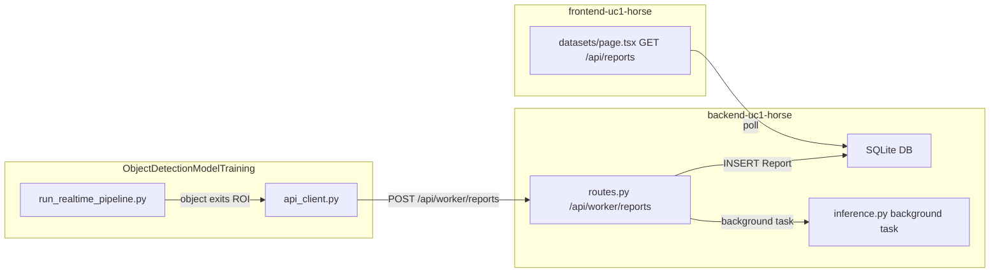

# Connect ObjectDetectionModelTraining to Frontend

## Current State

The wiring is **almost complete** but has 3 critical bugs that will cause runtime failures. Here is the data flow and where each break occurs:




## Bug 1 -- `Report.job_id` has FK + unique constraint, but no matching Job row exists

The real-time pipeline sends `job_id="rtsp-live-stream"`. The backend tries to INSERT a Report with that `job_id`, but:

- `Report.job_id` is a **ForeignKey to `jobs.id`** -- there is no Job row with `id="rtsp-live-stream"`, so the INSERT fails with an integrity error.
- `Report.job_id` has `**unique=True**` -- even if the first report succeeds, the second one would fail because the same `job_id` is reused.

**Fix (backend):** Make `job_id` nullable and remove the unique constraint on [app/db/models.py](backend-uc1-horse/app/db/models.py):

```python
# Before
job_id = Column(String, ForeignKey("jobs.id"), unique=True)

# After
job_id = Column(String, nullable=True)
```

Also update the schema in [app/schemas/domain.py](backend-uc1-horse/app/schemas/domain.py) to make `job_id` optional:

```python
class ReportCreate(BaseModel):
    job_id: Optional[str] = None  # was: job_id: str
```

And make `ReportResponse.job_id` optional too.

## Bug 2 -- Each real-time event reuses `job_id="rtsp-live-stream"` instead of generating a unique ID

Even after fixing Bug 1, every report from the stream shares the same `job_id`. This is fine now that unique is removed, but the pipeline should ideally send a unique identifier per event so reports are individually trackable.

**Fix (pipeline):** In [api_client.py](ObjectDetectionModelTraining/src/core/api_client.py), generate a UUID per call instead of reusing a fixed string:

```python
import uuid

def post_report(..., job_id: str = None) -> bool:
    if job_id is None:
        job_id = f"rtsp-{uuid.uuid4().hex[:8]}"
    ...
```

## Bug 3 -- Frontend `datasets/page.tsx` fallback URL is wrong port

The server-side fetch in [datasets/page.tsx](frontend-uc1-horse/src/app/datasets/page.tsx) falls back to `http://localhost:8000`, but the backend runs on port **8002**. Inside Docker Compose this is fine (it uses `BACKEND_API_URL=http://backend:8080`), but outside Docker it will fail.

**Fix (frontend):** Change the fallback from `8000` to `8002` in `datasets/page.tsx`.

## Summary of Changes


| File                                                  | Change                                                        |
| ----------------------------------------------------- | ------------------------------------------------------------- |
| `backend-uc1-horse/app/db/models.py`                  | Remove FK and unique on `Report.job_id`, make nullable        |
| `backend-uc1-horse/app/schemas/domain.py`             | Make `job_id` optional in `ReportCreate` and `ReportResponse` |
| `ObjectDetectionModelTraining/src/core/api_client.py` | Generate unique `job_id` per report instead of fixed string   |
| `frontend-uc1-horse/src/app/datasets/page.tsx`        | Fix fallback port from `8000` to `8002`                       |
| `backend-uc1-horse/local_dev.db`                      | Delete and let it recreate (schema changed)                   |


After these 4 file edits + DB reset, the end-to-end flow works: run `docker compose up`, start the real-time pipeline pointing at the RTSP stream, and objects that exit the ROI will appear in the frontend datasets page within seconds.