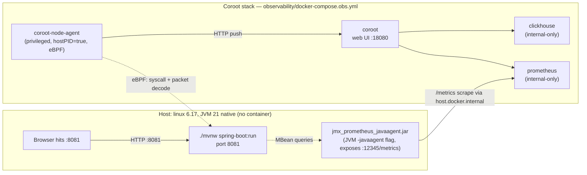

# Coroot eBPF PoC on subgrup-prop7.1

The fourth observability experiment in the cuberhaus portfolio, sized to mirror the LGTM and Honeycomb PoCs structurally so the comparison artefact in Phase 6 is a near-`diff`.

## User decisions feeding this plan

- Scope: **eBPF + JMX exporter, no OTel Java agent.** The "zero application code change" headline is preserved — JMX exporter is a single JVM arg with no app deps. The OTel Java agent (bytecode-rewriting paradigm) is explicitly out of scope and reserved for a possible future experiment.
- Sentry on this branch: **fully removed**, mirroring the LGTM and Honeycomb branches. `master` keeps the Sentry-instrumented baseline.
- Branch: **`obs-experiment-coroot`**, off `master`.

## Architecture



The eBPF node-agent watches **all** processes on the host, so it'll also see sentry-self-hosted and the Practica LGTM stack. Coroot scopes the UI to the spring-boot JVM via a process filter on `cmdline ~= "spring-boot"`.

## Phase 1 — Coroot stack bring-up

New directory [subgrup-prop7.1/observability/](subgrup-prop7.1/observability/):

- `docker-compose.obs.yml` — 4 services:
  - `coroot/coroot:latest` (UI, host port **18080**)
  - `coroot/coroot-node-agent:latest` (privileged, hostPID=true, host network, no host port)
  - `clickhouse/clickhouse-server:latest` (internal only, port 8123 — sentry-self-hosted owns 9000 so we deliberately don't expose it)
  - `prom/prometheus:latest` (internal only, port 9090)
- `coroot/coroot.yaml` — config: ClickHouse + Prometheus endpoints, project name "subgrup-prop", auto-discovery on.
- `prometheus/prometheus.yml` — single scrape job pointed at `host.docker.internal:12345` (the JMX exporter, added in Phase 4 — for now the scrape target is up but empty).
- `clickhouse/users.xml` — minimal user config; default password disabled for the docker-network user.
- `.env.obs.example` — Coroot license key (empty for OSS), retention defaults.
- `.gitignore` — ignore `.env.obs`, `clickhouse-data/`, `prom-data/`, `coroot-data/`.
- `README.md` — bring-up / tear-down / port map / coexistence notes (one-page, mirroring [Practica_de_Planificacion/observability/README.md](Practica_de_Planificacion/observability/README.md)).

Verify: `docker compose ... up -d`, hit `http://localhost:18080`, see the host as a node, see the spring-boot JVM listed as a service when `make web` is running.

**Commit 1**: "Scaffold Coroot eBPF observability stack"

## Phase 2 — Remove Sentry from the PoC branch

Modifications to existing files:

- [subgrup-prop7.1/web/pom.xml](subgrup-prop7.1/web/pom.xml) — drop the two Sentry deps:
  ```xml
  <!-- lines 41-50, REMOVE -->
  <dependency>
      <groupId>io.sentry</groupId>
      <artifactId>sentry-spring-boot-starter-jakarta</artifactId>
      ...
  </dependency>
  <dependency>
      <groupId>io.sentry</groupId>
      <artifactId>sentry-logback</artifactId>
      ...
  </dependency>
  ```
- [subgrup-prop7.1/web/src/main/resources/application.properties](subgrup-prop7.1/web/src/main/resources/application.properties) — drop the 6 `sentry.*` keys (lines 4-19).
- [subgrup-prop7.1/web/src/main/java/web/config/SessionIdFilter.java](subgrup-prop7.1/web/src/main/java/web/config/SessionIdFilter.java) — rewrite: keep the `X-Session-Id` extraction, drop `Sentry.setTag("session_id", ...)`, replace with **MDC** put so SLF4J/logback correlates logs by session id (Coroot can index MDC fields out of stdout). Net effect: less coupling, same correlation.
- [subgrup-prop7.1/web/src/main/resources/logback-spring.xml](subgrup-prop7.1/web/src/main/resources/logback-spring.xml) — drop the Sentry appender, switch to a JSON encoder (or keep the existing console layout) so Coroot's container-log scraper produces structured fields.

Verify: `cd web && ./mvnw clean package -DskipTests` succeeds. `make web` boots cleanly with no Sentry classes loaded.

**Commit 2**: "Remove Sentry instrumentation from PoC branch"

## Phase 3 — Zero-instrumentation observation (no commit)

Just bring up Coroot + run `make web` + click around the app. Capture in `obs-experiment-notes.md` (Phase 6) what surfaces **for free** with zero JVM-side configuration:

- HTTP traces per controller endpoint (URL, method, status, duration distribution)
- Service map (browser ↔ JVM — uninteresting here since there's no DB)
- Infra metrics: CPU, memory, network IO, disk IO, FD count
- Per-process metrics from the eBPF agent
- HTTP RED metrics auto-generated from packet decode

What's **missing** that the LGTM/Sentry stacks gave us:
- GC pauses / heap usage / thread-pool stats (deferred to Phase 4)
- Custom span boundaries inside business logic (would need OTel Java agent — out of scope)
- Error stack traces (Coroot infers errors from HTTP 5xx + log severity, not from stack frames)

This phase is intentionally a thinking phase — no code, no commit. Documenting the gaps IS the educational outcome.

## Phase 4 — JMX exporter for JVM internals

Adds JVM-level metrics (GC, heap, threads, Tomcat connection pool) without touching application code.

- New file [subgrup-prop7.1/observability/jmx_exporter/jmx-config.yaml](subgrup-prop7.1/observability/jmx_exporter/jmx-config.yaml) — Prometheus's recommended Spring Boot rules (allowlist for `java.lang:*`, `Catalina:*`, `org.springframework.boot:*`).
- Download `jmx_prometheus_javaagent-1.0.1.jar` into `subgrup-prop7.1/observability/jmx_exporter/` (gitignored; Makefile target fetches on first use).
- [subgrup-prop7.1/Makefile](subgrup-prop7.1/Makefile) — modify the `web` target to set `JAVA_TOOL_OPTIONS`:
  ```makefile
  web:
      @echo "Launching web interface on http://localhost:8081"
      cd web && JAVA_TOOL_OPTIONS="-javaagent:../observability/jmx_exporter/jmx_prometheus_javaagent-1.0.1.jar=12345:../observability/jmx_exporter/jmx-config.yaml" ./mvnw spring-boot:run
  ```
- [subgrup-prop7.1/observability/prometheus/prometheus.yml](subgrup-prop7.1/observability/prometheus/prometheus.yml) — already has the scrape target stub from Phase 1; verify it's hitting the JMX endpoint.

Verify: `curl localhost:12345/metrics | grep jvm_` shows JVM metrics. Coroot UI > application > "Java" tab shows GC chart.

**Commit 3**: "Add JMX exporter for JVM internals (no application code change)"

## Phase 5 — Scenarios + Coroot SLOs

New file [subgrup-prop7.1/observability/SCENARIOS.md](subgrup-prop7.1/observability/SCENARIOS.md), structurally mirroring [pracpro2/observability/SCENARIOS.md](pracpro2/observability/SCENARIOS.md):

- **Scenario A — latency regression.** Inject `Thread.sleep(500)` into one controller endpoint (e.g., `RecomanacioController.recomanar()`); drive load; watch Coroot's automatic SLO inference notice the deviation.
- **Scenario B — error spike.** Throw on a specific path; watch the error-rate alert fire.

Plus:
- [subgrup-prop7.1/observability/coroot/inspections.yaml](subgrup-prop7.1/observability/coroot/inspections.yaml) — explicit SLO definitions (95% requests < 200ms, error rate < 1%) so the alerting is reproducible (Coroot also auto-infers, but the explicit version is what the comparison artefact will reference).
- [subgrup-prop7.1/observability/coroot/integrations.yaml](subgrup-prop7.1/observability/coroot/integrations.yaml) — webhook receiver pointing at a local listener (so screenshots of "alert fired" can be taken offline).

**Commit 4**: "Add scenario harness + Coroot SLO/alert configuration"

## Phase 6 — Comparison artefact

New file [subgrup-prop7.1/observability/obs-experiment-notes.md](subgrup-prop7.1/observability/obs-experiment-notes.md), reusing the same headings as [pracpro2/observability/obs-experiment-notes.md](pracpro2/observability/obs-experiment-notes.md) so a `diff` is the comparison medium:

- First impressions
- Latency-regression UX (Scenario A)
- Error-spike UX (Scenario B)
- Cost & operational shape (memory budget on a 4 GiB CX22, CPU during eBPF probe attach, etc.)
- Verdict
- Cross-PoC comparison table — adds a third column to the existing Honeycomb-vs-LGTM table covering Coroot

Update [dev/observability_architectures_summary.md](dev/observability_architectures_summary.md) to insert Coroot as section 6 and add a row to the cross-architecture trade-offs table.

**Commit 5**: "Fill in obs-experiment-notes.md with Coroot-vs-everything comparison"

## Verification gates per commit

- After Commit 1: `docker compose -f observability/docker-compose.obs.yml ps` shows 4 services healthy, `curl localhost:18080` returns the Coroot UI HTML.
- After Commit 2: `cd web && ./mvnw clean package -DskipTests` succeeds, `rg -i 'sentry' web/src` returns nothing, `make web` boots without error.
- After Commit 3: `curl localhost:12345/metrics | grep -c jvm_` returns ≥20, Coroot UI > Java tab populated.
- After Commit 4: scenario scripts run, Coroot fires an automatic alert on the injected regression within 60s.
- After Commit 5: `dev/observability_architectures_summary.md` builds with Coroot as the 6th architecture.

## Risks / known limitations called out up front

- **No external DB on this app.** The service map will be a single node — less interesting than Coroot demos with microservices. The eBPF HTTP-trace story is still the headline, just without the satisfying "found the slow query" moment.
- **Native (non-containerized) JVM.** Coroot labels by `cmdline` rather than container name. Means the Coroot UI lists "java" rather than "subgrup-prop"; we set a friendly label in `coroot.yaml` to fix this.
- **Memory budget.** Coroot stack is ~1.0–1.5 GiB. Combined with sentry-self-hosted (~6 GiB) and the running Practica LGTM stack (~3 GiB), the dev box is under pressure. The README documents the "stop LGTM while running this PoC" workflow.
- **eBPF kernel requirements.** Linux 6.17 is well past the 4.16 minimum, no concern.
- **Coroot Community Edition vs Enterprise.** Community Edition has the eBPF agent, ClickHouse storage, Prometheus integration, SLO inference, and alerting — everything we need. Enterprise adds RBAC, AI root-cause analysis, and Single Sign-On — none of which is on the learning agenda here. PoC stays on CE.
- **Sentry self-hosted port collision.** ClickHouse default 9000 collides with sentry-self-hosted-nginx; the docker-compose deliberately doesn't expose ClickHouse on the host (only Coroot needs to reach it on the docker network).

## Time estimate

- Phase 1: 1–2 hours (docker-compose authoring + first-boot debugging)
- Phase 2: 30 min (Sentry removal is mechanical)
- Phase 3: 30 min (just clicking around + note-taking; no code)
- Phase 4: 30 min (JMX exporter is one JVM arg + a YAML file)
- Phase 5: 1 hour (scenarios + SLO config)
- Phase 6: 1 hour (writing the comparison)
- **Total: ~4–5 hours of focused work**, similar to the LGTM PoC's Phase 1+2 budget.

## Out of scope (worth a future experiment)

- **OpenTelemetry Java agent** (`-javaagent:opentelemetry-javaagent.jar`) — bytecode-rewriting paradigm, distinct from eBPF. Could be its own PoC against the same repo on a different branch (`obs-experiment-otel-java-agent`) for a clean A/B between zero-instrumentation and bytecode-instrumentation.
- **Profiles via Pyroscope or Coroot's own profiler** — Coroot has experimental eBPF-based continuous profiling; deferred to keep this PoC focused.
- **RUM** — no browser instrumentation in this PoC. Coroot doesn't have RUM in CE.
