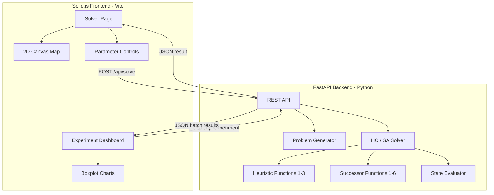

# desastresIA Web App

## Architecture

## Backend: Python reimplementation of Java logic

The `IA.Desastres` JAR is gitignored and unavailable. The library API is simple (documented in Javadoc) -- just seed-based random generation. We reimplement everything in Python.

### Files to create under `desastresIA/web/backend/`

- `**models.py**` -- Data classes for `Centro`, `Grupo`, `Helicopter`, `State`
  - `Centro(x: int, y: int, n_helicopters: int)`
  - `Grupo(x: int, y: int, priority: int, n_personas: int)`
  - `State` = list of lists (helicopter -> ordered group IDs), same as Java `estado.asignacion`
- `**generator.py**` -- Reimplement `IA.Desastres.Centros` and `IA.Desastres.Grupos`
  - `generate_centros(n: int, helicopters_per_center: int, seed: int) -> list[Centro]`
  - `generate_grupos(n: int, seed: int) -> list[Grupo]`
  - Uses Python `random.Random(seed)` to match the Java `Random(seed)` distribution
  - Note: exact seed parity with Java is not guaranteed, but the statistical properties will be identical
- `**board.py**` -- Reimplement `Desastres.board`
  - Precompute center-group and group-group Euclidean distance matrices
  - Same `get_distance(id1, id2, mode)` interface
  - Store helicopter-to-center mapping
- `**state.py**` -- Reimplement `Desastres.estado`
  - Three initial state generators: `random`, `all_to_one`, `greedy`
  - Greedy uses priority queue with nearest-group logic (port of [estado.java](desastresIA/Desastres/src/Desastres/estado.java) `gen_estado_inicial_greedy`)
  - Operators: `swap_groups(i, j, x, y)`, `reassign_general(i, j, x, y)`, `reassign_reduced(id1, id2)`
- `**heuristics.py**` -- Port all 3 heuristic functions from Java
  - `heuristic_1(state, board)` -- weighted total time (port of [DesastresHeuristicFunction1.java](desastresIA/Desastres/src/Desastres/DesastresHeuristicFunction1.java))
  - `heuristic_2(state, board)` -- plain sum of times
  - `heuristic_3(state, board)` -- weighted + priority rescue time
  - Physics model: 1.66667 km/min speed, max 15 people per trip, max 3 groups per trip, 10 min cooldown, 2x time for priority groups
- `**successors.py**` -- Port successor functions 1-6
  - SF1: full SWAP enumeration
  - SF2: reassign general (all positions)
  - SF3: reassign reduced (last element only)
  - SF4: SWAP + general combined
  - SF5: SWAP + reduced combined
  - SF6: randomized mix for SA
- `**solver.py**` -- Hill Climbing and Simulated Annealing
  - `hill_climbing(problem) -> SolveResult` -- steepest ascent, returns final state + metrics
  - `simulated_annealing(problem, steps, stiter, k, lambda_) -> SolveResult` -- with temperature schedule
  - `SolveResult`: final state, heuristic value, execution time (ms), nodes expanded, per-helicopter times, iteration trace (for SA convergence chart)
- `**app.py**` -- FastAPI application
  - `POST /api/solve` -- single run with full config, returns state + routes + metrics
  - `POST /api/experiment` -- batch run: sweep over seeds/configs, returns aggregated metrics
  - `GET /api/status` -- health check
  - Response includes structured route data (per-helicopter trip legs with coordinates) for frontend visualization

### Key design decisions

- The `POST /api/solve` response includes **resolved route geometry**: for each helicopter, an ordered list of `{from: {x,y}, to: {x,y}, group_id, trip_number}` segments. The frontend doesn't need to compute routes -- it just draws them.
- The experiment endpoint runs in a thread pool to avoid blocking, with progress streaming via SSE if needed.

## Frontend: Solid.js + Vite + HTML5 Canvas

### Files to create under `desastresIA/web/frontend/`

Scaffold with `npm create vite@latest frontend -- --template solid-ts`.

- `**src/App.tsx`** -- Root with tab navigation (Solver / Experiments)
- `**src/pages/SolverPage.tsx`** -- Interactive solver
  - Left panel: parameter controls (seed, ngrupos, ncentros, nhelicopters, algorithm toggle HC/SA, successor function dropdown, heuristic dropdown, initial state dropdown, SA params when SA selected)
  - Center: 2D Canvas map showing centers (blue squares with helicopter count badges) and groups (circles color-coded: red=priority 1, orange=normal). After solving, draws helicopter routes as colored polylines with trip segments, animated direction arrows
  - Right panel: results -- heuristic value, execution time, nodes expanded, per-helicopter breakdown table (time, groups, trips)
  - "Generate" button to randomize a new scenario (changes seed), "Solve" button to run
- `**src/pages/ExperimentPage.tsx`** -- Batch comparison dashboard
  - Config: select which algorithms/heuristics/successors to compare, seed range, problem size
  - Results: boxplot charts (using a lightweight Canvas chart lib or custom SVG) for heuristic value and execution time across configurations
  - Mirrors what `python_scripts/plots.py` does but interactively
- `**src/components/MapCanvas.tsx**` -- Reusable Canvas component
  - Renders centers, groups, routes with pan/zoom
  - Color legend for priority groups and helicopter assignments
  - Tooltip on hover showing group details (people count, priority)
  - Animated route drawing after solve completes
- `**src/components/Controls.tsx**` -- Parameter form with Solid.js signals
- `**src/components/ResultsPanel.tsx**` -- Metrics display + per-helicopter table
- `**src/components/BoxplotChart.tsx**` -- SVG-based boxplot for experiments
- `**src/lib/api.ts**` -- Fetch wrapper for backend calls
- `**src/styles/` ** -- Dark theme CSS (to match the user's preference)

## Dockerization

- `**desastresIA/Dockerfile`** -- 2-stage build
  - Stage 1: `node:22-slim` to build Solid.js frontend (`npm run build`)
  - Stage 2: `python:3.12-slim` for FastAPI, copies built frontend into static serving
  - Single container serving both API and static files
- `**desastresIA/docker-compose.yml`** -- simple service on port 8083

## Makefile and Integration

- `**desastresIA/Makefile`** -- targets: `dev`, `install`, `docker-build`, `docker-up`, `docker-down`, `help`
- Update `**desastresIA/.gitignore`** to include `web/frontend/node_modules/`, `web/frontend/dist/`, `__pycache__/`
- Add to `PersonalPortfolio/scripts/dev-all-demos.sh` for the full portfolio spin-up
- Add a `LiveAppEmbed` to the portfolio's desastresIA demo page (if one exists, or create one)

## Dark Theme

All UI uses a dark color scheme consistent with the user's preference:

- Background: deep navy (#0f0f1a / #1a1a2e)
- Canvas: dark grid with light entities
- Controls: dark inputs with subtle borders
- Accent colors: helicopter routes use distinct bright colors (cyan, magenta, lime, orange, etc.)

