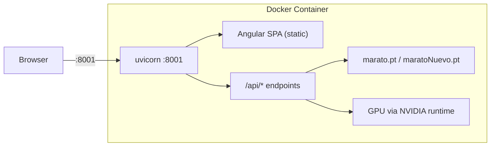

# Dockerize bitsXlaMarato

## Architecture

In production mode, the app is a **single process**: FastAPI (uvicorn) serves both the API endpoints and the built Angular SPA as static files. This means a single container is sufficient.




## Model switching feature

### Backend changes

`**[web/backend/app.py](bitsXlaMarato/web/backend/app.py)`:**

- New `GET /api/models` endpoint — scans `MODELS_DIR` for `*.pt` files, returns list with name and whether it's currently active:

```json
  [
    {"name": "maratoNuevo.pt", "active": true},
    {"name": "marato.pt", "active": false}
  ]
  

```

- New `POST /api/models/switch` endpoint — accepts `{"name": "marato.pt"}`, calls `load_model()` with the new path, runs warmup, returns status. Rejects if a job is currently running.
- Add `active_model` field to `/api/status` response so the UI always knows which model is loaded.

`**[web/backend/services/inference.py](bitsXlaMarato/web/backend/services/inference.py)`:**

- No structural changes needed — `load_model()` already accepts any path and replaces the global `_model`. Just need to call it again with the new path.

### Frontend changes

`**[web/frontend/src/app/services/api.ts](bitsXlaMarato/web/frontend/src/app/services/api.ts)`:**

- Add `active_model: string` to `ServerStatus` interface
- Add `ModelInfo` interface: `{name: string, active: boolean}`
- Add `getModels()` and `switchModel(name: string)` methods

`**[web/frontend/src/app/app.html](bitsXlaMarato/web/frontend/src/app/app.html)` + `[app.ts](bitsXlaMarato/web/frontend/src/app/app.ts)`:**

- Add a model selector dropdown in the header/banner area (next to the GPU status info)
- Populated from `GET /api/models`, highlights the active one
- On change, calls `POST /api/models/switch`, shows a loading state while the model reloads + warms up
- Disabled while a job is processing

## Docker files to create

### 1. `Dockerfile` (multi-stage)

**Stage 1 — Build Angular frontend:**

- Base: `node:22-slim`
- Copy `web/frontend/`, run `npm ci && npm run build`
- Output: `dist/frontend/browser/`

**Stage 2 — CUDA runtime with Python backend:**

- Base: `nvidia/cuda:12.4.1-runtime-ubuntu22.04`
- Install system deps: `python3`, `python3-pip`, `libgl1`, `libglib2.0-0` (needed by OpenCV)
- Copy and pip install `[web/backend/requirements.txt](bitsXlaMarato/web/backend/requirements.txt)`
- Copy backend source from `web/backend/`
- Copy Angular build from stage 1 into `web/frontend/dist/frontend/browser/`
- Copy `models/` directory (both `.pt` files, ~352MB total)
- Working directory: `web/backend`
- Entrypoint: `python3 -m uvicorn app:app --host 0.0.0.0 --port 8001`
- Expose port 8001

Paths inside container:

```
/app/
  models/
    maratoNuevo.pt      (176MB, baked in, default)
    marato.pt           (176MB, baked in)
  web/
    backend/
      app.py            (working dir, uvicorn runs here)
      services/
      jobs/             (created at runtime)
    frontend/
      dist/frontend/browser/   (Angular build, served by FastAPI)
```

This matches the existing `PROJECT_ROOT`, `MODELS_DIR`, `FRONTEND_DIR` path resolution in `[web/backend/app.py](bitsXlaMarato/web/backend/app.py)` lines 62-65 without code changes.

### 2. `docker-compose.yml`

Provides GPU passthrough config (requires [NVIDIA Container Toolkit](https://docs.nvidia.com/datacenter/cloud-native/container-toolkit/latest/install-guide.html) on host):

```yaml
services:
  app:
    build: .
    ports:
      - "8001:8001"
    deploy:
      resources:
        reservations:
          devices:
            - driver: nvidia
              count: 1
              capabilities: [gpu]
    volumes:
      - jobs:/app/web/backend/jobs
    environment:
      - BATCH_SIZE=${BATCH_SIZE:-16}

volumes:
  jobs:
```

- Named `jobs` volume persists processed video data across container restarts
- `BATCH_SIZE` is configurable via env var (defaults to 16 for RTX 5090)

### 3. `.dockerignore`

Exclude: `web/frontend/node_modules/`, `web/frontend/dist/`, `web/frontend/.angular/`, `web/backend/jobs/`, `.venv/`, `.git/`, `__pycache__/`, `*.tiff`, `*.png`, `*.stl`, `src/`, `MASKRCNN/`, `.cursor/`

Keep: `models/*.pt` (both models, baked in), `web/backend/`, `web/frontend/` (source for build)

### 4. Makefile targets

Add to `[bitsXlaMarato/Makefile](bitsXlaMarato/Makefile)`:

```makefile
docker-build: ## Build Docker image (includes model files)
	docker compose build

docker-up: ## Start container with GPU
	docker compose up -d

docker-down: ## Stop container
	docker compose down

docker-logs: ## Tail container logs
	docker compose logs -f
```

## Image size estimate

- CUDA 12.4 runtime base: ~1.2GB
- Python3 + pip + system libs: ~300MB
- PyTorch + torchvision (CUDA): ~2GB
- Other Python deps: ~200MB
- Model files: ~352MB (both models)
- Angular build: ~1MB
- **Total: ~4.1GB** (typical for GPU inference images)

## Prerequisites on host

- Docker Engine 20.10+
- NVIDIA driver installed
- [NVIDIA Container Toolkit](https://docs.nvidia.com/datacenter/cloud-native/container-toolkit/latest/install-guide.html) (`nvidia-ctk`)

