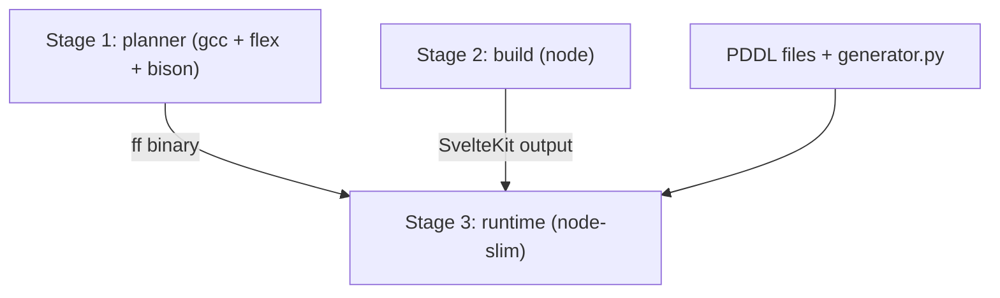

# Dockerize Practica de Planificacion

## Key decisions

- **SvelteKit adapter**: Switch from `adapter-auto` to `adapter-node` so the build produces a standalone Node.js server (required for Docker).
- **Multi-stage build**: 3 stages to keep the final image small:
  1. **planner** -- compiles Metric-FF from source (needs gcc, flex, bison)
  2. **build** -- installs npm deps and builds SvelteKit
  3. **runtime** -- slim Node image with only the built app, the `ff` binary, PDDL files, and `generator.py`
- **PDDL files**: Copied into the image at `/app/pddl/` so the server-side code can read/write them.
- **Paths**: `files.ts`, `planner.ts`, and `generator.ts` use `path.resolve('..')` as `PROJECT_ROOT`. In Docker, the working directory will be `/app/web` with PDDL dirs at `/app/Basico`, `/app/Extension_1`, etc., so this continues to work.

## Architecture




## Changes

### 1. Switch to adapter-node

In `[web/svelte.config.js](Practica_de_Planificacion/web/svelte.config.js)`, replace `adapter-auto` with `adapter-node`:

```js
import adapter from '@sveltejs/adapter-node';
```

Install the dependency:

```bash
npm install -D @sveltejs/adapter-node
```

### 2. Create Dockerfile

At `Practica_de_Planificacion/Dockerfile`:

- **Stage 1 (planner)**: `debian:bookworm-slim` with gcc/flex/bison, clone and compile Metric-FF, produce the `ff` binary.
- **Stage 2 (build)**: `node:22-slim`, copy `web/`, run `npm ci && npm run build`.
- **Stage 3 (runtime)**: `node:22-slim`, copy the SvelteKit build output from stage 2, the `ff` binary from stage 1, the PDDL directories, `generator.py`, and `python3` for the generator. Working directory: `/app/web`. Entrypoint: `node build/index.js`.

### 3. Create .dockerignore

At `Practica_de_Planificacion/.dockerignore` to exclude `node_modules`, `.svelte-kit`, `tools/`, `*.zip`, etc.

### 4. Add docker targets to Makefile

Add `docker-build` and `docker-run` targets to `[Practica_de_Planificacion/Makefile](Practica_de_Planificacion/Makefile)`.

### 5. Update PERFORMANCE/README if needed

Mention Docker usage in the Makefile help output.