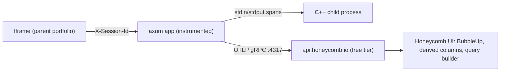

# Honeycomb PoC for `pracpro2` — replace Sentry with `tracing` + OTLP

This branch is the second PoC in the demo-repo series, paired against the LGTM PoC on `Practica_de_Planificacion`. It deliberately picks a **paradigm-distinct** stack — wide events to a SaaS — so the eventual `obs-experiment-notes.md` comparison has real contrast.

## Why this shape, briefly

`pracpro2` is `axum` + a C++ child process driven over stdin/stdout. Every interesting metric is high-cardinality — which command was issued, which species was operated on, was the child alive, what was the latency from request to child reply. That is exactly Honeycomb's "wide event" wheelhouse: you do not pre-aggregate into metrics, you record one fat event per request and query later. Rust's `tracing` crate already encourages adding fields to spans, so the Sentry → OTel rewrite is mostly *deleting Sentry*; the rest is annotating handlers with `#[instrument]` and `tracing::info!`.

## Stack



No local containers. The entire PoC is: SaaS account + `OTEL_EXPORTER_OTLP_HEADERS=x-honeycomb-team=...` + Rust code changes.

## Branch & deletion scope

Create `obs-experiment-honeycomb` off `main`. The following Sentry artefacts get deleted:

- [`web/backend/Cargo.toml`](web/backend/Cargo.toml) — drop `sentry`, `sentry-tower`, `sentry-tracing` (lines 14–17) and the `Phase 14 (Option A)` comment.
- [`web/backend/src/main.rs`](web/backend/src/main.rs):
  - line 17 `use sentry_tower::NewSentryLayer;`
  - lines 19–44 `fn _init_sentry()`
  - lines 46–64 `async fn _session_id_middleware` (replaced by an OTel-flavoured equivalent)
  - line 412 `let _sentry_guard = _init_sentry();`
  - lines 452–460 the Sentry-specific comment block + `.layer(NewSentryLayer::new_from_top())`
- [`Dockerfile`](Dockerfile) lines 8–10 — drop the `# Pinned to 1.88-slim because Sentry SDK 0.34…` comment; the toolchain pin can stay or be relaxed (your call — the plan keeps it for reproducibility).
- `Cargo.lock` — removed transitively when `cargo update` runs after the dep removal.

A pre-flight `rg -n 'sentry|Sentry|SENTRY' .` after Phase A must return zero matches outside `target/`.

## Phases

### Phase A — Sentry uninstall (clean working tree)

1. `git checkout -b obs-experiment-honeycomb`.
2. Edit `Cargo.toml`, `main.rs`, `Dockerfile` per the deletion list above.
3. `cargo check` from `web/backend/` — must compile with the unrelated handlers untouched.
4. `cargo test` — the existing `mod tests` block does not reference Sentry; it must still pass.
5. Commit checkpoint: `chore(pracpro2): remove Sentry instrumentation`. (Will surface for your approval first; auto-commit is off.)

### Phase B — OTel + Honeycomb plumbing

New file [`web/backend/src/observability.rs`](web/backend/src/observability.rs) with:

- `init_otel(service_name: &str) -> OtelGuard` — builds an `opentelemetry-otlp` tonic exporter using the standard env vars (`OTEL_EXPORTER_OTLP_ENDPOINT`, `OTEL_EXPORTER_OTLP_HEADERS`, `OTEL_SERVICE_NAME`, `OTEL_RESOURCE_ATTRIBUTES`) so Honeycomb config is purely env-driven and the same code points at any OTLP backend later.
- Combines `tracing_subscriber::Registry` with three layers: `EnvFilter`, `tracing_subscriber::fmt::layer().json()` (keeps the existing local stdout JSON logs), and `tracing_opentelemetry::layer().with_tracer(...)`.
- A `Drop` impl on `OtelGuard` that calls `provider.shutdown()` so spans flush on Ctrl-C.

Crate additions in [`web/backend/Cargo.toml`](web/backend/Cargo.toml) (latest 2026-stable line):

```toml
opentelemetry              = "0.27"
opentelemetry_sdk          = { version = "0.27", features = ["rt-tokio"] }
opentelemetry-otlp         = { version = "0.27", features = ["grpc-tonic", "tls-roots", "trace"] }
opentelemetry-semantic-conventions = "0.27"
tracing-opentelemetry      = "0.28"
```

`main.rs` changes:

- Replace `tracing_subscriber::fmt().json().init();` and the dropped `_init_sentry()` call with `let _otel = observability::init_otel("pracpro2");`.
- Replace `_session_id_middleware` with a new `session_id_middleware` that reads `X-Session-Id` and calls `tracing::Span::current().record("session.id", &sid as &dyn Value)`. Drops the `NewSentryLayer` line.

### Phase C — Wide-event annotations (the actual learning)

`#[tracing::instrument(skip_all, fields(...))]` on the four handlers, with deliberately rich fields so Honeycomb queries can pivot:

| Handler | Fields recorded on the span |
|---|---|
| `api_init` | `request.species_count`, `request.k`, `process.restarted` |
| `api_command` | `command.name`, `command.argv_len`, `command.outcome` (`ok`/`menu_repeat`/`process_dead`/`timeout`), `child.elapsed_ms` |
| `api_read_species` | `payload.bytes`, `payload.species_parsed`, `parse.outcome` |
| `api_status` | `process.alive`, `process.k` |

`ProcessManager::send_command` gets its own child span with `child.pid`, `child.stdout_lines`, `child.stderr_lines`, `child.exit_status` — this is the per-request → child-process boundary that, in Honeycomb's UI, makes BubbleUp's "what's different about slow requests" actually answer something useful.

Errors become `tracing::error!(error.kind = ..., error.message = ...)` events on the active span; OTel converts them into span events with `exception.*` semantic-convention attributes automatically, so Honeycomb's error grouping picks them up.

### Phase D — Config & local run

New files:

- [`observability/.env.honeycomb.example`](observability/.env.honeycomb.example):
  ```
  OTEL_SERVICE_NAME=pracpro2
  OTEL_EXPORTER_OTLP_ENDPOINT=https://api.honeycomb.io
  OTEL_EXPORTER_OTLP_HEADERS=x-honeycomb-team=YOUR_API_KEY
  OTEL_RESOURCE_ATTRIBUTES=service.namespace=cuberhaus,deployment.environment=local-dev
  RUST_LOG=info,pracpro2_backend=debug
  ```
- [`observability/README.md`](observability/README.md) — five-step quickstart: sign up at honeycomb.io → create env "local-dev" → copy `.env.honeycomb.example` → `cargo run` → click first trace.
- [`observability/QUERIES.md`](observability/QUERIES.md) — three canned Honeycomb queries that are worth saving as boards: p99 latency by `command.name`, error count by `command.outcome`, BubbleUp on `child.elapsed_ms > 500`.
- [`observability/SCENARIOS.md`](observability/SCENARIOS.md) — two scripted experiments mirroring the LGTM PoC (deliberate `tokio::time::sleep` regression in one handler; throw on every 10th request) so the eventual comparison artefact compares like-for-like time-to-detection across stacks.

### Phase E — Comparison stub

[`observability/obs-experiment-notes.md`](observability/obs-experiment-notes.md) — empty template with the same headings as the LGTM-PoC notes file (`first impressions`, `latency-regression UX`, `error-spike UX`, `cost & operational shape`, `verdict`). You fill it in as you actually use Honeycomb; after both PoCs, the side-by-side is the deliverable.

## Verification gates

- `cargo check` / `cargo test` pass after each phase.
- `rg -n 'sentry|Sentry|SENTRY' . --glob '!target/'` returns zero after Phase A.
- After Phase D: `cargo run` with `.env.honeycomb` loaded → at least one span visible in Honeycomb's "Recent traces" within 30 s, with `service.name=pracpro2`, `session.id=<uuid>`, and a child span for the C++ process.

## What this plan deliberately does *not* do

- Does not run the existing portfolio orchestrator (`dev-all-demos.sh`) or touch any sibling repo. The Sentry-helper changes from the prior session that live elsewhere stay where they are.
- Does not add metrics or logs OTLP pipelines. Honeycomb's pricing model is span-based; metrics on the free tier go to a separate UI ("Honeycomb Metrics") that is paid. Adding metrics later is a one-flag change in `observability.rs`.
- Does not run a load test. The "throw every 10th request" scripted scenario in `SCENARIOS.md` is enough to populate Honeycomb during click-through; a `k6`-style harness can come later if the comparison artefact wants throughput numbers.

## Risk & rollback

- If Honeycomb's free tier limits feel tight, swap the env block to OpenObserve / SigNoz cloud; `observability.rs` does not change.
- If the OTel Rust crates' SDK API has shifted by the time we run this, expect ~30 min of API-shape churn around `opentelemetry_sdk::trace::TracerProvider::builder()` — the wide-event annotations themselves are stable.
- Branch is throwaway. `git checkout main` discards every change in this plan.
