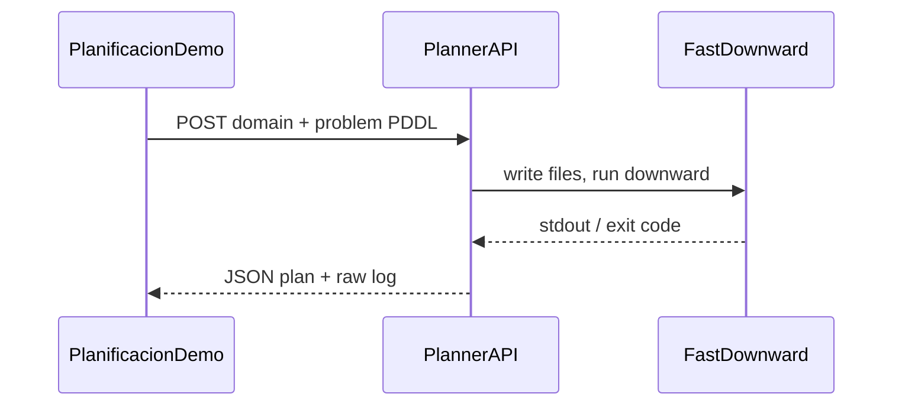

# Interactive planning demo (real solver)

## Why not “WASM-only” in the browser

Your domain uses `**:fluents**` and `**:metric minimize**`. General numeric PDDL in the browser would mean either:

- A **large** WASM build of a full planner (Fast Downward–class), or  
- **Pyodide + unified-planning** (multi‑MB download, slow cold start).

Neither fits a lightweight static portfolio well. A **small backend** that shells out to **Fast Downward** is the standard, reliable approach.

## Architecture

## 1. Planner service (new repo or folder)

- **Stack**: Python **FastAPI** (or Flask) + **subprocess** to [Fast Downward](https://www.fast-downward.org/) (build once in Docker image).
- **Endpoint**: `POST /plan` with JSON body `{ "domain": "...", "problem": "..." }` (or multipart files).
- **Behaviour**: Write `domain.pddl` / `problem.pddl` to a temp dir, run e.g.  
`fast-downward.py domain.pddl problem.pddl --search "astar(lmcut())"`  
(or another config that supports your metric; you may need **LPG** or FD with numeric support — verify one planner from your course works on [Extension_2/agencia_de_viajes_domain.pddl](Practica_de_Planificacion/Extension_2/agencia_de_viajes_domain.pddl) and lock the search config in the API).
- **Response**: `{ "ok": true, "plan": ["(anadir_ciudad ...)", ...], "stdout": "..." }` or `{ "ok": false, "error": "..." }`.
- **Hardening**: Max body size (~~256KB), timeout (~~30s), optional API key, CORS allowlist for your portfolio origin.

**Deploy**: Docker on **Fly.io**, **Railway**, or a VPS — not on pure GitHub Pages (static only).

## 2. Frontend changes ([PersonalPortfolio/src/components/demos/PlanificacionDemo.tsx](PersonalPortfolio/src/components/demos/PlanificacionDemo.tsx))

- **Env**: `PUBLIC_PLANNER_URL` (Astro) or `import.meta.env.VITE`_* depending on how you inject it — must be set at build time for static export.
- **UI**:
  - Textareas (or collapsible editors) for **domain** and **problem**, prefilled with Extension_2 defaults.
  - **“Run planner”** → `fetch(PUBLIC_PLANNER_URL + '/plan', { method: 'POST', ... })`.
  - Show **ordered action list** + expandable **raw solver log**.
  - If URL unset or request fails: clear message (“Planner API not configured”) and keep current static tabs.
- **plan.astro**: One line in “About” explaining that live solving needs the deployed API.

## 3. Planner choice caveat

Fast Downward’s support for **arbitrary numeric metrics** depends on configuration. **Before coding the API**, run locally:

`fast-downward.py` on your Extension_2 domain/problem and confirm you get a valid plan. If FD struggles with the metric, the API can call **LPG-td** or another tool you already use in the práctica — same HTTP shape, different CLI.

## 4. Optional later

- Preset dropdown (Problem 1 / 2 / juegopruebas) loading PDDL from `public/demos/planificacion/`.
- Parse plan into a small **trip timeline** (city sequence + days).

## Summary

| Piece                       | Role                                                                    |
| --------------------------- | ----------------------------------------------------------------------- |
| New planner API + Docker    | Actually solves PDDL                                                    |
| Env URL + PlanificacionDemo | Makes the page interactive                                              |
| Deploy API separately       | Static site stays on Pages; solver runs on a host that allows processes |

