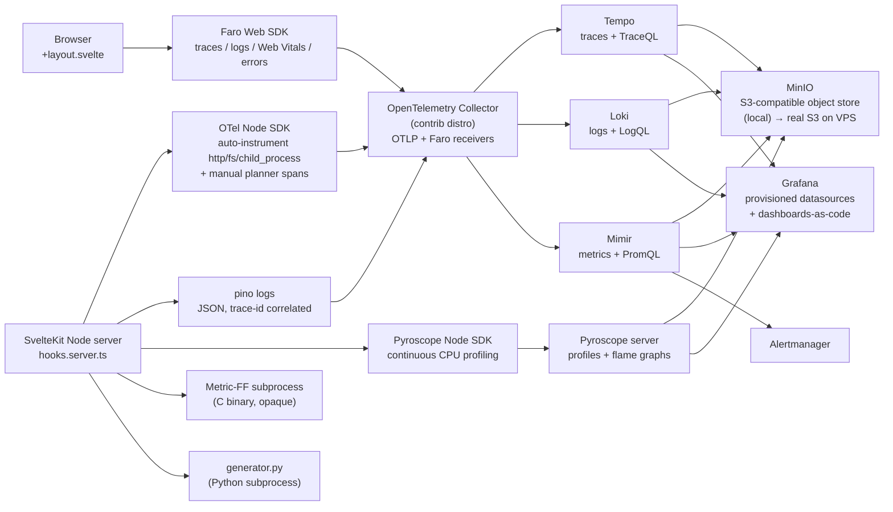

# LGTM + Pyroscope + Faro PoC for Practica_de_Planificacion

Standalone observability experiment built into the repo on a branch (`obs-experiment-lgtm`). Sentry SDK stays in [`web/src/hooks.server.ts`](Practica_de_Planificacion/web/src/hooks.server.ts) for now so the two stacks can be A/B'd; OTel layers alongside it.

## Architecture (data flow)



## Repo layout (target)

```
Practica_de_Planificacion/
  observability/
    docker-compose.obs.yml
    .env.obs.example                  # MinIO creds + retention knobs
    otel-collector/config.yaml        # OTLP gRPC/HTTP + Faro receivers
    tempo/tempo.yaml                  # S3 backend, TraceQL
    loki/loki.yaml                    # S3 backend, BoltDB shipper
    mimir/mimir.yaml                  # monolithic mode, S3 blocks storage
    pyroscope/pyroscope.yaml          # S3 backend
    grafana/
      grafana.ini
      provisioning/datasources/datasources.yaml
      provisioning/dashboards/dashboards.yaml
      dashboards/
        sveltekit-red.json
        planner-deep-dive.json
        node-process.json
        browser-rum.json
    alerts/sveltekit.yml              # Mimir-managed rules
    alertmanager/alertmanager.yaml
    minio/provision.sh                # creates obs-tempo / obs-loki / obs-mimir / obs-pyro
    load-test/
      k6-baseline.js
      k6-error-spike.js
      k6-latency-regression.js
    README.md                         # ports, run cmd, where to click
    SCENARIOS.md                      # the two scenarios + expected outcomes
  web/
    src/
      hooks.server.ts                 # OTel SDK started before SvelteKit handle
      lib/
        otel/init.ts                  # NodeSDK setup, exporter wiring
        otel/spans.ts                 # planner / generator span helpers
        otel/metrics.ts               # RED meters + planner-success counter
        log/pino.ts                   # pino logger w/ trace-id mixin
        rum/faro.ts                   # @grafana/faro-web-sdk init
      routes/
        +layout.svelte                # imports rum/faro client-side
        api/plan/+server.ts           # wraps Metric-FF spawn in span+metric
        api/generate/+server.ts       # wraps generator.py spawn in span+metric
    package.json                      # +@opentelemetry/* +pino +@pyroscope/nodejs +@grafana/faro-*
  Makefile                            # adds obs-up / obs-down / obs-load / obs-baseline
```

## Architectural calls baked into the plan

- **Collector**: OTel Collector contrib (not Alloy). Vendor-neutral, includes the Faro receiver and OTLP-to-Loki exporter natively. Single config file describes the whole pipeline.
- **Metrics backend**: Mimir in monolithic mode (single binary, S3-backed). One config away from horizontal-scale microservices on the VPS.
- **Object store**: MinIO locally on the same docker-compose network. VPS swap is two env vars (`S3_ENDPOINT`, `S3_BUCKET`) — no config diffs in Tempo/Loki/Mimir/Pyroscope themselves.
- **Logs**: pino + `pino-opentelemetry-transport` so logs ride OTLP to the Collector, then to Loki. Correlation with traces is automatic via OTel's log API.
- **Profiling**: Pyroscope Node SDK in push mode (the SDK pushes profiles to Pyroscope server). Easier than configuring Pyroscope to scrape `/debug/pprof` from a Node process.
- **RUM**: Faro Web SDK in `+layout.svelte`, sending to Faro receiver in the OTel Collector. Browser traces propagate `traceparent` so the same trace links browser ↔ Node handler ↔ subprocess.
- **Sentry coexistence**: Both SDKs initialise; nothing fights over scope. The point is to compare on the same workload, not to remove Sentry yet.
- **Sample rates**: 100% locally (high-signal). Tail-based sampling configured in the Collector but disabled by default — flip on for the VPS.

## Phased todos

Each phase ends in a runnable, observable state — you can stop after any phase and have a working subset.

## What gets validated (the two scenarios)

[`SCENARIOS.md`](Practica_de_Planificacion/observability/SCENARIOS.md) documents the two end-to-end checks. Both run via `make obs-load` against the running stack.

1. **Latency regression**: drive `/api/plan` with a large PDDL domain that pushes Metric-FF past 5s. Expected: latency dashboard panel goes red, `PlannerSlowP95` alert fires, Tempo trace shows the subprocess span dominating, Pyroscope flame graph shows the Metric-FF wait dominating event-loop time.
2. **Error spike**: POST malformed PDDL on every 10th request. Expected: `HighErrorRate` alert fires, Loki query `{service="planificacion"} |= "level=error"` shows the JSON-line stream, Faro RUM dashboard shows correlated browser-side `fetch` errors with the same `trace_id`.

After the PoC: commit a one-page `obs-experiment-notes.md` to the repo recording what each signal got right and wrong on the two scenarios. That's the comparable artefact for the next stack-experiment in the matrix (Elastic on `tenda_online`, etc.).

## Time budget (~22h, mostly waiting on Docker images)

- Phase 1 (stack bring-up): ~5h
- Phase 2 (OTel app instrumentation): ~4h
- Phase 3 (Pyroscope + Faro): ~4h
- Phase 4 (dashboards-as-code): ~4h
- Phase 5 (alerts + load tests): ~3h
- Phase 6 (VPS-ready polish + docs): ~2h