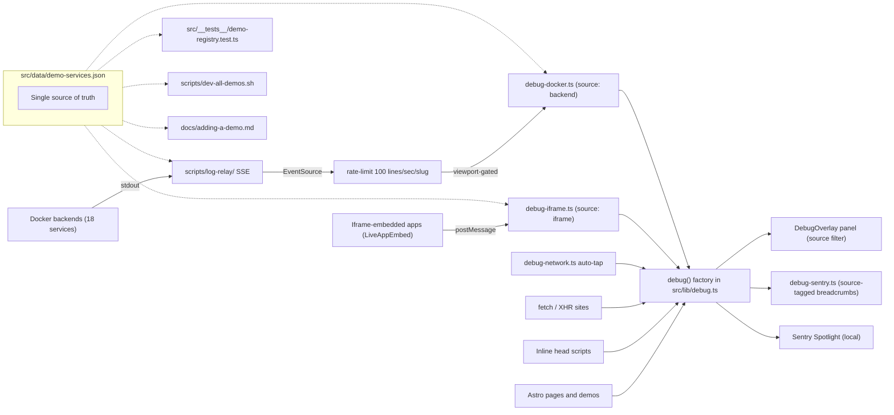

# Comprehensive logging instrumentation

> **Backend stack decision: Option A** (Sentry SDKs in every backend) — see
> [`PersonalPortfolio/docs/debugging-architecture.md` § Backend observability options](PersonalPortfolio/docs/debugging-architecture.md).
> All backends emit errors, breadcrumbs, and traces into the same Sentry org
> as the frontend. Single shared Sentry project with `tags.service = <slug>`
> for distinction. Local relay (Phase 9–10) remains for immediate dev
> feedback in the in-page overlay.

## Conventions (apply across all phases)

- **Namespaces** use dot/colon hierarchy:
  - top-level domain — `nav`, `theme`, `design`, `i18n`, `debug`
  - subdomain — `demo:rob`, `demo:matriculas`, `ui:modal`, `ui:nav`, `net:contact`, `net:draculin`
  - backend logs append `:backend` (e.g. `demo:draculin:backend`); iframe logs prefix `iframe:` (e.g. `iframe:demo:rob`).
- **Sources** (new field, see Phase 13): every entry carries `source: 'browser' | 'iframe' | 'backend'` and an optional `origin` (slug for backend, `URL.origin` for iframe). `debug(ns).<level>(...)` defaults to `browser`; iframe forwarder and Docker subscriber pass the appropriate value.
- **Levels**:
  - `trace` — high-volume / per-event (joint slider drags, RAF cadence, BFS step counters, parameter sweeps)
  - `info` — state transitions (mount, navigate, action triggered, theme set, modal open)
  - `warn` — soft failure with fallback (chat backend down, world atlas fetch failed, frame stall)
  - `error` — unrecoverable / unhandled (shader compile, OCR worker spawn, fetch reject without fallback)
- In `.tsx` use `import { debug } from '../lib/debug'` and `const log = debug('demo:rob');` (or the `useDebug` hook). In inline `.astro` scripts use `window.__debug?.log(level, ns, msg, ...args)` so it degrades to `console` if the bus hasn't loaded yet.
- Network call sites already get a low-level `network` breadcrumb from [`src/lib/debug-network.ts`](PersonalPortfolio/src/lib/debug-network.ts); add a **semantic operation log** alongside (e.g. `fetch_news_started` / `fetch_news_failed`) — do **not** duplicate the breadcrumb.
- All non-essential subscribers (iframe forwarder, Docker SSE subscriber) MUST be installed behind `requireEnabled()` (Phase 13) so production builds never open localhost connections.

## Phase 1 — Global plumbing

Goal: every page load, theme change, and currently-silent error reaches the bus.

- [`src/layouts/Layout.astro`](PersonalPortfolio/src/layouts/Layout.astro) — add a single `astro:page-load` listener after the existing `<ScrollToTop />` block: `nav.info('navigated', { path: location.pathname, lang: document.documentElement.lang, title: document.title })`. Skip the first event-noise log if `astro:page-load` fires before the bus hydrates by gating on `window.__debug`.
- [`src/layouts/DemoLayout.astro`](PersonalPortfolio/src/layouts/DemoLayout.astro) — mirror the same listener (no view-transitions here, but it still fires on initial paint).
- [`src/components/ThemeInit.astro`](PersonalPortfolio/src/components/ThemeInit.astro):
  - lines 33–68: `theme.info('resolved', { theme, source })` and `design.info('resolved', { design, source })` after the IIFEs that set initial values.
  - lines 84–91 (`__loadDesignFonts`): `design.info('font-load', { design, families })`.
  - lines 99 / 111 (the `console.error` fallback inside `setTheme`/`setDesign`): swap to `window.__debug?.log('error', 'theme', ...)` (already partially done; finish the success paths too with `theme.info('set', { id })` / `design.info('set', { id })`).
  - lines 1045–1098 (modal): `ui:modal.info('open' | 'close', { source: 'click' | 'escape' | 'shortcut' })`, plus `theme.info('select', {...})` and `design.info('select', {...})` on successful pick.
  - **New**: add a `matchMedia('(prefers-color-scheme: dark)').addEventListener('change', ...)` that emits `theme.info('system-changed', { matches })`.
- [`src/components/ThemeToggle.astro`](PersonalPortfolio/src/components/ThemeToggle.astro) lines 78–89: `theme.info('quick-toggle', { from, to })`.
- [`src/components/DebugInit.astro`](PersonalPortfolio/src/components/DebugInit.astro) line ~63 inside `toggleDebug()`: dispatch a `debug.info('toggle', { enabled })` once the bus is available (gated by `window.__debug`).
- [`src/lib/grafics-kernels.ts`](PersonalPortfolio/src/lib/grafics-kernels.ts) line 13: replace `console.error` with `debug('demo:grafics').error('shader-compile-failed', { type, log }, error)` and keep the throw.

## Phase 2 — Network operation logs (semantic, alongside fetch tap)

Goal: every backend boundary has a one-line "what we tried to do" log even when the request is opaque (`no-cors`) or silently caught.

- [`src/components/demos/LiveAppEmbed.tsx`](PersonalPortfolio/src/components/demos/LiveAppEmbed.tsx) lines 21–34: `net:embed.info('probe', { url })` start and `net:embed.info('probe-result', { url, status })` on resolve / `warn('probe-aborted')` on abort.
- [`src/components/demos/DraculinDemo.tsx`](PersonalPortfolio/src/components/demos/DraculinDemo.tsx):
  - lines 29–41 (news): `net:draculin.info('fetch-news')` + `warn('fetch-news-fallback')`.
  - lines 68–80 (chat prefetch): `net:draculin.info('chat-prefetch')`.
  - lines 94–105 (chat send): `net:draculin.info('chat-send', { len })` + `warn('chat-parse-failed', err)`.
- [`src/components/demos/MPIDSDemo.tsx`](PersonalPortfolio/src/components/demos/MPIDSDemo.tsx) lines 173–179: `net:mpids.info('load-sample', { name })` + `error('load-sample-failed', err)`.
- [`src/components/demos/caim/PageRankTab.tsx`](PersonalPortfolio/src/components/demos/caim/PageRankTab.tsx) lines 171–181: `net:caim.warn('world-atlas-failed', err)` (currently silent catch).
- [`src/components/Contact.astro`](PersonalPortfolio/src/components/Contact.astro) lines 234–272: `net:contact.info('submit')` + `info('submit-ok', { id })` / `error('submit-failed', err)`.
- [`src/lib/opencv-loader.ts`](PersonalPortfolio/src/lib/opencv-loader.ts) lines 31–59: `demo:matriculas.info('worker-spawn')` + `info('worker-ready')` + `error('worker-error', e)`.

## Phase 3 — Demo lifecycle (one info per mount + cleanup)

Goal: clear `[demo:foo] mount` / `[demo:foo] cleanup` markers in the panel for every interactive demo. Add a single `useEffect` log to each component below.

Per-demo: `demo:rob`, `demo:polyps`, `demo:grafics`, `demo:algorithms` (FibDemo), `demo:par`, `demo:desastres`, `demo:mpids`, `demo:caim`, `demo:phase`, `demo:jsbach`, `demo:matriculas`, `demo:apa`, `demo:draculin`, `demo:sbc`, `demo:tenda`, `demo:planificacion`, `demo:pro2`, `demo:bitsx`, `demo:embed`.

Files: every `.tsx` under [`src/components/demos/`](PersonalPortfolio/src/components/demos/) + the inline scripts in [`src/pages/demos/prop.astro`](PersonalPortfolio/src/pages/demos/prop.astro) and [`src/pages/demos/joc-eda.astro`](PersonalPortfolio/src/pages/demos/joc-eda.astro). Add a single `useEffect(() => { log.info('mount'); return () => log.trace('unmount'); }, [])` near the top of each component (or per-panel for multi-canvas demos like `RobDemo`, `GraficsDemo`, `FibDemo`, `ParDemo`).

For sub-tabs:
- [`src/components/demos/CAIMDemo.tsx`](PersonalPortfolio/src/components/demos/CAIMDemo.tsx) lines 24–37: `demo:caim.info('tab', { tab })`.
- [`src/components/demos/caim/PageRankTab.tsx`](PersonalPortfolio/src/components/demos/caim/PageRankTab.tsx) lines 29–46: `demo:caim.info('pagerank-run', { damping, init, iterations })`.
- [`src/components/demos/caim/ZipfTab.tsx`](PersonalPortfolio/src/components/demos/caim/ZipfTab.tsx) lines 56–59: `demo:caim.info('zipf-corpus', { corpus })`.

## Phase 4 — User interactions worth tracking (info)

Goal: every meaningful click / submit / state-change emits one `info`.

- Theme/design picks (covered in Phase 1).
- Mobile menu / sidebar / scroll-to-top:
  - [`src/components/Navbar.astro`](PersonalPortfolio/src/components/Navbar.astro) ~line 298: `ui:nav.info('mobile-menu', { open })`.
  - [`src/components/DemoSidebar.astro`](PersonalPortfolio/src/components/DemoSidebar.astro) lines 70–81: `ui:sidebar.info('toggle', { open })`.
  - [`src/components/ScrollToTop.astro`](PersonalPortfolio/src/components/ScrollToTop.astro) lines 100–108: `ui:scroll.info('to-top')`.
- Demo controls (one log per click / change):
  - [`RobDemo.tsx`](PersonalPortfolio/src/components/demos/RobDemo.tsx) joint sliders ~213–223 (info on commit; trace on drag — see Phase 5).
  - [`TfgPolypDemo.tsx`](PersonalPortfolio/src/components/demos/TfgPolypDemo.tsx) ~91–99: metric/sort changes.
  - [`DesastresIADemo.tsx`](PersonalPortfolio/src/components/demos/DesastresIADemo.tsx) lines 93–111: algo, seed, run.
  - [`JSBachDemo.tsx`](PersonalPortfolio/src/components/demos/JSBachDemo.tsx) lines 131–164: run, play, sample.
  - [`PhaseTransitionsDemo.tsx`](PersonalPortfolio/src/components/demos/PhaseTransitionsDemo.tsx) lines 248–300: family change, percolation apply, sweep trigger.
  - [`MPIDSDemo.tsx`](PersonalPortfolio/src/components/demos/MPIDSDemo.tsx) lines 128–165: sample / upload / random / solve.
  - [`ParDemo.tsx`](PersonalPortfolio/src/components/demos/ParDemo.tsx) lines 60–219: Mandelbrot pan/zoom/iter, heat play/pause, pi steps.
  - [`SPMatriculasDemo.tsx`](PersonalPortfolio/src/components/demos/SPMatriculasDemo.tsx) lines 270–305: image select, pipeline run, OCR outcome.
  - [`TendaDemo.tsx`](PersonalPortfolio/src/components/demos/TendaDemo.tsx) lines 144–178: view nav, cart mutation, checkout.
  - [`SbcDemo.tsx`](PersonalPortfolio/src/components/demos/SbcDemo.tsx): tab/step changes.
  - [`ApaPracticaDemo.tsx`](PersonalPortfolio/src/components/demos/ApaPracticaDemo.tsx) ~124: model/dataset selection.
  - [`PlanificacionDemo.tsx`](PersonalPortfolio/src/components/demos/PlanificacionDemo.tsx): plan recompute trigger.
  - [`Pro2Demo.tsx`](PersonalPortfolio/src/components/demos/Pro2Demo.tsx): simulation control changes.
  - [`LiveAppEmbed.tsx`](PersonalPortfolio/src/components/demos/LiveAppEmbed.tsx) lines 100–109: external-tab open, expand/collapse.
- Debug overlay self-events:
  - [`src/components/DebugOverlay.tsx`](PersonalPortfolio/src/components/DebugOverlay.tsx) lines 145–153: `debug:ui.trace('copy-logs', { count })`.

## Phase 5 — Verbose `trace` events

Goal: when filtering to `trace` you see the per-frame / per-step detail; when filtering to `info` it's hidden.

- [`RobDemo.tsx`](PersonalPortfolio/src/components/demos/RobDemo.tsx) lines 150–223: `demo:rob.trace('joint', { idx, deg })` on every input event; `trace('fk-step', { ee })` after `forwardKinematicsPositions`.
- [`GraficsDemo.tsx`](PersonalPortfolio/src/components/demos/GraficsDemo.tsx) lines 11–82: per-RAF cadence — emit `trace('raf', { dt })` and a `warn('frame-stall', { dt })` when `dt > 50ms`.
- [`ParDemo.tsx`](PersonalPortfolio/src/components/demos/ParDemo.tsx) lines 153–219: heat-equation step counter (`trace('heat-step', { t })`); pi MC trial counter every N steps.
- [`PhaseTransitionsDemo.tsx`](PersonalPortfolio/src/components/demos/PhaseTransitionsDemo.tsx) sweep loop: `trace('sweep-trial', { p, runs })`.
- [`MPIDSDemo.tsx`](PersonalPortfolio/src/components/demos/MPIDSDemo.tsx) layout iterations: `trace('layout-iter', { i, energy })`.
- [`FibDemo.tsx`](PersonalPortfolio/src/components/demos/FibDemo.tsx) BFS / Dijkstra / merge-sort step events: `trace('algo-step', { algo, step })`.
- [`SPMatriculasDemo.tsx`](PersonalPortfolio/src/components/demos/SPMatriculasDemo.tsx) pipeline progress events from worker: `trace('pipeline-progress', { stage, pct })`.
- [`JSBachDemo.tsx`](PersonalPortfolio/src/components/demos/JSBachDemo.tsx) `playNotes` ticks: `trace('note', { pitch, dur })`.

## Phase 6 — i18n awareness (low-volume info)

- Each demo island root: log the resolved `lang` prop on mount (`i18n.trace('lang', { ns, lang })`).
- Add to the global `astro:page-load` log a `lang` field (already in Phase 1).
- [`src/components/LanguagePicker.astro`](PersonalPortfolio/src/components/LanguagePicker.astro): no separate log — the global `nav.info` after navigation will capture the new `lang`.

## Phase 7 — Smoke test

- `npm run dev`, open the overlay (`Alt+Shift+D`).
- Visit `/`, `/demos/rob-robotics/`, `/demos/tfg-polyps/`, `/demos/draculin/`, `/demos/matriculas/`, `/contact` and the theme modal.
- Verify panel shows `nav` page-load entries, `theme`/`design` picks, demo `mount` / `unmount` markers, network `info`/`warn`, and that switching the level filter to `trace` reveals per-frame events from `demo:rob` joint drag and `demo:grafics` RAF.
- Confirm `?debug=0` clears the overlay and the bus stays silent on subsequent loads.

## Phase 0 — Service registry (foundation for everything Docker-related)

Goal: a single source of truth that the orchestrator script, the in-page subscriber, the log relay, the tests, and the onboarding doc all read.

Create [`src/data/demo-services.json`](PersonalPortfolio/src/data/demo-services.json) with one entry per demo. Schema (TypeScript shape, validated in tests):

```ts
type DemoService = {
  slug: string;            // e.g. "tfg-polyps"
  page: string;            // path under src/pages/demos/
  component?: string;      // path under src/components/demos/ (if .tsx)
  hasBackend: boolean;
  backend?: {
    container: string;     // docker container name
    port: number;          // host port
    iframeUrl?: string;    // if rendered through LiveAppEmbed
    logRoute?: string;     // e.g. "/__debug/stream" if app-level SSE exists
    composeFile?: string;  // path relative to repo root for `docker compose ...`
    makefile?: string;     // path relative to repo root for `make docker-up`
    stack: "fastapi" | "django" | "spring" | "sveltekit" | "qwik" | "ember" | "rust" | "go" | "php" | "flask";
  };
};
```

Seed with the 18 backends from the inventory:
- `tfg-polyps` → 8082 (TFG, FastAPI), `bitsx-marato` → 8001 (FastAPI, has SSE), `pro2` → 8000 (Rust), `planificacion` → 3000 (SvelteKit), `desastres-ia` → 8083, `mpids` → 8084 (Flask, projectA), `phase-transitions` → 8085 (projectA2), `caim` → 8086 (uvicorn), `joc-eda` → 8087 (Go), `sbc-ia` → 8088 (uvicorn), `par-parallel` → 8089, `algorithms` → 8090 (fib `web`), `rob-robotics` → 8092 (Ember/Babylon), `grafics` → 8093 (fib/G/web), `prop` → 8081 (Spring), `tenda` → 8888 (PHP), `draculin` → 8890 (Django frontend), plus `planner-api` → 8765 (FastAPI; not iframed).
- Demos without a backend (`apa-practica`, `matriculas`) get `hasBackend: false`.

Refactor:

- [`scripts/dev-all-demos.sh`](PersonalPortfolio/scripts/dev-all-demos.sh) — rewrite the `SERVICE_REGISTRY` block to `node -e "console.log(...)"` reading the JSON, so the orchestrator and the rest of the toolchain are guaranteed in sync. Or keep bash but generate the bash array from the JSON via `jq` at startup.
- [`LiveAppEmbed.tsx`](PersonalPortfolio/src/components/demos/LiveAppEmbed.tsx) — accept a `slug` prop and resolve `iframeUrl` from the registry instead of literal `http://localhost:<port>`. Pages already pass slug-equivalent context.
- [`README.md`](PersonalPortfolio/README.md) — link to the registry and to `docs/adding-a-demo.md`.

## Phase 8 — Iframe boundary (browser-side)

Goal: any iframe-embedded demo running inside our origin-checked LiveAppEmbed can post log lines into the parent bus.

- New file [`src/lib/debug-iframe.ts`](PersonalPortfolio/src/lib/debug-iframe.ts):
  - exports `installIframeForwarder({ allowedOrigins })`.
  - attaches one `window.message` listener; expects envelope `{ type: 'debug:log', level, ns, msg, args, ts? }`. Validates: `event.origin` against `allowedOrigins` (derived from registry), `level` is one of `trace|info|warn|error`, `ns` is a string. Forwards into the bus via `debug(ns).<level>(msg, ...args)` after prefixing `ns` with `iframe:`.
  - exports `uninstallIframeForwarder()`.
- Wire from [`LiveAppEmbed.tsx`](PersonalPortfolio/src/components/demos/LiveAppEmbed.tsx): on mount, call `installIframeForwarder({ allowedOrigins: [new URL(url).origin] })`; on unmount, uninstall.
- The embedded apps must voluntarily emit. Provide a 30-line client script `src/lib/debug-iframe-emitter.ts` (also published to `docs/adding-a-demo.md`) that the embedded apps can copy. It does:
  ```js
  function send(level, ns, msg, ...args) {
    if (!window.parent || window.parent === window) return;
    window.parent.postMessage({ type: 'debug:log', level, ns, msg, args, ts: Date.now() }, '*');
  }
  ```
  and exposes `window.__embed_debug = { trace, info, warn, error }` so the embedded app's existing `console.*` can be wrapped.

## Phase 9 — Universal log relay (sidecar that tails Docker stdout)

Goal: a single Node service that exposes per-slug SSE streams of stdout from every running container, regardless of the backend's stack. Avoids touching every backend.

- New folder [`scripts/log-relay/`](PersonalPortfolio/scripts/log-relay/):
  - `index.mjs` — Node 20 HTTP server. Reads `src/data/demo-services.json`. For each `GET /stream/<slug>`, spawns `docker logs -fn 100 --since 0s <container>` and pipes to SSE. CORS allows `http://localhost:4321`. Exposes `GET /health` and `GET /services` (lists available streams).
  - `package.json` — single dependency: nothing (pure stdlib HTTP). Add a `start` script `node index.mjs --port 9999`.
  - `README.md` — one-paragraph explanation + how to add a demo.
  - Tries to detect structured JSON lines (one log object per line); if parseable, forwards `{level, ns, msg}`; otherwise falls back to `info` text.
- Wire into [`scripts/dev-all-demos.sh`](PersonalPortfolio/scripts/dev-all-demos.sh): start `node scripts/log-relay/index.mjs &` after backends come up, kill on `--stop`.
- Add a Makefile target `log-relay` and include in `dev-all`.

Browser cannot run `docker logs` directly; it consumes the relay's SSE. The relay runs on the same host (localhost), so this works without auth in dev. For production, the relay is not deployed; production logs go through the existing Sentry forwarder.

## Phase 10 — Docker subscriber in the browser

Goal: when a demo page mounts AND the demo is visible AND debug is enabled, open an SSE connection to the relay and pipe backend logs into the bus. Avoid drowning the 500-entry ring buffer with noisy backends.

- New file [`src/lib/debug-docker.ts`](PersonalPortfolio/src/lib/debug-docker.ts):
  - exports `subscribeBackend(slug)` — opens `EventSource('http://localhost:9999/stream/<slug>')`, on `message` parses the line and calls `debug('demo:'+slug+':backend').<level>(msg, ...args)` with `source: 'backend'` and `origin: slug` (Phase 13 schema). Returns an unsub.
  - **Rate limiter**: cap each slug at **100 lines/sec**. Implementation: a token-bucket per slug; over-budget lines are coalesced into a single `warn('rate-limited', { dropped: N })` summary every second. Browser bus stays responsive even if a backend goes wild.
  - exports `subscribeAllVisible(root?: Element)` — uses `IntersectionObserver` over `[data-demo-slug]` elements. Subscribes a slug when its element becomes visible; unsubscribes when it scrolls out OR the page unmounts. Idle pages stay quiet.
- Each demo page with a backend adds `data-demo-slug="<slug>"` to its root container (one-line edit per page).
- Bootstrap from `astro:page-load` in [`Layout.astro`](PersonalPortfolio/src/layouts/Layout.astro) and [`DemoLayout.astro`](PersonalPortfolio/src/layouts/DemoLayout.astro): `if (requireEnabled()) subscribeAllVisible();` (Phase 13 helper).
- Gate by `requireEnabled()` (Phase 13) — production builds never open connections to localhost.

## Phase 11 — Onboarding doc and emitter snippets

Goal: a step-by-step `docs/adding-a-demo.md` so future demos automatically end up in the same logging pipeline.

Create [`docs/adding-a-demo.md`](PersonalPortfolio/docs/adding-a-demo.md) covering:

1. **Skeleton** — paths to create:
   - `src/pages/demos/<slug>.astro`
   - `src/components/demos/<Slug>Demo.tsx` (if interactive)
   - `src/i18n/demos/<slug>.ts` translations
2. **Browser logging** — `import { useDebug } from '../lib/useDebug'; const log = useDebug('demo:<slug>');` + standard `mount`/`cleanup` snippet.
3. **Backend logging emitter snippets** — one minimal example per stack (FastAPI, Django, Spring, SvelteKit, Rust/axum, Go, Qwik, Ember, PHP, Flask). Each shows how to write a structured JSON line to stdout: `{"level":"info","ns":"draculin","msg":"chat sent","ts":"..."}`. Since the relay forwards stdout regardless, this is optional but recommended.
4. **Iframe-embedded demo** — paste the `debug-iframe-emitter.ts` snippet into the embedded app's bootstrap; replace internal `console.log` calls with `__embed_debug.info(...)`.
5. **Docker plumbing** — Dockerfile minimum (UNBUFFERED stdout: `ENV PYTHONUNBUFFERED=1` for Python, `--unbuffer` for Java/Spring `java -jar`, etc.). docker-compose service entry. Pin host port.
6. **Makefile** — add `_db-<slug>` target in `PersonalPortfolio/Makefile` that calls the demo's local Makefile docker target. Add to `build` parallel target list.
7. **Service registry** — append entry to `src/data/demo-services.json`.
8. **dev-all-demos.sh** — no edit needed once script reads the JSON (Phase 0). Otherwise add to `SERVICE_REGISTRY`.
9. **Tests** — one e2e fixture in `e2e/` (copy nearest existing). Run `npm test`.
10. **Verification** — `make dev-all`; open `http://localhost:4321/demos/<slug>/`; press `Alt+Shift+D`; confirm `demo:<slug>` and `demo:<slug>:backend` log lines.
11. **Removal** — checklist for safely removing a demo (registry, page, component, i18n, e2e, README).

## Phase 12 — Automated checks (the markdown is fallback only when a check is impossible)

New test file [`src/__tests__/demo-registry.test.ts`](PersonalPortfolio/src/__tests__/demo-registry.test.ts) with assertions:

- Every file under `src/pages/demos/*.astro` has an entry in `src/data/demo-services.json`, and vice versa.
- Every entry's `component` (if set) resolves to a real file under `src/components/demos/`.
- Every entry's `backend.port` is unique across the registry.
- Every entry with `hasBackend: true` has `backend.container`, `backend.port`, and `backend.stack`.
- The `SERVICE_REGISTRY` block in `scripts/dev-all-demos.sh` mirrors the JSON (parse the file, extract slugs/ports, diff against JSON).
- Every `LiveAppEmbed` site that requires a backend uses `slug` prop (not literal URL) — grep `src/components/demos/` and `src/pages/demos/`.
- Every backend declared in registry has either a Dockerfile or compose file referenced from its `composeFile`/`makefile` field that exists on disk.
- `docs/adding-a-demo.md` mentions every stack listed in the registry's `stack` field (regex check) so the doc stays current as new stacks are added.

Run via existing `npm test`. Also add a `make check-registry` target that runs only this test for fast pre-commit feedback.

## Phase 13 — Bus schema upgrade (load-bearing for everything Docker/iframe-related)

Goal: extend [`src/lib/debug.ts`](PersonalPortfolio/src/lib/debug.ts) so it can distinguish browser, iframe, and backend logs without breaking any existing call site, and so the overlay can filter by source.

- **Schema additions** in [`src/lib/debug.ts`](PersonalPortfolio/src/lib/debug.ts):
  ```ts
  export type DebugSource = 'browser' | 'iframe' | 'backend';

  export interface DebugLogEntry {
    ns: string;
    level: DebugLevel;
    msg: string;
    args: unknown[];
    ts: number;
    err?: Error;
    source: DebugSource;   // NEW — defaults to 'browser' on existing call sites
    origin?: string;        // NEW — slug for backend, URL.origin for iframe
  }
  ```
- **Internal `emit()`** keeps its current public signature; add an internal `emitFrom(source, origin, level, ns, msg, args)` used by the new subscribers. The `debug(ns).<level>(...)` factory routes through the existing path with `source: 'browser'`. **All existing call sites work unchanged.**
- **`requireEnabled()` helper**: `export const requireEnabled = () => isEnabled() ? true : (() => { return false })();` — installer functions in [`src/lib/debug-network.ts`](PersonalPortfolio/src/lib/debug-network.ts), [`src/lib/debug-iframe.ts`](PersonalPortfolio/src/lib/debug-iframe.ts), and [`src/lib/debug-docker.ts`](PersonalPortfolio/src/lib/debug-docker.ts) early-return on `if (!requireEnabled()) return;`. Production with no `?debug=1` keeps the bus in pure-pull mode (callers can still emit; nothing auto-installs).
- **Test additions** in [`src/__tests__/debug.test.ts`](PersonalPortfolio/src/__tests__/debug.test.ts):
  - new entry has `source: 'browser'` by default
  - `emitFrom('iframe', 'http://localhost:8092', 'info', 'demo:rob', 'msg', [])` → entry has `source: 'iframe'`, `origin: 'http://localhost:8092'`
  - `emitFrom('backend', 'tfg-polyps', ...)` → matching `source` and `origin`
  - `requireEnabled()` returns `false` in non-DEV when `__DEBUG_ENABLED` is unset

- **Overlay UI** ([`src/components/DebugOverlay.tsx`](PersonalPortfolio/src/components/DebugOverlay.tsx)):
  - Add a source filter pill row above the log list: `all | browser | iframe | backend` (multi-select). Default `all`.
  - In log rendering, prefix each entry with a small badge for its source (`B` / `I` / `BE`) tinted differently from the level color, so a browser `info` and a backend `info` are visually distinct at a glance.
  - When the rate limiter (Phase 10) emits `warn('rate-limited', {...})`, render that line in italic with a separator so it's obvious it's an aggregation marker.

- **Sentry forwarder** ([`src/lib/debug-sentry.ts`](PersonalPortfolio/src/lib/debug-sentry.ts)):
  - In `forwardLog()`, set `Sentry.addBreadcrumb({ category: 'debug', level, message: msg, data: { ns, source, origin, ...args } })`. The `data.source` and `data.origin` fields make session replay filtering trivial in the Sentry UI.
  - When `level === 'error'` and `source !== 'browser'`, prefer `Sentry.captureMessage(msg, level)` with `extra: { ns, source, origin }` instead of `captureException`, since iframe/backend errors lack a JS stack on the parent side.

- **Ring buffer** stays at 500 entries. The rate limiter in Phase 10 is the primary defense; the buffer never sees the dropped lines, so 500 remains comfortable.

## Mermaid: full data flow with Docker capture



## Phase 14 — Option A backend Sentry SDK rollout

Goal: install the language-specific Sentry SDK in every backend with a `hasBackend: true` entry in [`src/data/demo-services.json`](PersonalPortfolio/src/data/demo-services.json) (Phase 0). Shared Sentry project; backend identity carried in `tags.service`. Distributed tracing is enabled so a browser fetch and the backend handler that served it appear in the same Sentry trace.

### Common setup (do once)

- Create a single Sentry project named `portfolio-backends-shared` in the same org as the frontend project. Copy its DSN.
- Add `SENTRY_DSN_BACKEND` to a shared `.env` (gitignored) at `PersonalPortfolio/.env.shared` and source it from [`scripts/dev-all-demos.sh`](PersonalPortfolio/scripts/dev-all-demos.sh).
- For every backend's `docker-compose.yml`, propagate the env into the service: `environment: [SENTRY_DSN, SENTRY_ENVIRONMENT, SENTRY_RELEASE, SENTRY_TRACES_SAMPLE_RATE]`.
- Set `SENTRY_TRACES_SAMPLE_RATE=1.0` in dev, `0.1` in production (most backends only run in dev anyway).

### Per-backend instructions

Each backend gets ~5–25 lines depending on its stack, matching the table in [`docs/debugging-architecture.md` § Option A](PersonalPortfolio/docs/debugging-architecture.md). Install order is by ease, so we hit early wins first.

1. **`tfg-polyps`** [`/home/pol/cuberhaus/TFG`](TFG/) — FastAPI. `pip install sentry-sdk[fastapi]`. Add `sentry_sdk.init(dsn=os.environ["SENTRY_DSN"], environment=os.environ.get("SENTRY_ENVIRONMENT","local-dev"), traces_sample_rate=float(os.environ.get("SENTRY_TRACES_SAMPLE_RATE","0.1")), enable_tracing=True)` at top of `app.py` (or wherever `FastAPI()` is constructed). `sentry_sdk.set_tag("service", "tfg-polyps")`.
2. **`bitsx-marato`** [`/home/pol/cuberhaus/bitsXlaMarato`](bitsXlaMarato/) — FastAPI. Same pattern. Tag `"bitsx-marato"`.
3. **`mpids`** [`/home/pol/cuberhaus/projectA`](projectA/) — Flask. `pip install sentry-sdk[flask]`. Add `sentry_sdk.init(dsn=..., integrations=[FlaskIntegration()], ...)` before `Flask(__name__)`.
4. **`phase-transitions`** [`/home/pol/cuberhaus/projectA2`](projectA2/) — uvicorn. Same as FastAPI pattern.
5. **`caim`** [`/home/pol/cuberhaus/CAIM`](CAIM/) — uvicorn FastAPI. Same as FastAPI pattern.
6. **`sbc-ia`** [`/home/pol/cuberhaus/SBC_IA`](SBC_IA/) — uvicorn FastAPI. Same.
7. **`desastres-ia`** [`/home/pol/cuberhaus/desastresIA`](desastresIA/) — Python uvicorn. Same.
8. **`draculin`** [`/home/pol/cuberhaus/Draculin-Backend`](Draculin-Backend/) — Django. `pip install sentry-sdk[django]`. In `settings.py`: `import sentry_sdk; from sentry_sdk.integrations.django import DjangoIntegration; sentry_sdk.init(dsn=os.environ["SENTRY_DSN"], integrations=[DjangoIntegration()], traces_sample_rate=..., send_default_pii=False); sentry_sdk.set_tag("service", "draculin")`.
9. **`planner-api`** [`/home/pol/cuberhaus/PersonalPortfolio/planner-api`](PersonalPortfolio/planner-api/) — FastAPI. Same.
10. **`prop`** [`/home/pol/cuberhaus/subgrup-prop7.1`](subgrup-prop7.1/) — Spring Boot. Add `<dependency><groupId>io.sentry</groupId><artifactId>sentry-spring-boot-starter-jakarta</artifactId><version>...</version></dependency>` to the `web/pom.xml`. In `application.yml`: `sentry: { dsn: ${SENTRY_DSN}, environment: ${SENTRY_ENVIRONMENT:local-dev}, traces-sample-rate: 1.0, send-default-pii: false }` plus a `Sentry.setTag("service", "prop")` in the main configuration class.
11. **`planificacion`** [`/home/pol/cuberhaus/Practica_de_Planificacion`](Practica_de_Planificacion/) — SvelteKit. `npm install @sentry/sveltekit`. `npx @sentry/wizard@latest -i sveltekit` (auto-instruments). Override DSN/env via env vars. Tag `"planificacion"`.
12. **`pro2`** [`/home/pol/cuberhaus/pracpro2`](pracpro2/) — Rust. `cargo add sentry sentry-tower tower-http`. In `main.rs`: `let _guard = sentry::init((dsn, sentry::ClientOptions { release: sentry::release_name!(), traces_sample_rate: 1.0, ..Default::default() }))` and add `NewSentryLayer::new_from_top()` to the axum/tower service stack.
13. **`joc-eda`** [`/home/pol/cuberhaus/joc_eda`](joc_eda/) — Go. `go get github.com/getsentry/sentry-go github.com/getsentry/sentry-go/http`. In `main.go`: `sentry.Init(sentry.ClientOptions{Dsn: os.Getenv("SENTRY_DSN"), TracesSampleRate: 1.0, Environment: ...})` and wrap mux with `sentryhttp.New(sentryhttp.Options{}).Handle(mux)`.
14. **`algorithms`** [`/home/pol/cuberhaus/fib`](fib/) (image `./web`) — likely Node or Qwik build. If Node serves it: `npm install @sentry/node` plus `Sentry.init({...})`. If purely static, no backend instrumentation needed (it's served from disk by nginx).
15. **`grafics`** [`/home/pol/cuberhaus/fib/G/web`](fib/G/web/) — same logic as `algorithms`. If purely static, skip; otherwise instrument the serving Node/Bun process.
16. **`rob-robotics`** [`/home/pol/cuberhaus/ROB`](ROB/) — Ember + Babylon. The Babylon scene runs in the iframe (browser code, captured via Phase 8 iframe forwarder). The Ember dev server itself usually has nothing to log; skip backend SDK and rely on iframe forwarder for the in-iframe app errors.
17. **`par-parallel`** [`/home/pol/cuberhaus/PAR`](PAR/) — Preact + Vite + WASM. Static at runtime; no backend SDK. Iframe forwarder picks up runtime errors.
18. **`tenda`** [`/home/pol/cuberhaus/tenda_online`](tenda_online/) — PHP. `composer require sentry/sentry`. In `bootstrap.php` (or earliest entry): `\Sentry\init(['dsn' => getenv('SENTRY_DSN'), 'environment' => getenv('SENTRY_ENVIRONMENT'), 'traces_sample_rate' => 1.0]); \Sentry\configureScope(function ($scope) { $scope->setTag('service', 'tenda'); });`.

### Distributed tracing wiring

- Browser side: [`src/lib/debug-network.ts`](PersonalPortfolio/src/lib/debug-network.ts) is already monkey-patching `fetch`. The Sentry browser SDK (`@sentry/astro`) automatically attaches the `sentry-trace` and `baggage` headers when `tracePropagationTargets` covers the backend origin.
- Update [`sentry.client.config.ts`](PersonalPortfolio/sentry.client.config.ts) to set `tracePropagationTargets: ['localhost', /^http:\/\/localhost:(8001|8082|8083|8084|8085|8086|8087|8088|8089|8090|8092|8093|8765|8888|8889|8890|3000|8081|8000)/]` (read the list from the registry at build time if convenient).
- Backend SDKs honor `sentry-trace` automatically once installed. No backend code change needed for this.

### Verification

Per backend, after installing:

1. Restart the container: `cd <backend-repo> && make docker-down && make docker-up`.
2. Hit the demo page in the browser with `?debug=1`.
3. Trigger an action that calls the backend (chat send / sample load / submit form).
4. In the in-page overlay, find the `network` entry; copy the trace id (Sentry attaches it as `sentry-trace` header).
5. Open `https://sentry.io/...` → Performance → search by trace id. Expect a single trace with two spans: browser fetch + backend handler.
6. Throw a `1/0` in the backend handler temporarily; reload; expect the error in Sentry's Issues tab tagged `service: <slug>`. Remove the test code.

### Free-tier sanity check

Frontend project + `portfolio-backends-shared` project share the org budget:
- 5 000 errors / month (one error count per service)
- 10 000 transactions / month — at `traces_sample_rate=1.0` this is 10K backend requests / month total. Demoing for ~50 hours / month is comfortably under.
- 50 replays / month — frontend only.

If a noisy backend would spike traces, set its `SENTRY_TRACES_SAMPLE_RATE=0.1` per-service via `docker-compose` env override.

### Updates to onboarding doc

Phase 11's [`docs/adding-a-demo.md`](PersonalPortfolio/docs/adding-a-demo.md) gains an "Option A — Sentry SDK setup" section that copies the per-stack snippets above into a checklist new demos must follow.

### Updates to registry test

Phase 12's [`src/__tests__/demo-registry.test.ts`](PersonalPortfolio/src/__tests__/demo-registry.test.ts) gains a new assertion: every backend with `hasBackend: true` AND `stack: <one of the 9>` AND not in a static-only allowlist must have `SENTRY_DSN` referenced in its compose file (regex check on disk). Catches missing instrumentation when adding new demos.

## Caveats / explicit non-goals

- The relay is **dev-only**. In production the portfolio is a static site with no localhost backends; production errors flow through Sentry as already wired.
- For demos whose embedded app source you don't own (e.g. third-party iframes), only the parent boundary logs (probe, load, error) are captured — there is no way around this without code in the embedded app.
- Backends that print **only** unstructured logs still appear, but as flat `info` strings without level/ns. Adopting structured JSON stdout per Phase 11 §3 unlocks proper filtering.
- The `bitsXlaMarato` SSE at `/api/jobs/<id>/status` is a **product** SSE (job progress), not a logging stream. Phase 9's relay handles its container's logs separately. Document this distinction in the doc.