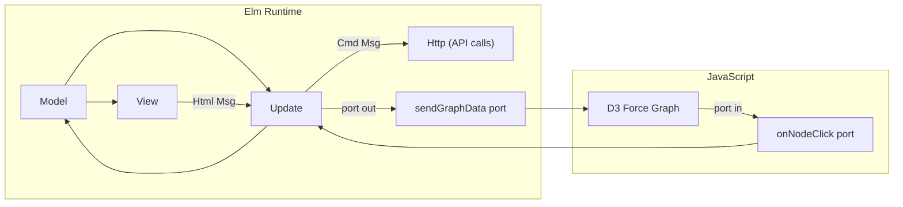

# MPIDS Frontend: Preact to Elm Rewrite

## What stays the same

- **Backend** (`projectA/web/backend/`) — untouched. Same endpoints: `/api/instances`, `/api/generate`, `/api/solve`, `/api/validate`
- **API contract** — identical JSON shapes, 0-based vertex IDs, same request/response types
- **CSS** — `theme.css` and `app.css` can be reused almost verbatim (class names stay the same)
- **Port** — `:8084`

## What changes

The entire `projectA/web/frontend/` directory gets rewritten.

### Architecture: The Elm Architecture (TEA) + Ports




D3 force simulation (zoom, drag, tick loop) cannot run in pure Elm. The solution is **ports**:

- **Outbound port** `sendGraphData`: Elm sends `{ nodes, edges, vertexStatus, manualSet }` to JS whenever the graph or coloring changes
- **Inbound port** `onNodeClick`: JS sends back the clicked node ID
- A small `forceGraph.js` file (adapted from the current `ForceGraph.tsx`) handles D3 initialization, simulation, zoom, drag, and click

### File structure

```
projectA/web/frontend/
  elm.json                    -- Elm dependencies (elm/http, elm/json, elm/browser)
  package.json                -- Vite + vite-plugin-elm (dev/build tooling only)
  vite.config.ts              -- proxy to backend
  index.html                  -- mount point
  src/
    Main.elm                  -- TEA: Model, Msg, init, update, view, subscriptions
    Types.elm                 -- All data types + JSON decoders/encoders
    Api.elm                   -- HTTP requests (getInstances, generate, solve, validate)
    Ports.elm                 -- port declarations (sendGraphData, onNodeClick)
    View/
      Controls.elm            -- Left panel (source, params, algorithm, buttons)
      Results.elm             -- Right panel (stats, validity, trace chart SVG, unsatisfied list)
      Layout.elm              -- Top bar, grid layout, legend
    js/
      forceGraph.js           -- D3 force graph (adapted from ForceGraph.tsx)
      ports.js                -- Wire Elm ports to D3
    styles/
      theme.css               -- Reuse existing (dark theme variables)
      app.css                 -- Reuse existing (layout, forms, stats, etc.)
```

### Key Elm types (mapping from current TypeScript)

```elm
type alias GraphData = { n : Int, edges : List (Int, Int), degrees : List Int }
type alias VertexStatus = { id : Int, inSet : Bool, domNeighbors : Int, needed : Int, satisfied : Bool }
type alias SolveResponse = { dominatingSet : List Int, size : Int, timeMs : Float, nodesExplored : Int, vertexStatus : List VertexStatus, trace : List Int, n : Int, edges : List (Int, Int), degrees : List Int }
type alias InstanceInfo = { name : String, file : String, n : Int, e : Int }
type Source = Instance | Random
type Algorithm = Greedy | LocalSearch
```

### Model (corresponds to App.tsx state)

All of the current `useState` hooks collapse into a single `Model` record:

- `instances`, `source`, `instanceName`, `genN`, `genP`, `genSeed`
- `algorithm`, `iterations`, `temperature`, `cooling`
- `graphData`, `result`, `manualSet` (as `Set Int`), `manualStatus`
- `solving`, `error`
- Panel widths (`leftW`, `rightW`) and drag state

### D3 Port interop ([js/forceGraph.js](projectA/web/frontend/src/js/forceGraph.js))

Adapted from the current `ForceGraph.tsx`:

- On `sendGraphData` port message: tear down old simulation, rebuild nodes/links, set up `forceSimulation`, `forceLink`, `forceManyBody`, `forceCenter`, `forceCollide`, zoom, drag — same parameters as current code
- On node click: call `app.ports.onNodeClick.send(nodeId)`
- On vertex status/manualSet change: update circle fills and titles without rebuilding simulation (same optimization as current second `useEffect`)

### Build tooling

Use **Vite + vite-plugin-elm** for development (HMR, proxy) and production builds. This keeps the same `npm run dev` / `npm run build` workflow and Dockerfile structure.

### Dockerfile changes

Only the frontend build stage changes: install Elm compiler alongside Node in the frontend stage. The Python runtime stage stays identical.

### Portfolio updates

- [PersonalPortfolio/src/data/demos.json](PersonalPortfolio/src/data/demos.json): Update `mpids` tags from `["Preact", "D3.js", ...]` to `["Elm", "D3.js", ...]`
- [dev/frontend_technologies_summary.md](dev/frontend_technologies_summary.md): Rewrite entry #11 from "Preact" to "Elm"
- [PersonalPortfolio/src/pages/demos/mpids.astro](PersonalPortfolio/src/pages/demos/mpids.astro): Update `aboutDescs` to mention Elm instead of Preact

