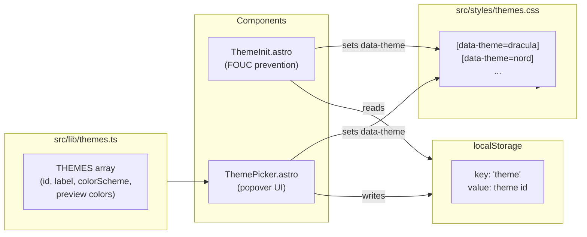

# Multi-Theme System

## Theme Set

10 curated themes (6 dark, 4 light), each mapping to the existing CSS custom property set:

**Dark:**

- **Default Dark** (current) -- indigo/purple accents on near-black
- **Dracula** -- purple/pink/cyan on #282a36
- **Nord** -- frost blue on #2e3440
- **Tokyo Night** -- blue/purple on #1a1b26
- **Catppuccin Mocha** -- mauve/lavender on #1e1e2e
- **One Dark** -- blue/purple on #282c34 (Atom editor theme)

**Light:**

- **Default Light** (current) -- indigo/purple on white
- **Nord Light** -- frost blue on #eceff4
- **Catppuccin Latte** -- mauve/pink on #eff1f5
- **Solarized Light** -- yellow/blue on #fdf6e3

Each theme overrides these 14 properties (already used everywhere in the site):

```
--bg-primary, --bg-primary-rgb, --bg-secondary, --bg-card, --bg-card-hover
--bg-nav, --bg-nav-scrolled
--text-primary, --text-secondary, --text-muted
--accent-start, --accent-end, --accent-gradient
--glow-color, --glow-color-strong
--border-color, --border-color-hover
```

Plus `color-scheme: dark | light` for native form controls.

## Architecture




### File changes

**New: `src/styles/themes.css`** -- One `[data-theme='...']` block per theme. Imported from `global.css`. This keeps theme definitions separate and organized.

**New: `src/lib/themes.ts`** -- Theme metadata (id, label, dark/light flag, two preview hex colors for the swatch). Imported by ThemePicker for rendering and by ThemeInit for the default/fallback list.

```typescript
export interface ThemeMeta {
  id: string;
  label: string;
  colorScheme: 'dark' | 'light';
  preview: [string, string]; // two swatch colors (bg, accent)
}

export const THEMES: ThemeMeta[] = [
  { id: 'dark',             label: 'Default Dark',     colorScheme: 'dark',  preview: ['#0a0a0f', '#6366f1'] },
  { id: 'dracula',          label: 'Dracula',          colorScheme: 'dark',  preview: ['#282a36', '#bd93f9'] },
  { id: 'nord',             label: 'Nord',             colorScheme: 'dark',  preview: ['#2e3440', '#88c0d0'] },
  { id: 'tokyo-night',      label: 'Tokyo Night',      colorScheme: 'dark',  preview: ['#1a1b26', '#7aa2f7'] },
  { id: 'catppuccin-mocha', label: 'Catppuccin Mocha', colorScheme: 'dark',  preview: ['#1e1e2e', '#cba6f7'] },
  { id: 'one-dark',         label: 'One Dark',         colorScheme: 'dark',  preview: ['#282c34', '#61afef'] },
  { id: 'light',            label: 'Default Light',    colorScheme: 'light', preview: ['#f8fafc', '#4f46e5'] },
  { id: 'nord-light',       label: 'Nord Light',       colorScheme: 'light', preview: ['#eceff4', '#5e81ac'] },
  { id: 'catppuccin-latte', label: 'Catppuccin Latte', colorScheme: 'light', preview: ['#eff1f5', '#8839ef'] },
  { id: 'solarized-light',  label: 'Solarized Light',  colorScheme: 'light', preview: ['#fdf6e3', '#b58900'] },
];

export const DEFAULT_THEME = 'dark';
```

**Modified: `src/styles/global.css`** -- The existing `:root` block stays as-is (it IS the default dark theme). The existing `[data-theme='light']` block stays. Add `@import './themes.css';` at the top. The current `data-theme` values `dark` and `light` continue to work unchanged.

**Modified: `src/components/ThemeInit.astro`** -- Instead of just `dark`/`light`, read the full theme id from localStorage and set `data-theme` to it. Fall back to system preference (dark/light) if no saved theme.

**New: `src/components/ThemePicker.astro`** -- Replaces `ThemeToggle.astro`. A button that opens a small popover panel showing all themes as labeled color swatches, grouped into "Dark" and "Light" sections. Clicking a swatch applies the theme instantly and saves to localStorage. Clicking outside or pressing Escape closes the popover.

**Modified: `src/components/Navbar.astro`** -- Replace `ThemeToggle` import/usage with `ThemePicker`.

**Modified: `src/layouts/DemoLayout.astro`** -- Same replacement.

## Picker UI Design

The picker button shows a small palette icon (replaces sun/moon). Clicking it opens a popover:

```
+-----------------------------------+
| Dark                              |
| [##] Default    [##] Dracula      |
| [##] Nord       [##] Tokyo Night  |
| [##] Catppuccin [##] One Dark     |
|-----------------------------------|
| Light                             |
| [##] Default    [##] Nord         |
| [##] Catppuccin [##] Solarized    |
+-----------------------------------+
```

Each `[##]` is a small dual-color circle showing the theme's background and accent. The active theme gets a checkmark or ring highlight. The popover uses `position: absolute` relative to the button, closes on outside click or Escape.

## Migration

- `data-theme="dark"` continues to use `:root` defaults (no explicit selector needed)
- `data-theme="light"` continues to use the existing `[data-theme='light']` block
- New themes get new `[data-theme='...']` selectors in `themes.css`
- localStorage key stays `'theme'`; old values `'dark'` / `'light'` are valid theme ids
- `ThemeToggle.astro` is replaced by `ThemePicker.astro` (the old file can be deleted)

## What stays unchanged

- All CSS custom property names and usage throughout the site -- themes only override values
- The `DemoHeader.astro` `--hdr-from` / `--hdr-to` per-demo gradients
- All 14 demo page scoped styles
- The `LanguagePicker` component

