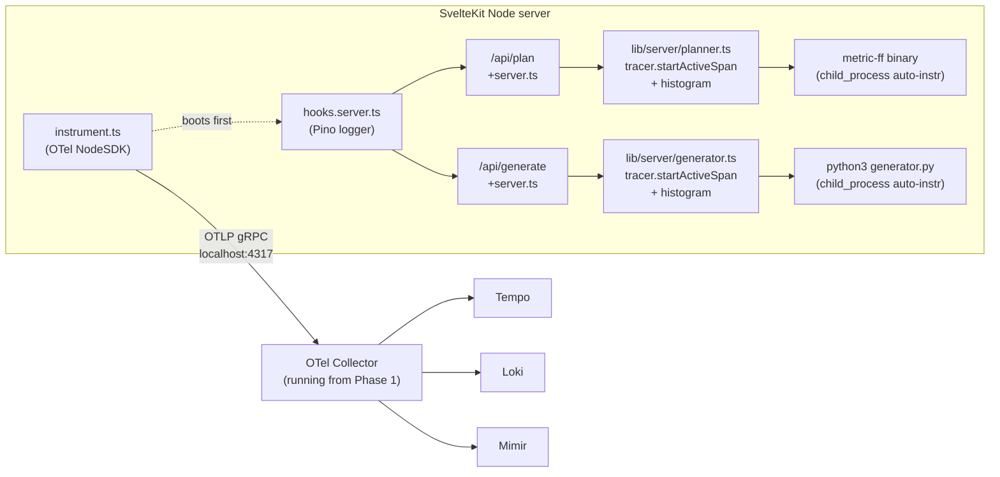

# Phase 2 — Pure OTel SvelteKit instrumentation (Sentry-free)

User decisions feeding this plan:
- **Sentry scope:** uninstall from `web/package.json` on this branch; main keeps Sentry untouched. Branch becomes a clean A/B against main for the Phase 6 comparison.
- **Session-id correlation:** dropped for the PoC. The portfolio's `X-Session-Id` flow is Sentry-shaped; revisit in a possible Phase 7. The dirty `web/src/hooks.server.ts` changes from the prior session (env-aware Sentry sample rate + Sentry session-id handle) get fully reverted.

## Architecture



The `instrument.ts` file is a **no-op when `OTEL_EXPORTER_OTLP_ENDPOINT` is unset** so a developer can still run the app without bringing up the obs stack — the import at the top of `hooks.server.ts` becomes a tiny env-var check.

## Removals (commit 1)

- `npm uninstall @sentry/sveltekit` in `web/`. This also drops `@opentelemetry/instrumentation-*` peers that Sentry had pulled in transitively, freeing the install for OTel v2.
- Discard dirty changes in [web/src/hooks.server.ts](web/src/hooks.server.ts):
  - Drop `import * as Sentry from '@sentry/sveltekit'`
  - Drop `Sentry.init(...)`, `Sentry.setTag('service', 'planificacion')`
  - Drop `sessionIdHandle` (Sentry-specific)
  - Drop `sequence(Sentry.sentryHandle(), ...)` and `Sentry.handleErrorWithSentry()`
- The JSON-line `console.*` wrapper stays for one commit (gets replaced by Pino in commit 2).

## Additions (commit 2 — instrumentation core)

**1. Dependencies** (`npm install`, clean resolve now that Sentry is gone):

```text
@opentelemetry/api
@opentelemetry/api-logs
@opentelemetry/sdk-node
@opentelemetry/sdk-metrics
@opentelemetry/sdk-logs
@opentelemetry/auto-instrumentations-node
@opentelemetry/exporter-trace-otlp-grpc
@opentelemetry/exporter-metrics-otlp-grpc
@opentelemetry/exporter-logs-otlp-grpc
@opentelemetry/resources
@opentelemetry/semantic-conventions
pino
pino-opentelemetry-transport
```

**2. New `web/src/instrument.ts`** — single OTel boot file:

- Early-exits if `OTEL_EXPORTER_OTLP_ENDPOINT` is unset.
- `Resource` attributes: `service.name=planificacion-web`, `service.namespace=planificacion`, `service.version=process.env.GIT_SHA ?? 'dev'`, `deployment.environment=process.env.NODE_ENV ?? 'development'`.
- Auto-instrumentations via `getNodeAutoInstrumentations()` — covers `http`, `https`, `undici`, `fs`, `child_process`, `dns`, `net`. The `child_process` instrumentation is what gets the FF planner and python generator into traces "for free".
- Trace pipeline: `BatchSpanProcessor(OTLPTraceExporter(grpc, OTEL_EXPORTER_OTLP_ENDPOINT))`.
- Metric pipeline: `PeriodicExportingMetricReader(OTLPMetricExporter(grpc, ...))` at 10 s intervals.
- Log pipeline: `BatchLogRecordProcessor(OTLPLogExporter(grpc, ...))`.
- Default sampler: `parentbased_traceidratio` driven by env vars `OTEL_TRACES_SAMPLER` / `OTEL_TRACES_SAMPLER_ARG`.
- Graceful shutdown via `process.on('SIGTERM')` calling `sdk.shutdown()`.

**3. New `web/src/lib/observability/index.ts`** — small facade so the rest of the app doesn't import OTel directly:

```ts
export const tracer = trace.getTracer('planificacion', SERVICE_VERSION);
export const meter = metrics.getMeter('planificacion', SERVICE_VERSION);
export const logger = pino({ ... });   // configured with pino-opentelemetry-transport
export async function withSpan<T>(name, attrs, fn): Promise<T> { ... }
```

`withSpan` automatically calls `recordException` + `setStatus(ERROR)` + `end()` on throw, removing the boilerplate from every hot path.

**4. Rewrite [web/src/hooks.server.ts](web/src/hooks.server.ts)** — Sentry-free:

```ts
import './instrument.js';                 // MUST be first import
import type { Handle, HandleServerError } from '@sveltejs/kit';
import { logger } from '$lib/observability';
import { trace } from '@opentelemetry/api';

export const handle: Handle = async ({ event, resolve }) => resolve(event);

export const handleError: HandleServerError = ({ error, event }) => {
    const span = trace.getActiveSpan();
    if (span) {
        span.recordException(error as Error);
        span.setStatus({ code: SpanStatusCode.ERROR });
    }
    logger.error({ err: error, path: event.url.pathname }, 'unhandled server error');
    return { message: error instanceof Error ? error.message : String(error) };
};
```

The HTTP auto-instrumentation already creates the parent request span — we don't need a custom `Handle` wrapper for tracing, only for error/log capture. The previous JSON-line `console.*` wrapper is removed; Pino takes over.

**5. New `web/.env.obs.example`** — documents the env vars `instrument.ts` reads:

```text
OTEL_EXPORTER_OTLP_ENDPOINT=http://localhost:4317
OTEL_EXPORTER_OTLP_PROTOCOL=grpc
OTEL_RESOURCE_ATTRIBUTES=deployment.environment=local
OTEL_TRACES_SAMPLER=parentbased_traceidratio
OTEL_TRACES_SAMPLER_ARG=1.0
OTEL_LOGS_EXPORTER=otlp
OTEL_METRICS_EXPORTER=otlp
GIT_SHA=$(git rev-parse --short HEAD)
```

**6. New `web/package.json` script** — `dev:obs` that loads the env file and starts vite:

```json
"dev:obs": "node --env-file=.env.obs --import ./src/instrument.ts ./node_modules/.bin/vite dev"
```

`--import` is what makes auto-instrumentation cover **all** SvelteKit-internal imports (not just those after `hooks.server.ts`). The plain `npm run dev` script is left untouched so a Sentry-on-main-style workflow still works locally.

## Additions (commit 3 — hot-path manual spans + RED meters)

**1. [web/src/lib/server/planner.ts](web/src/lib/server/planner.ts)** — wrap `runPlanner()`:

```ts
import { tracer, plannerDurationHistogram, plannerCallsCounter } from '$lib/observability';
import { SpanStatusCode } from '@opentelemetry/api';

export async function runPlanner(domainPath, problemPath): Promise<PlannerResult> {
    return tracer.startActiveSpan('planner.run', {
        attributes: {
            'planner.binary': 'metric-ff',
            'planner.domain': domainPath,
            'planner.problem': problemPath,
        }
    }, async span => {
        const start = performance.now();
        try {
            const result = await execFileAsync(...);
            const planLength = result.planFile?.split('\n').length ?? 0;
            span.setAttributes({
                'planner.found_plan': result.planFile !== null,
                'planner.plan_length_steps': planLength,
            });
            plannerCallsCounter.add(1, { status: 'ok' });
            return result;
        } catch (err) {
            span.recordException(err as Error);
            span.setStatus({ code: SpanStatusCode.ERROR });
            plannerCallsCounter.add(1, { status: 'error' });
            throw err;
        } finally {
            plannerDurationHistogram.record((performance.now() - start) / 1000, { status });
            span.end();
        }
    });
}
```

**2. [web/src/lib/server/generator.ts](web/src/lib/server/generator.ts)** — same pattern with `generator.run` span name and an extra `generator.level` attribute (the difficulty level passed in `params`).

**3. RED meters defined in `lib/observability`:**

- `planificacion_planner_duration_seconds` (histogram, attrs: `status=ok|error`)
- `planificacion_planner_calls_total` (counter, attrs: `status=ok|error`)
- `planificacion_generator_duration_seconds` (histogram, attrs: `status=ok|error`, `level`)
- `planificacion_generator_calls_total` (counter, attrs: `status=ok|error`, `level`)

The HTTP `request_duration_seconds` histogram is emitted automatically by the HTTP auto-instrumentation, so we don't double up.

## Verification

1. `cd web && npm install` — clean resolve, no `--legacy-peer-deps`, no `--force`.
2. `npm run check` — TypeScript compiles cleanly.
3. With the obs stack from Phase 1 running, `npm run dev:obs` then hit `/api/plan` and `/api/generate` from the browser:
   - Grafana > Tempo > Explore, query `{resource.service.name="planificacion-web"}` returns spans named `planner.run`, `generator.run`, plus auto-instr `POST /api/plan` and `child_process exec`.
   - Click a span → "View profile / logs" cross-correlation works (data sources are wired from Phase 1).
   - Grafana > Mimir > Explore, query `planificacion_planner_duration_seconds_count` returns counts; `histogram_quantile(0.99, sum by (le) (rate(planificacion_planner_duration_seconds_bucket[5m])))` shows P99.
   - Grafana > Loki > Explore, query `{service_name="planificacion-web"}` shows JSON log lines with `trace_id` / `span_id` populated, click-through to the corresponding Tempo trace.
4. `npm run dev` (no `:obs`) — app still boots and serves traffic without OTel; no errors in console.

## Commits planned (3 commits, in order, on `obs-experiment-lgtm`)

1. **`Remove @sentry/sveltekit from PoC branch`** — uninstall + revert hooks.server.ts dirty changes back to main's state. Touches `web/package.json`, `web/package-lock.json`, `web/src/hooks.server.ts`.
2. **`Add OTel NodeSDK instrumentation core`** — `web/src/instrument.ts`, `web/src/lib/observability/index.ts`, rewritten `hooks.server.ts`, `web/.env.obs.example`, new `dev:obs` script. Touches package.json (deps).
3. **`Instrument planner + generator hot paths`** — manual spans and RED meter recordings in `lib/server/planner.ts` and `lib/server/generator.ts`.

## Risks / known limitations called out up-front

- **`--import` flag for full coverage.** Top-of-`hooks.server.ts` import covers most modules but a few SvelteKit-internal `import` statements run earlier. The `dev:obs` script uses `--import` to fix that for dev; prod build will need `node --import ./build/instrument.js ./build/index.js` (deferred to Phase 6).
- **Pino transport in worker thread.** `pino-opentelemetry-transport` runs in a worker, so a crash there won't crash the app but will silently drop logs until restart. Acceptable for a PoC.
- **Existing `JSON-line console.*` wrapper consumers.** The PersonalPortfolio log relay reads JSON-lines from stdout. Once Pino takes over, the format becomes Pino's default JSON shape — slightly different keys (`level: 30` instead of `level: 'info'`). On this branch that's fine because the parent portfolio's relay isn't in scope; Phase 6 documents the difference in the comparison artefact.
- **Sentry remains on main.** `git checkout main` returns to the Sentry-instrumented state. Merging this branch back is a deliberate decision deferred to after Phase 6.