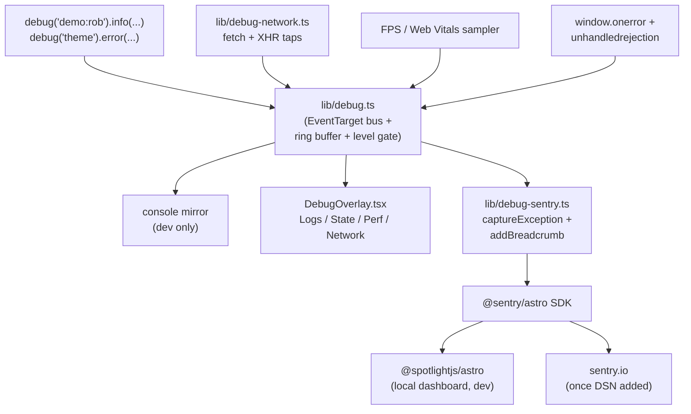

## Final shape (consolidated from discussion)

- **Pattern:** event bus (`EventTarget` singleton).
- **Foundation:** custom (≈150 LOC, zero deps) — keeps every backend swap a one-file change.
- **Backend:** `@sentry/astro` hosted, with `@spotlightjs/astro` for local dashboard testing without an account.
- **Activation:** dev = always-on; prod = opt-in via `?debug=1`, `localStorage.debug='1'`, or `Ctrl+Shift+D`.
- **Signals:** namespaced logs, JS errors + unhandledrejection, live state, FPS / Web Vitals, network requests.

## Architecture



The bus is the single producer surface. Subscribers are added/removed in one
file each. Spotlight intercepts the same SDK events locally → no account
needed to evaluate.

## Files to create

1. `[PersonalPortfolio/src/lib/debug.ts](PersonalPortfolio/src/lib/debug.ts)` — singleton bus.
   - `debug(namespace)` returns `{ trace, info, warn, error }`.
   - Ring buffer (last 500 entries) + per-level filtering.
   - Emits `CustomEvent('debug:log' | 'debug:network' | 'debug:perf' | 'debug:error')` on `window`.
   - Reads enabled state from `window.__DEBUG_ENABLED`.
   - In `import.meta.env.DEV`, always mirrors to `console.*`.

2. `[PersonalPortfolio/src/lib/useDebug.ts](PersonalPortfolio/src/lib/useDebug.ts)` — `useMemo`-wrapped hook returning `debug(ns)` for `.tsx` demos.

3. `[PersonalPortfolio/src/lib/debug-network.ts](PersonalPortfolio/src/lib/debug-network.ts)` — wraps `window.fetch` + `XMLHttpRequest.prototype.open/send` to emit `'debug:network'` events with `{method, url, status, ok, durationMs, startedAt}`. Installed only when debug is enabled.

4. `[PersonalPortfolio/src/lib/debug-sentry.ts](PersonalPortfolio/src/lib/debug-sentry.ts)` — bus subscriber that maps:
   - `info` → `Sentry.addBreadcrumb({ level: 'info', ... })`
   - `warn` → `Sentry.addBreadcrumb({ level: 'warning', ... })`
   - `error` → `Sentry.captureException(err)` (or `captureMessage` if no Error)
   - network events → `Sentry.addBreadcrumb({ category: 'fetch', ... })`

5. `[PersonalPortfolio/src/components/DebugInit.astro](PersonalPortfolio/src/components/DebugInit.astro)` — `<script is:inline>` that:
   - Computes `__DEBUG_ENABLED` from `URLSearchParams.debug` / `localStorage.debug` (mirrors pattern from `[PersonalPortfolio/src/components/ThemeInit.astro](PersonalPortfolio/src/components/ThemeInit.astro)` lines 33–50).
   - Always-on in `import.meta.env.DEV`.
   - Installs `window.addEventListener('error' | 'unhandledrejection', ...)` with a pre-init queue drained once `lib/debug.ts` loads.
   - Registers `Ctrl+Shift+D` toggle.
   - Lazy-loads overlay + network tap + Sentry subscriber on first activation.

6. `[PersonalPortfolio/src/components/DebugOverlay.tsx](PersonalPortfolio/src/components/DebugOverlay.tsx)` — React island (`client:idle`) with tabs:
   - **Logs** — namespace + level filters, copy-as-JSON, clear.
   - **State** — theme, design, lang, route, viewport, base URL.
   - **Perf** — live FPS via `requestAnimationFrame`, `PerformanceNavigationTiming` summary, `performance.memory` if available.
   - **Network** — recorded requests with method/URL/status/duration; click to expand.
   - Styled with existing CSS variables (`--bg-card`, `--text-primary`, `--accent-start`) so it auto-adapts to all themes/designs.

7. `[PersonalPortfolio/src/__tests__/debug.test.ts](PersonalPortfolio/src/__tests__/debug.test.ts)` — vitest (already configured):
   - Namespace filtering (`'demo:rob:fk'` matched by `'demo:rob:*'`).
   - Level gating.
   - Ring-buffer eviction.
   - `fetch` interception via `vi.stubGlobal('fetch', ...)`.
   - Subscriber ordering.

## Files to modify

- `[PersonalPortfolio/astro.config.mjs](PersonalPortfolio/astro.config.mjs)` — add `sentry()` and `spotlight()` integrations:

  ```ts
  import sentry from '@sentry/astro';
  import spotlight from '@spotlightjs/astro';

  integrations: [
    react(),
    sitemap(),
    cnameIntegration,
    sentry({
      dsn: import.meta.env.PUBLIC_SENTRY_DSN ?? 'https://test@test/0',
      environment: import.meta.env.DEV ? 'local' : 'production',
      tracesSampleRate: import.meta.env.DEV ? 1.0 : 0.1,
      replaysSessionSampleRate: 0,  // off until you opt in
      replaysOnErrorSampleRate: 1.0,
    }),
    spotlight(),  // Astro auto-strips it from production builds
  ],
  ```

- `[PersonalPortfolio/package.json](PersonalPortfolio/package.json)` — add `@sentry/astro` and `@spotlightjs/astro` to dependencies.

- `[PersonalPortfolio/src/layouts/Layout.astro](PersonalPortfolio/src/layouts/Layout.astro)` — add `<DebugInit />` next to `<ThemeInit position="head" />` on line 31.

- `[PersonalPortfolio/src/layouts/DemoLayout.astro](PersonalPortfolio/src/layouts/DemoLayout.astro)` — same insertion alongside `<ThemeInit position="head" />` on line 52.

- `[PersonalPortfolio/src/components/ThemeInit.astro](PersonalPortfolio/src/components/ThemeInit.astro)` — replace the two `console.error` calls (lines 96 and 108) with `window.__debug?.error('theme', ...)`.

## Public API the call sites use

```ts
import { debug } from '@/lib/debug';

const log = debug('demo:rob');
log.info('Loaded URDF', { joints: 6 });
log.warn('FK fell back to identity matrix');
log.error('Babylon engine failed to init', err);
```

```tsx
import { useDebug } from '@/lib/useDebug';
const log = useDebug('demo:phase-transitions');
useEffect(() => { log.trace('mounted'); }, [log]);
```

## Implementation order

1. Install deps: `npm install @sentry/astro @spotlightjs/astro`.
2. Wire `astro.config.mjs` with both integrations and a placeholder DSN.
3. Build `lib/debug.ts` + `lib/useDebug.ts` + tests; verify with `npm test`.
4. Build `components/DebugInit.astro` + activation logic.
5. Build `lib/debug-network.ts` and `lib/debug-sentry.ts`.
6. Build `components/DebugOverlay.tsx`.
7. Wire both layouts + replace `ThemeInit.astro` `console.error` calls.
8. Smoke test: `npm run dev`, click Spotlight icon, trigger demo error, confirm overlay + Spotlight both show it.
9. (Optional, later) swap fake DSN for real Sentry DSN in `.env`.

## Confirm before I start

- **DSN strategy**: use `import.meta.env.PUBLIC_SENTRY_DSN` env var with the placeholder `https://test@test/0` baked into `astro.config.mjs` as a fallback so Spotlight works out of the box on any clone — yes/no?
- **Per the user rules**: I will not run `git commit` / `git push`. I will run `npm install` (treating that as a normal package-manager add). OK?
