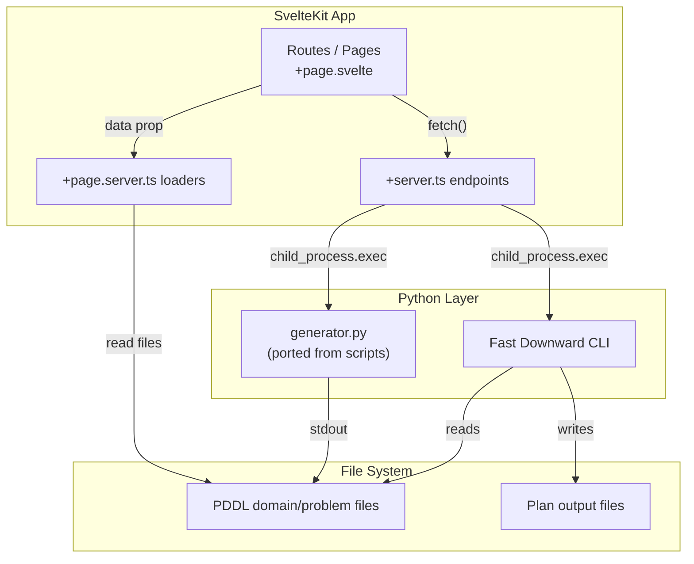

# Planning Practice Web UI (SvelteKit)

## Why SvelteKit

This becomes entry **#7** in [frontend_technologies_summary.md](dev/frontend_technologies_summary.md):

- **Architecture:** Full-stack SvelteKit (SSR + API routes) -- no separate backend framework needed
- **Key differentiators vs existing portfolio:** Svelte 5 runes reactivity, compiled framework (zero runtime overhead), file-based routing with server endpoints, form actions
- **Contrast with TFG's React:** No virtual DOM, no useState/useEffect -- reactive by default with `$state()` / `$derived()` / `$effect()`

## Tech Stack


| Layer         | Technology                                                          | Why                                                 |
| ------------- | ------------------------------------------------------------------- | --------------------------------------------------- |
| Framework     | **SvelteKit** (Svelte 5 with runes)                                 | New portfolio entry, full-stack capable             |
| Styling       | **Tailwind CSS v4**                                                 | Familiar utility framework, works great with Svelte |
| Code Editor   | **svelte-codemirror-editor** + `@codemirror/lang-json`              | PDDL syntax highlighting in the file editor         |
| Graph Viz     | **vis-network**                                                     | Interactive city/flight network visualization       |
| Python bridge | SvelteKit `+server.ts` endpoints calling Python via `child_process` | No separate FastAPI server needed                   |
| Planner       | **Fast Downward** (installed as CLI)                                | Supports STRIPS + numeric fluents                   |


**No separate FastAPI backend** -- SvelteKit's server endpoints (`+server.ts`) handle everything: calling Python generators, reading/writing PDDL files, invoking the planner. This is a key architectural difference from TFG and showcases SvelteKit's full-stack capabilities.

## Architecture




## Directory Structure

```
Practica_de_Planificacion/
├── Basico/                    # existing
├── Extension_1..4/            # existing
├── Extra_2/                   # existing
└── web/
    ├── src/
    │   ├── lib/
    │   │   ├── components/
    │   │   │   ├── PddlEditor.svelte      # CodeMirror wrapper
    │   │   │   ├── GraphPreview.svelte     # vis-network city graph
    │   │   │   ├── PlanSteps.svelte        # parsed plan display
    │   │   │   └── FileTree.svelte         # sidebar file browser
    │   │   ├── server/
    │   │   │   ├── generator.ts            # calls Python generator
    │   │   │   ├── planner.ts              # calls Fast Downward
    │   │   │   └── files.ts                # PDDL file read/write
    │   │   └── pddl.ts                     # lightweight PDDL parser (extracts objects, predicates, graph edges)
    │   ├── routes/
    │   │   ├── +layout.svelte              # nav sidebar + dark theme
    │   │   ├── +page.svelte                # redirect or landing
    │   │   ├── generate/
    │   │   │   ├── +page.svelte            # generator form UI
    │   │   │   └── +page.server.ts         # list extensions
    │   │   ├── editor/
    │   │   │   ├── +page.svelte            # file tree + code editor
    │   │   │   └── +page.server.ts         # list PDDL files
    │   │   ├── planner/
    │   │   │   ├── +page.svelte            # run planner UI
    │   │   │   └── +page.server.ts         # list domain/problem pairs
    │   │   └── api/
    │   │       ├── generate/+server.ts     # POST: run generator
    │   │       ├── files/+server.ts        # GET/PUT: read/save PDDL
    │   │       └── plan/+server.ts         # POST: run planner
    │   └── app.html
    ├── generator.py                        # ported from scriptinstancias*.py (programmatic, not interactive)
    ├── package.json
    ├── svelte.config.js
    ├── vite.config.ts
    ├── tailwind.config.ts
    └── tsconfig.json
```

## Key Implementation Details

### generator.py (ported Python)

Port all 5 script levels into a single `generator.py` with a CLI interface (argparse, no interactive `input()`):

```bash
python generator.py --level basico --cities 5 --min-cities 3 --flights 6 --hotels 5
python generator.py --level ext4 --cities 5 --min-cities 3 --flights 6 --hotels 5 \
  --min-days 1 --max-days 3 --min-total-days 5 --min-price 100 --max-price 500
```

Outputs PDDL to stdout. The SvelteKit server endpoint captures it and either returns it to the UI or writes it to disk.

### PDDL Parser (`src/lib/pddl.ts`)

Lightweight TypeScript parser that extracts from a PDDL problem file:

- Objects (cities, flights, hotels) for graph nodes
- `va_a` predicates for graph edges (flight routes)
- `esta_en` predicates for hotel-city associations
- Numeric fluents (prices, interest, days) for node labels

This powers the instant graph preview in the generator and visualizer tabs.

### Plan Parser

Parse Fast Downward output to extract:

- Plan steps (action name + parameters)
- Total cost / metric value
- Route sequence for highlighting on the graph

### Planner Installation

Fast Downward will be built from source (C++/Python) into `web/tools/fast-downward/`. The server endpoint calls it as:

```bash
python fast-downward.py --alias seq-opt-fdss-1 domain.pddl problem.pddl
```

If not installed, the Planner tab shows an install guide / offers to run the build script.

## Pages / Tabs

### 1. Generate (`/generate`)

- Dropdown to select extension level (Basico, Ext 1-4)
- Dynamic form: fields appear/disappear based on level (e.g., price fields only for Ext 3+)
- "Generate" button produces PDDL in a preview pane (CodeMirror, read-only)
- Live graph preview (vis-network) showing the generated city/flight network
- "Save to File" button writes to disk (user picks filename)

### 2. Editor (`/editor`)

- Left sidebar: file tree of all `*.pddl` files across Basico/, Extension_*/, Extra_2/
- Main area: CodeMirror editor with PDDL syntax highlighting
- Save button (writes back to disk via API)
- Graph preview toggle for problem files

### 3. Planner (`/planner`)

- Dropdowns to select domain file and problem file
- "Run Planner" button
- Output panel: raw planner output + parsed plan steps
- Graph visualization with the planned route highlighted
- Trip summary: total cities, days, cost, interest (depending on extension level)

## Update to Portfolio Summary

After building, add entry #7 to [frontend_technologies_summary.md](dev/frontend_technologies_summary.md):

```markdown
## 7. SvelteKit (Svelte 5)
**Project:** `Practica_de_Planificacion` (PDDL Planning Web Interface)
- **Architecture:** Full-stack SvelteKit (SSR + API routes)
- **Use Case:** Interactive PDDL problem generation, editing, and automated planning visualization.
- **Key Features:** Svelte 5 runes ($state, $derived, $effect), file-based routing, server endpoints replacing a separate backend, CodeMirror integration, vis-network graph visualization.
- **Pros:** Compiled framework with zero runtime overhead; full-stack without a separate backend; intuitive reactivity model; excellent performance.
- **Cons:** Smaller ecosystem than React; fewer job listings (though growing); some libraries require manual integration.
```

