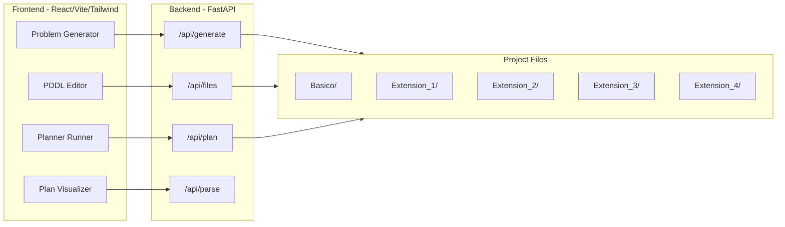

# Web Interface for Practica de Planificacion

## Architecture

## Directory Structure

All new files go under `/home/pol/cuberhaus/Practica_de_Planificacion/web/`:

- `web/backend/main.py` -- FastAPI server
- `web/backend/generator.py` -- Port of all 5 `scriptinstancias*.py` into callable functions
- `web/backend/parser.py` -- PDDL problem/plan parser (extracts cities, flights, hotels, plan steps)
- `web/backend/requirements.txt` -- FastAPI, uvicorn
- `web/frontend/` -- React + Vite + TypeScript + Tailwind app

## Backend Endpoints

- `**GET /api/extensions**` -- List available extensions with metadata (name, features, description)
- `**GET /api/files?extension=Basico**` -- List PDDL files in a given extension folder
- `**GET /api/files/{extension}/{filename}**` -- Read a PDDL file
- `**PUT /api/files/{extension}/{filename}**` -- Save edits to a PDDL file
- `**POST /api/generate**` -- Generate a PDDL problem from form parameters; returns the PDDL text and optionally saves it
- `**POST /api/plan**` -- Run a planner (configurable command) on a domain+problem pair; returns the plan text
- `**POST /api/parse**` -- Parse a PDDL problem file and extract the graph structure (cities, flights, hotels, costs, interests) for visualization

## Frontend Pages / Tabs

### 1. Problem Generator

- Extension selector dropdown (Basico, Extension 1-4)
- Dynamic form that adapts per extension:
  - **All**: num cities, min cities to visit, num flights, num hotels
  - **Ext 1+**: min/max days per city, min total trip days
  - **Ext 2+**: (interest auto-generated, shown as preview)
  - **Ext 3+**: min/max plan price
- "Generate" button produces PDDL text shown in a preview panel
- "Save to file" button writes it to the extension folder
- The graph of the generated problem is shown immediately (cities as nodes, flights as edges, hotels as labels)

### 2. File Browser / Editor

- Sidebar tree of all extension folders and their PDDL files
- Monospace text editor with PDDL syntax coloring (keywords like `:domain`, `:objects`, `:init`, `:goal`, `:action`, `:metric` highlighted)
- Save button

### 3. Plan Runner

- Select a domain file and a problem file (from dropdowns populated by the file browser)
- "Run Planner" button
  - Backend attempts to run a configurable planner command (default: `metric-ff` or `fast-downward`)
  - If no planner is installed, shows a clear message with install instructions
- Plan output shown as:
  - Raw text log
  - Parsed step list: "Step 1: anadir_ciudad cg1 c2 v1 h2 dias3"

### 4. Plan Visualizer

- Interactive network graph (using a lightweight library like `react-force-graph-2d` or `vis-network`)
- Cities = nodes (hub `cg1` highlighted differently)
- Flights = directed edges between cities (labeled with flight name + price if available)
- Hotels = shown as badges/labels on city nodes
- When a plan is available: the planned route is highlighted as a thick colored path with step numbers
- Side panel shows trip summary: total cities, total days, total cost, total interest

## Key Design Decisions

- **Generator logic**: Port the Python `scriptinstancias*.py` logic into clean functions in `web/backend/generator.py` so they can be called programmatically (no stdin prompts). The Extension 4 generator is a superset of all others, so one unified function with an `extension_level` parameter controls which features are included.
- **Planner**: Make the planner command configurable via an environment variable (`PLANNER_CMD`). Default behavior if not set: show "no planner configured" with instructions for installing Metric-FF (good for numeric PDDL). The planner feature is fully optional -- the rest of the app works without it.
- **PDDL parsing**: A lightweight regex-based parser in `parser.py` extracts objects, predicates (`va_a`, `esta_en`), and function values from problem files -- enough to build the graph. No full PDDL parser needed.
- **Styling**: Dark theme similar to the TFG dashboard for consistency. Tailwind CSS.

## Tech Stack

- **Frontend**: React 19, Vite, TypeScript, Tailwind CSS, `@uiw/react-codemirror` for the editor, `vis-network` (via `vis-network/standalone`) for graph visualization
- **Backend**: FastAPI, uvicorn, Python standard library only (no external PDDL libraries needed)

