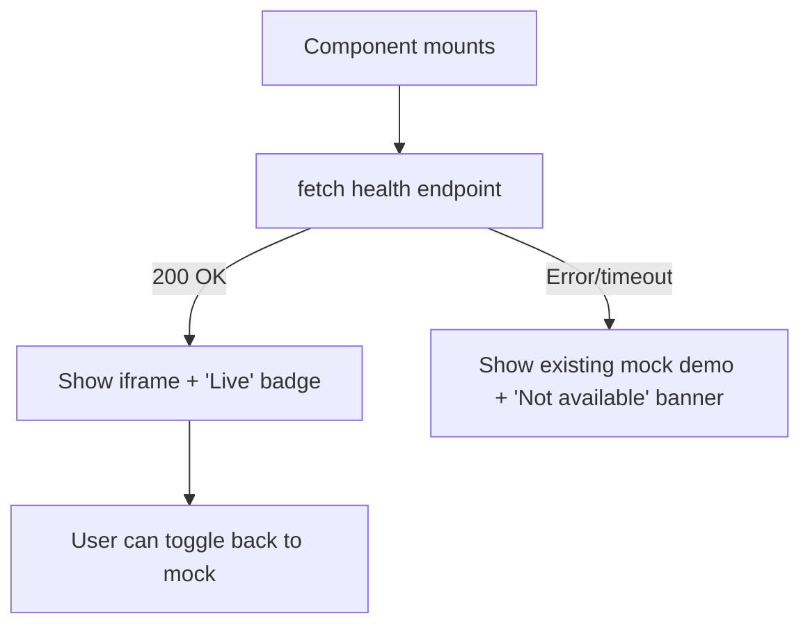

# Portfolio: Auto-Detect and Iframe Local Docker Apps

## Architecture

Each of the 4 demo pages already has a React demo component with mock/interactive content. We will wrap them with a detection layer that:

1. On mount, pings the local Docker service's health endpoint
2. If reachable: renders a full-page iframe of the real web app
3. If unreachable: renders the existing mock demo as-is, with a small banner explaining the local app is not running

## Service endpoints (health check + iframe URL)

- **TFG**: health `http://localhost:8082/api/status`, iframe `http://localhost:8082`
- **bitsXlaMarato**: health `http://localhost:8001/api/status`, iframe `http://localhost:8001`
- **pracpro2**: health `http://localhost:8000/api/status`, iframe `http://localhost:8000`
- **Practica de Planificacion**: health `http://localhost:3000`, iframe `http://localhost:3000`

## Key files to create/modify

### New shared component

- `**[src/components/demos/LocalAppEmbed.tsx](PersonalPortfolio/src/components/demos/LocalAppEmbed.tsx)`** (new): Reusable React component that:
  - Props: `healthUrl`, `iframeUrl`, `appName`, `dockerCmd`, `children` (the mock fallback)
  - Calls `fetch(healthUrl, { mode: 'no-cors', signal: AbortSignal.timeout(2000) })` on mount
  - On success: shows a styled card with a "Live" badge, the iframe (full-width, ~80vh height), and a "Show mock instead" toggle
  - On failure: shows the children (existing mock) with a subtle top banner: "Local app not detected. Run `{dockerCmd}` to see the live version." styled consistently with existing demo card theme
  - Re-checks periodically (every 10s) so switching Docker on/off is reflected without page reload

### Modified demo pages (4 files)

Each page wraps its existing `<XxxDemo>` component inside `<LocalAppEmbed>`:

- `**[src/pages/demos/tfg-polyps.astro](PersonalPortfolio/src/pages/demos/tfg-polyps.astro)`**
  - `healthUrl="http://localhost:8082/api/status"`, `iframeUrl="http://localhost:8082"`, `dockerCmd="cd TFG && make docker-up"`
- `**[src/pages/demos/bitsx-marato.astro](PersonalPortfolio/src/pages/demos/bitsx-marato.astro)`**
  - `healthUrl="http://localhost:8001/api/status"`, `iframeUrl="http://localhost:8001"`, `dockerCmd="cd bitsXlaMarato && make docker-up"`
- `**[src/pages/demos/pro2.astro](PersonalPortfolio/src/pages/demos/pro2.astro)`**
  - `healthUrl="http://localhost:8000/api/status"`, `iframeUrl="http://localhost:8000"`, `dockerCmd="cd pracpro2 && make docker-run"`
- `**[src/pages/demos/planificacion.astro](PersonalPortfolio/src/pages/demos/planificacion.astro)**`
  - `healthUrl="http://localhost:3000"`, `iframeUrl="http://localhost:3000"`, `dockerCmd="cd Practica_de_Planificacion && make docker-run"`

### CORS: Backend changes (3 files)

The health-check `fetch` from `localhost:4321` (Astro dev) to `localhost:8082` etc. is cross-origin. The backends need to allow it. All 3 Python backends already use FastAPI with a CORS middleware -- we just need to verify `localhost:4321` is allowed or that `allow_origins=["*"]` is set. The SvelteKit app (port 3000) serves HTML so the iframe will work, and for the health check we can use `mode: "no-cors"` (opaque response, but no error = service is up).

- Verify/update CORS in `[TFG/backend/main.py](TFG/backend/main.py)`
- Verify/update CORS in `[bitsXlaMarato/web/backend/app.py](bitsXlaMarato/web/backend/app.py)`
- Verify/update CORS in `[pracpro2/web/app.py](pracpro2/web/app.py)`

### Localized router update

- `**[src/pages/[lang]/demos/[demo].astro](PersonalPortfolio/src/pages/[lang]/demos/[demo].astro)**`: No changes needed -- it delegates to the same `.astro` page components which will now include `LocalAppEmbed`.

## UX Details

- **Live state**: Green "LIVE" pill badge at top, full-width iframe with subtle border, small "Show mock demo" text button below
- **Offline state**: Amber/muted banner at top of the existing mock: "Local app not running -- start it with `docker compose up` to see the live version", then the full mock demo renders underneath unchanged
- **Toggle**: When live, user can click "Show mock demo" to see the original interactive mock (useful for GitHub Pages visitors who want to understand what the mock does)
- The banner/iframe styling reuses existing CSS variables (`--bg-card`, `--border-color`, `--text-muted`, etc.) for theme consistency

## What stays the same

- All existing mock React components are untouched (no logic changes)
- `demos.json` / `demos.es.json` / `demos.ca.json` entries unchanged
- Tests pass without modification (no new slugs, no removed pages)
- GitHub Pages deployment works exactly as before (health checks fail = mocks shown)

