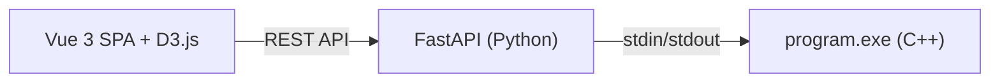

# Web Interface for pracpro2

## Architecture




Vue 3 loaded via CDN (no build step). The backend keeps the C++ subprocess alive for the duration of a session. Commands are sent to stdin; output is read until the `OPCIONS:` delimiter and parsed into structured JSON.

## Key Files

- **C++ program**: [program.cc](c:\Users\polcg\cuberhaus\pracpro2\program.cc) -- command loop reads from stdin, prints `# command args` echo + result + blank line + OPCIONS menu after each command
- **Build**: [Makefile](c:\Users\polcg\cuberhaus\pracpro2\Makefile) -- `make program.exe` with g++C++11
- **Test data**: [jocs_de_prova/entrada.txt](c:\Users\polcg\cuberhaus\pracpro2\jocs_de_prova\entrada.txt) / [correct.txt](c:\Users\polcg\cuberhaus\pracpro2\jocs_de_prova\correct.txt)

## Files to Create

```
pracpro2/web/
  app.py              # FastAPI backend
  requirements.txt    # fastapi, uvicorn
  static/
    index.html        # Vue 3 app shell (CDN imports for Vue + D3)
    style.css         # Dark modern theme
    app.js            # Vue 3 Composition API app + D3.js tree rendering
```

## Backend Design (`app.py`)

- **Startup**: Build `program.exe` via `make`, spawn subprocess with `k` value
- **Session management**: One global subprocess (single-user). On `/api/reset` or new `k`, kill and respawn
- `**POST /api/command`**: Accept `{"command": "...", "args": [...]}`, write to stdin, read stdout lines until `OPCIONS:` marker, strip echo/menu, return `{"output": "...", "lines": [...]}`
- **Output parsing**: Use a thread to read stdout into a queue (avoids blocking). After sending a command, drain lines until OPCIONS block ends
- **Endpoints for structured data**:
  - `POST /api/init` -- send `k`, spawn process
  - `POST /api/command` -- generic command dispatch
  - `GET /api/status` -- check if process is alive

## Frontend Design (Vue 3 + D3.js)

**Stack:** Vue 3 via CDN (`vue.esm-browser.prod.js`), Composition API with `setup()`, D3.js v7 via CDN. No build step, no Node.js required.

**Vue App Structure:**

- **Reactive state**: `ref()` / `reactive()` for selected command, form inputs, output history, process status
- **Computed**: Dynamic form fields based on selected command
- **Methods**: `sendCommand()`, `parseDistanceTable()`, `parseTree()`, `resetProcess()`
- **Template**: Uses `v-for` for command sidebar, `v-if`/`v-show` for conditional form fields, `v-model` for inputs

**Layout:**

- Sidebar with command buttons grouped into 3 categories (Species, Clusters, Tree). Main area split into input form + output panel
- Command forms: Dynamic form based on selected command (e.g., `crea_especie` shows two text inputs for id and gene; `lee_cjt_especies` shows a textarea for bulk input)

**Output rendering:**

- **Species list** (`imprime_cjt_especies`): Vue-rendered `<table>` with `v-for` rows (id | gene)
- **Distance table** (`tabla_distancias`, `inicializa_clusters`): Parsed into a reactive matrix, rendered as an HTML table with species IDs as headers
- **Phylogenetic tree** (`imprime_arbol_filogenetico`): Parse bracket notation into `{name, distance, children}`, render as SVG dendrogram via D3.js (mounted in a `ref` container)
- **Cluster print** (`imprime_cluster`): Same tree rendering
- **Errors**: Highlighted in red via conditional class binding
- **Raw output**: Always available as fallback toggle below the rendered view

**Styling:** Dark-themed, monospace for data, clean sans-serif for UI. Responsive layout.

## Output Parsing Details

The C++ program output after each command follows this pattern:

```
# command args        <-- echo line (strip)
<actual output>       <-- capture this
                      <-- blank line
OPCIONS:              <-- delimiter (strip everything from here)
crea_especie
...
fin
```

The backend reads lines in a loop, collecting everything between the echo line and the OPCIONS block.

## Tree Bracket Notation Parser

The phylogenetic tree format: `[(acdbe, 45.7951) [(acd, 43.695) [(ac, 35.7143) [a][c]][d]][(be, 41.9355) [b][e]]]`

Recursive grammar:

- `[id]` = leaf node
- `[(id, dist) left right]` = internal node with two children

The JS parser builds a `{name, distance, children}` object, then D3.js renders it as a horizontal dendrogram with branch lengths proportional to distances.

## Frontend Technologies Summary Entry

New section 7 in `dev/frontend_technologies_summary.md`:

- **Tech:** Vue 3 (CDN, Composition API) + D3.js
- **Project:** `pracpro2`
- **Architecture:** SPA with a decoupled REST API (FastAPI) wrapping a C++ CLI backend via subprocess
- **Use Case:** Interactive academic tool for phylogenetic tree construction via WPGMA clustering
- **Key Features:** CDN-only Vue 3 (no build step), reactive forms, D3.js dendrogram visualization, real-time subprocess communication
- **Pros:** Lightweight setup, reactive data binding without build tooling, good portfolio diversity
- **Cons:** CDN-based Vue lacks SFC support and IDE tooling; D3 integration requires manual DOM management outside Vue's reactivity

