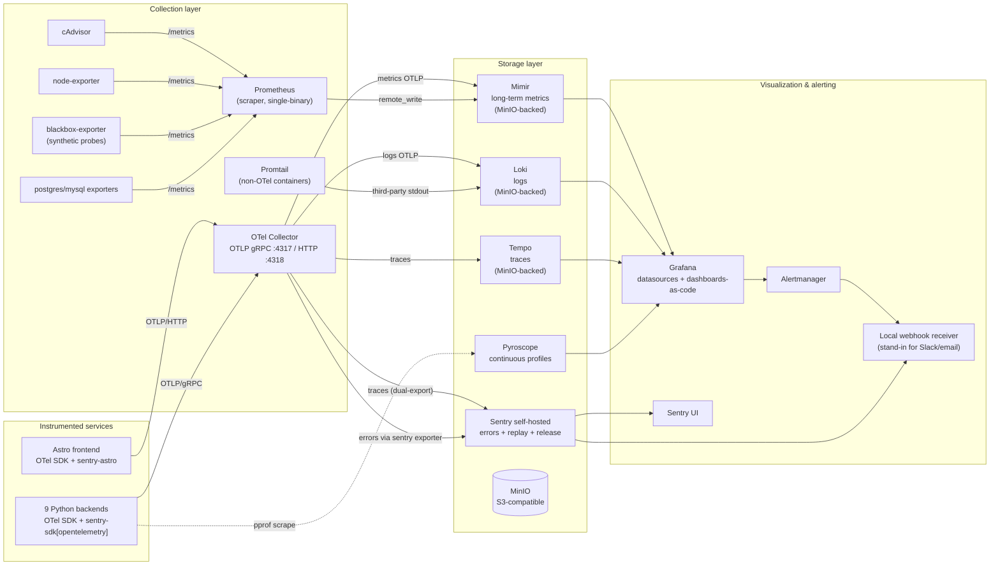

## Verdict on the Sentry work

**Not wasted.** Every line of existing Sentry instrumentation stays. The change is what *produces* the spans/metrics/logs (OTel SDK, not Sentry SDK directly) and where they *land* (LGTM in addition to Sentry, not instead of it). Sentry retains exclusive ownership of errors, session replay, release health, and a portion of profiling — it has no real OSS competitor on those signals, so dropping it would lose capability.

This plan **supersedes** [signal-completeness-additions](.cursor/plans/signal-completeness-additions_cefcd9ec.plan.md), which becomes a strict subset.

## Target architecture



### Why this exact shape (production canon)

- **OTel as instrumentation** — vendor-neutral; one SDK across all services; `service.name` / `deployment.environment` / `service.version` are OTel-semconv resource attributes that propagate to every backend automatically.
- **Dual-export of traces** — Tempo gives Grafana-native trace exploration with TraceQL; Sentry keeps trace-to-issue, trace-to-replay, and trace-to-profile correlation. Cloudflare and similar OSS-leaning teams run this exact pattern.
- **Mimir over plain Prometheus** — single-binary mode for now, but Mimir's API and storage model is what real production runs at scale. Same dashboards, S3-compatible backend (MinIO locally, S3/GCS in prod).
- **MinIO for object storage** — emulates the S3-compatible layer Loki/Tempo/Mimir all expect in real prod. Teaches the right deployment shape; running these on plain volumes is what hobbyists do, not what production runs.
- **Promtail alongside OTel logs** — production-realistic: OTel-instrumented services push logs via OTLP, third-party containers (postgres, redis, the Sentry stack itself) get tailed by Promtail. Both terminate at Loki.
- **cAdvisor + node-exporter + blackbox-exporter + db exporters** — the canonical Prometheus exporter set. Synthetic probes (blackbox) are how real teams answer "is the service reachable from outside?".
- **Pyroscope for OSS profiling** — Grafana's profiling backend, native datasource. Sentry's profiling stays for cross-trace correlation; Pyroscope adds always-on continuous profiling.
- **Alertmanager as the dedicated router** — Grafana Alerting writes rules; Alertmanager handles routing/grouping/silencing. Production canon (running Grafana Alerting alone is the shortcut).
- **Dashboards-as-code, recording-rules-as-code, alerts-as-code** — every config under `PersonalPortfolio/observability/` and provisioned via files. UI editing is forbidden by convention. This is THE production-grade discipline that makes the rest of the stack actually maintainable.

## Tech picks at each layer (with discarded alternatives)

### Instrumentation backbone
- **OpenTelemetry SDK — picked.** Universal in 2026, every framework auto-instrumented, W3C `traceparent` propagation. The Sentry-SDK-native `sentry-trace` header keeps working alongside (Sentry SDKs accept both).
- *Discarded:* direct `sentry_sdk.start_span` (locks instrumentation to Sentry); Datadog/New Relic agents (vendor-locked).

### Trace storage
- **Tempo + Sentry (dual-export) — picked.** TraceQL on Tempo, issue-correlation on Sentry.
- *Discarded:* Jaeger (older, less Grafana-integrated), Tempo-only (loses Sentry replay/profile correlation).

### Metric storage
- **Mimir single-binary — picked.** Grafana Labs' canonical L-in-LGTM "M" (Mimir/Metrics).
- *Discarded:* VictoriaMetrics (faster but smaller community), Prometheus + Thanos (older pattern), Cortex (deprecated in favor of Mimir).

### Log storage
- **Loki — picked.** LogQL, MinIO-backed, native Grafana datasource.
- *Discarded:* Elastic/OpenSearch (heavier), ClickHouse + SigNoz (newer pattern, less standard).

### Object storage
- **MinIO — picked.** S3-API drop-in, mirrors prod cloud setup.
- *Discarded:* filesystem volumes (does not represent prod).

### Profiling
- **Pyroscope (OSS) + Sentry profiling (kept) — picked.** Pyroscope is the LGTM-native profiler; Sentry's profiling stays for trace-to-profile correlation.
- *Discarded:* Pyroscope-only (loses Sentry trace correlation).

### Error tracking + replay + release health
- **Sentry — picked.** No OSS competitor on session replay; release health and issue grouping are best-in-class.
- *Discarded:* GlitchTip (limited), HyperDX (newer, fewer features).

### Container / host / synthetic / db metrics
- **cAdvisor + node-exporter + blackbox-exporter + postgres-exporter + mysql-exporter — picked.** Canonical Prometheus exporter set.
- *Discarded:* Netdata (single-tool replacement, breaks the production pattern).

### Logs ingest path
- **OTLP via Collector (instrumented services) + Promtail (third-party) — picked.** Both terminate in Loki.
- *Discarded:* Loki Docker driver (works, but harder to manage than Promtail-as-container).

### Alerting
- **Grafana Alerting (rule authoring) + Alertmanager (routing) + local webhook receiver (mock destination) — picked.** Alertmanager is what real prod runs; mock receiver replaces Slack/email until you wire one up.
- *Discarded:* PagerDuty/Opsgenie (real prod, but no need locally).

### Dashboards
- **Grafana, dashboards as JSON files — picked.** Provisioned via `grafana/provisioning/`. Editable in UI but committed in git; "drift" caught by CI.

## File-and-folder layout

```
PersonalPortfolio/
  docker-compose.observability.yml   # OTel collector + LGTM + Pyroscope + Alertmanager + MinIO + Grafana
  docker-compose.exporters.yml       # cAdvisor + node-exporter + blackbox + Promtail + db exporters
  docker-compose.metrics-mock.yml    # local webhook receiver for alerts
  observability/
    README.md                        # architecture, runbook, datasource matrix
    otel-collector/config.yaml
    prometheus/{prometheus.yml,recording-rules.yml,alert-rules.yml}
    mimir/config.yaml
    loki/config.yaml
    tempo/config.yaml
    pyroscope/config.yaml
    promtail/config.yaml
    alertmanager/alertmanager.yml
    blackbox-exporter/config.yml
    grafana/
      provisioning/{datasources,dashboards,alerting}/*.yaml
      dashboards/{red-method,use-method,containers,slo,traces,logs}/*.json
    minio/init.sh                    # creates buckets: loki, tempo, mimir
  scripts/sentry-snippets/
    _obs.py                          # NEW canonical helper (OTel + Sentry combined)
    _sentry_obs.py                   # deprecated re-export shim, kept one cycle
  sentry.client.config.ts            # add OTel browser tracer side-by-side
  sentry.server.config.ts            # unchanged
  Makefile                           # new targets: obs-stack-up/down/restart, obs-stack-logs, obs-stack-status
```

## Phased rollout

Each phase is independently shippable; later phases depend on earlier ones but the system stays runnable at every step. Phase 0 + 1 land the storage/visualization plane (no service-side changes). Phase 4 is the irreversible-feeling one (canonical helper rewrite); it's still gated by an opt-out env var.

### Phase 0 — Scaffolding (no telemetry yet)
- Create `PersonalPortfolio/observability/` directory tree (empty configs).
- Create shared Docker network `observability-net` via `docker network create`.
- Make targets: `obs-stack-up`, `obs-stack-down`, `obs-stack-restart`, `obs-stack-logs`, `obs-stack-status`. Mirror existing `obs-up` pattern from [`PersonalPortfolio/Makefile`](PersonalPortfolio/Makefile).

### Phase 1 — Storage + visualization plane
- `docker-compose.observability.yml`: MinIO, Mimir (single-binary `-target=all`), Loki (single-binary `-target=all`), Tempo (single-binary), Pyroscope, Grafana, OTel Collector, Alertmanager.
- `observability/minio/init.sh`: creates `loki`, `tempo`, `mimir` buckets.
- `observability/grafana/provisioning/datasources/datasources.yaml`: Mimir, Prometheus, Loki, Tempo, Pyroscope, Sentry (via the Sentry datasource plugin; optional).
- Health validation: `curl http://localhost:3001/api/datasources` returns six entries.

### Phase 2 — Exporters (no service-side changes)
- `docker-compose.exporters.yml`: cAdvisor (`:8081`), node-exporter (`:9100`), blackbox-exporter (`:9115`), Promtail (no port, scrapes Docker socket).
- `observability/prometheus/prometheus.yml`: scrape jobs for cAdvisor, node-exporter, blackbox (with module config probing each demo's port from `src/data/demo-services.json`).
- Promtail config tails `/var/lib/docker/containers/*/*-json.log` for any container that doesn't push OTel logs.
- Health validation: cAdvisor metrics visible at Grafana `Explore` → Prometheus → query `container_memory_usage_bytes`.

### Phase 3 — OTel Collector wiring
- `observability/otel-collector/config.yaml`:
  - `receivers`: `otlp` (gRPC + HTTP), `prometheus` (scrapes self).
  - `processors`: `memory_limiter`, `batch`, `resource` (sets `deployment.environment` from env), `attributes` (drops PII), `tail_sampling` (parent-based + error-priority for traces).
  - `exporters`: `otlp/tempo`, `otlphttp/sentry` (Sentry's OTLP endpoint), `prometheusremotewrite/mimir`, `loki`, `debug` (gated by `OTEL_DEBUG=1`).
  - `service.pipelines`: `traces` → tempo + sentry, `metrics` → mimir, `logs` → loki + sentry.
- The Collector ingests from nothing yet (Phase 4 will start the push). Smoke-tested with `telemetrygen`.

### Phase 4 — Canonical OTel + Sentry helper (replaces `_sentry_obs.py`)
- New file `PersonalPortfolio/scripts/sentry-snippets/_obs.py`:
  - Sets up OTel resource (`service.name=<slug>`, `service.version=<release>`, `deployment.environment=<env>`).
  - Auto-instruments framework via env-driven `OTEL_INSTRUMENTATION_*` flags + explicit `*Instrumentor().instrument()` calls per framework (Flask, FastAPI, Django, Litestar via ASGI auto-instrumentation).
  - Initializes `sentry_sdk` with the `[opentelemetry]` extra so Sentry consumes OTel-produced spans (instead of producing its own). Keeps existing `service` tag, release tag, before-send hooks.
  - Re-exports `tag`, `breadcrumb`, `span` helpers — backwards compatible signature.
  - Old `_sentry_obs.py` becomes a deprecated `from ._obs import *` shim plus a `DeprecationWarning`.
- Resync to all 9 backend repos using the proven one-liner pattern (referenced in [comprehensive-instrumentation_68d7f9cf](.cursor/plans/comprehensive-instrumentation_68d7f9cf.plan.md)).
- Each backend's `docker-compose.yml` joins `observability-net` and gets `OTEL_EXPORTER_OTLP_ENDPOINT=http://otel-collector:4318`.

### Phase 5 — Frontend OTel
- Add `@opentelemetry/sdk-trace-web`, `@opentelemetry/instrumentation-fetch`, `@opentelemetry/instrumentation-document-load`, `@opentelemetry/exporter-trace-otlp-http` to [`PersonalPortfolio/package.json`](PersonalPortfolio/package.json).
- New `src/lib/observability/otel-browser.ts` — initializes the WebTracerProvider, exports OTLP/HTTP to `http://localhost:4318`, propagates W3C `traceparent` (Sentry SDK already accepts this in 2026).
- Wire into [`sentry.client.config.ts`](PersonalPortfolio/sentry.client.config.ts) so the Sentry init runs first (claims its priority queue), then the OTel tracer attaches.
- `tracePropagationTargets` in the Sentry config already covers all backend ports — no change.

### Phase 6 — Dashboards as code
Per backend (9 dashboards, one JSON each):
- **RED method** — Rate (req/s), Errors (5xx %), Duration (p50/p95/p99) by transaction.
Cross-cutting:
- **USE method** for the Docker host (CPU/memory/disk/network utilization, saturation, errors).
- **Container infra** (cAdvisor) — per-`service.name`.
- **Synthetic probes** — `probe_success`, `probe_duration_seconds` over time.
- **Service graph** (Tempo) — auto-rendered from spans.
- **Logs explorer** (Loki) — saved queries by `service.name`.
- **SLOs** — one or two SLIs per backend (e.g., TFG `/api/predict` p95 < 2s, Draculin chat success rate > 99%), multi-window multi-burn-rate panels.

### Phase 7 — Recording rules + alerts
- `observability/prometheus/recording-rules.yml`:
  - `service:request_duration_seconds:p95`, `service:errors:rate5m`, `slo:availability:30d`, etc.
  - Mimir evaluates these against the long-term store.
- `observability/prometheus/alert-rules.yml`:
  - SLO burn-rate alerts (Google SRE workbook 4-window pattern).
  - Container restart spike (cAdvisor `container_start_time_seconds` change).
  - Synthetic probe failure (blackbox `probe_success == 0`).
- `observability/alertmanager/alertmanager.yml`:
  - Routing tree by severity; default destination = local webhook receiver.
- `docker-compose.metrics-mock.yml`:
  - Tiny Node service that POST-receives webhooks and writes them to disk + the existing log-relay stream → in-page debug overlay.

### Phase 8 — Database exporters (conditional)
- Audit `Draculin-Backend`, `tenda_online`, `bitsXlaMarato`, etc. for actual database backends ([`Draculin-Backend/Draculin/settings.py`](Draculin-Backend/Draculin/settings.py) likely reveals MySQL).
- Add postgres-exporter / mysql-exporter for each found instance.
- Provisioned dashboards from the official exporter dashboard JSON.

### Phase 9 — Tail sampling, retention, cardinality
- Tail-sampling policy in collector: 100% of error traces, 10% of healthy traces, 100% of slow traces (>2s). Production canon.
- Retention: Loki 7d hot / 30d cold; Mimir 7d / 30d; Tempo 3d (traces are voluminous).
- Cardinality limits in Mimir: max 100k series per tenant.
- Document each tunable in `observability/README.md`.

### Phase 10 — Documentation rewrite
- New `PersonalPortfolio/docs/observability-architecture.md` — single source of truth replacing the architectural sections of [`debugging-architecture.md`](PersonalPortfolio/docs/debugging-architecture.md). Includes:
  - Signal-routing matrix (which signal goes to which backend).
  - Datasource matrix in Grafana.
  - Per-component runbook.
  - Dashboards-as-code workflow ("how to add a new dashboard").
  - Trade-off section explaining why Sentry stayed.
- [`PersonalPortfolio/docs/observability.md`](PersonalPortfolio/docs/observability.md) refactored: keep the four-option chooser for the *Sentry collector*, add a fifth section for the LGTM stack.
- [`PersonalPortfolio/.env.shared.example`](PersonalPortfolio/.env.shared.example) — document all new `OTEL_*` env vars + the `SENTRY_ENABLE_LOGS` opt-out.
- Update the in-flight plans ([comprehensive-instrumentation_68d7f9cf](.cursor/plans/comprehensive-instrumentation_68d7f9cf.plan.md), [git-sha-release-tracking_18fc1c61](.cursor/plans/git-sha-release-tracking_18fc1c61.plan.md), [signal-completeness-additions_cefcd9ec](.cursor/plans/signal-completeness-additions_cefcd9ec.plan.md)) with a "superseded by production-grade-observability" header.

## Validation strategy

After each phase:
- **Phase 1:** `make obs-stack-up` → all 8 storage/viz containers `healthy` in `docker compose ps`. Grafana shows six provisioned datasources.
- **Phase 2:** `curl http://localhost:8081/metrics` (cAdvisor) shows backend container series. Blackbox probes return `probe_success=1` for every demo port.
- **Phase 3:** `telemetrygen traces --otlp-endpoint localhost:4318` → trace appears in Tempo AND Sentry.
- **Phase 4:** restart TFG → first request produces a trace in BOTH Tempo and Sentry; the OTel-produced span has the same `trace_id` Sentry shows. `docker exec tfg-app-1 env | grep OTEL_` confirms env propagation.
- **Phase 5:** browser pageload → trace continuum browser → backend visible in Tempo's service graph.
- **Phase 6:** every dashboard renders with no "no data" panels after running each demo's slow endpoint once.
- **Phase 7:** `curl http://localhost:8082/api/predict -d 'broken'` repeated 100x → SLO burn-rate alert fires → mock receiver shows the JSON payload → in-page debug overlay shows the alert banner.
- **Phase 9:** retention-eviction smoke test: tag a trace, wait `tempo` retention window, confirm it's gone.

End-to-end: `make check-registry` still passes. The existing `make obs-up` (self-hosted Sentry) and `make obs-stack-up` (LGTM) coexist and can be brought up independently or together.

## Things explicitly NOT in this plan

These are deliberate exclusions, each with a one-sentence rationale:
- **Service mesh (Istio/Linkerd).** No inter-service traffic to mesh.
- **Multi-host deployment / Kubernetes.** Single laptop is the target; document the multi-host pattern as "what you'd add for prod".
- **Datadog / New Relic / Honeycomb / Lightstep.** Vendor SaaS — wrong fit for OSS-leaning learning vehicle.
- **Real Slack/email/PagerDuty alert routing.** Mock receiver covers learning the routing pattern; wiring real destinations is one config file change.
- **Source-map upload to Sentry tied to release.** Tracked separately as item 11 of the comprehensive-instrumentation plan.
- **Cron monitors.** No scheduled tasks in the codebase yet.
- **Per-trace flame-graph correlation across Sentry and Pyroscope.** Possible (Pyroscope supports `trace_id` labels), worth a follow-up but not load-bearing.
- **Multi-tenant Mimir/Loki.** Single-tenant for a single user; multi-tenant patterns documented as "what changes for prod".
- **OTel logs via auto-instrumentation only.** Existing `JsonLineHandler` keeps working; OTel logs flow through the explicit logging instrumentor in Phase 4.
- **iframe-demos sending their own telemetry.** Tracked as item 9 of the comprehensive-instrumentation plan.

## Trade-offs you're accepting

- **Maintenance surface goes from ~3 containers (Sentry self-hosted is one logical unit) to ~30+ containers** when both stacks are up. Acceptable for a learning rig.
- **First-time bring-up time goes from ~30s to ~2 minutes.** Cacheable.
- **Disk usage grows ~5–10 GB/day at portfolio traffic levels** (Loki + Tempo + Mimir blocks). Retention policies in Phase 9 cap it.
- **Two UIs (Grafana + Sentry) instead of one.** Real prod has this. Document the workflow ("Grafana for metrics/logs/traces exploration, Sentry for issue triage and replay").
- **OTel SDK churn.** OTel APIs were unstable for years; in 2026 the trace API is stable, metrics is stable, logs is in beta-stable. Accept that the logs path may need a refresh in 6–12 months.