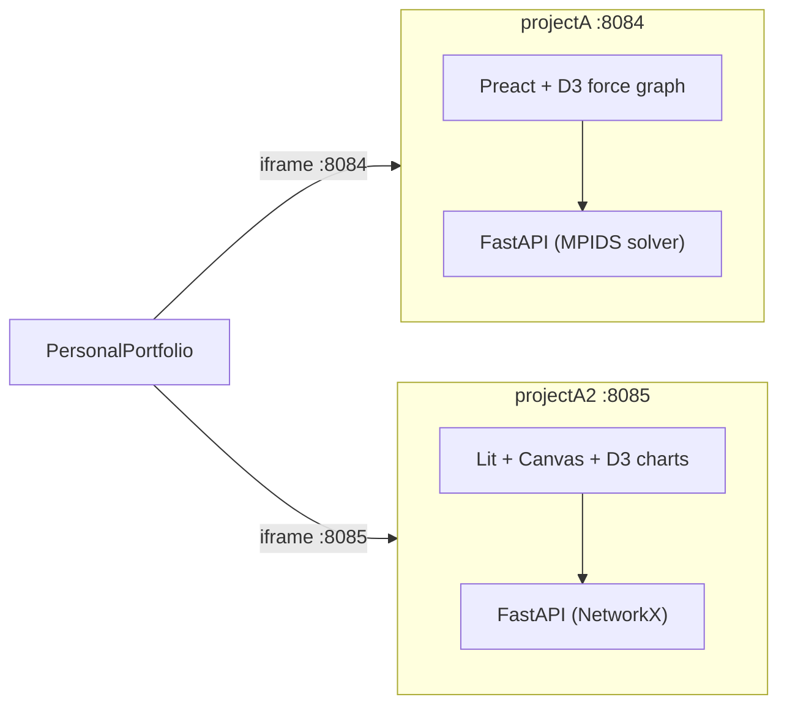

# Web Apps for projectA and projectA2

## Architecture Overview

Both apps follow the proven pattern from desastresIA: **Python FastAPI backend + JS frontend + Docker + Portfolio integration**.

**New frameworks for portfolio diversity:**

- **projectA** -> **Preact** (3KB React alternative, JSX/hooks, new to portfolio) + **D3.js** force-directed graphs
- **projectA2** -> **Lit** (Web Components / standards-based, new to portfolio) + **Canvas** + **D3.js** charts

**Ports:** projectA = `:8084`, projectA2 = `:8085`

---

## Part 1: projectA — MPIDS Graph Dominance Solver

### Problem

Find the **Minimum Positive Influence Dominating Set**: smallest set D where every vertex has at least ceil(deg/2) neighbors in D.

### Backend (`projectA/web/backend/`)

Reimplement core algorithms in clean Python (the C++ has bugs and quirky I/O):

- `**models.py`** — `Graph` (adjacency list), `MPIDSResult` (dominating set, size, time, trace, per-vertex status)
- `**graph_io.py`** — Parse the `N, E, edge-pairs` format from `jocs_de_prova/`; random graph generator (Erdos-Renyi, Barabasi-Albert)
- `**solver.py`** — Three algorithms:
  - `greedy()` — degree-sorted construction (clean reimplementation of `sources/greedy.cpp`)
  - `local_search(iterations, temp, cooling)` — SA-style: start with all vertices in D, try removing; Metropolis acceptance. Fix the bugs from the original (rand()%0, dead temperature)
  - `validate(graph, domset)` — check feasibility, return per-vertex deficit/surplus
- `**app.py`** (FastAPI) — Endpoints:
  - `GET /api/instances` — list bundled graph files (football, jazz, small tests)
  - `POST /api/solve` — `{graph_data | instance_name, algorithm, params}` -> `MPIDSResult`
  - `POST /api/validate` — check a user-drawn dominating set
  - `POST /api/generate` — generate random graph with given N, p
  - `GET /api/status` — health check
  - Static file serving for the built frontend

### Frontend (`projectA/web/frontend/`) — Preact + Vite + TypeScript + D3.js

**Solver Page (main):**

- **Left panel:** Controls — pick instance (dropdown of bundled graphs) or generate random (N, p sliders), algorithm selector (Greedy / Local Search), SA parameters (iterations, temperature, cooling rate)
- **Center:** D3.js **force-directed graph** — nodes colored by domination status:
  - Green: in D (dominating set)
  - Blue: satisfied (enough neighbors in D)
  - Red: unsatisfied (not enough neighbors in D)
  - Node size ~ degree; hover shows `dom_neighbors / needed`
  - Click node to manually toggle in/out of D (for user exploration)
- **Right panel:** Results — set size |D|, execution time, improvement %, per-vertex stats
- **Draggable dividers** (reuse pattern from desastresIA)

**Key interactions:**

- "Solve" button runs algorithm, animates the result onto the graph
- Manual mode: user clicks nodes, live validation shows which vertices become satisfied/unsatisfied
- Preset graphs capped to visualizable sizes: football (115), jazz (198), small tests (10). Large graphs (facebook, actors) available for solve-only (no visualization)

### Bundled instances

Copy the small/medium `.txt` files from `[sources/jocs_de_prova/](projectA/sources/jocs_de_prova/)` into `web/backend/instances/`: `input.txt`, `test.txt`, `graph_football.txt`, `graph_jazz.txt`, `ego-facebook.txt`. Skip the very large ones (CA-AstroPh 198K lines etc.) to keep the Docker image small.

---

## Part 2: projectA2 — Phase Transitions in Random Graphs

### Problem

Explore how graph properties (connectivity, complexity) undergo **phase transitions** as edge probability p, geometric radius r, or percolation parameter q varies.

### Backend (`projectA2/web/backend/`)

Wrap the existing Python/NetworkX logic from `[graph.py](projectA2/graph.py)` into clean API modules:

- `**models.py`** — `GraphData` (nodes with positions, edges), `SweepPoint` (parameter value, P(connected), P(complex)), `SweepResult`, `PercolationFrame`
- `**generator.py`** — Wrap NetworkX: `binomial_graph(n, p)`, `geometric_graph(n, r)` (with node positions), `grid_graph(n)` (with grid positions)
- `**analysis.py`** — Port from `graph.py`:
  - `is_complex(g)` — every component has >=2 independent cycles (cycle_basis)
  - `node_percolation(g, q)` / `edge_percolation(g, q)` — return modified graph
  - `sweep(model, n, param_range, trials, percolation_type)` — Monte Carlo P(connected), P(complex) curves
- `**app.py`** (FastAPI) — Endpoints:
  - `POST /api/generate` — generate single graph instance, return nodes (with positions for geometric/grid) + edges
  - `POST /api/percolate` — apply percolation to a graph, return surviving nodes/edges
  - `POST /api/sweep` — run parameter sweep, return curve data points
  - `GET /api/status` — health check

### Frontend (`projectA2/web/frontend/`) — Lit + Vite + TypeScript

**Explorer Page (main):**

- **Top bar:** Model selector (Binomial / Geometric / Grid), N slider, main parameter slider (p for binomial, r for geometric, n for grid)
- **Left:** **Canvas graph visualization** — draw the generated graph:
  - Binomial: force-directed layout (computed client-side with simple spring simulation)
  - Geometric: natural (x,y) positions on unit square
  - Grid: grid layout
  - Nodes colored by component membership; edges fade on removal during percolation
- **Right:** **D3.js line charts** — phase transition curves:
  - P(connected) vs parameter (blue line)
  - P(complex) vs parameter (orange line)
  - P(connected AND complex) vs parameter (green line)
  - Overlay multiple N values for comparison
- **Bottom controls:** Percolation controls — type (node/edge/composed), q slider with **animated scrubber** that shows percolation in real-time on the graph

**Key interactions:**

- Adjust N and p/r -> instant graph regeneration (small N) or backend call (large N)
- Drag the percolation q slider -> watch nodes/edges disappear in real-time on the canvas
- "Run Sweep" button -> backend computes Monte Carlo curves, charts update progressively
- Toggle curves for different N values on the same chart

---

## Part 3: Shared Infrastructure

### Docker (per project)

Each project gets a multi-stage `Dockerfile` (Node for frontend build, Python for runtime) and `docker-compose.yml`, same pattern as [desastresIA/Dockerfile](desastresIA/Dockerfile).

### PersonalPortfolio Integration

- Add `LiveAppEmbed` to existing (or new) demo pages for both projects
- Update `[scripts/dev-all-demos.sh](PersonalPortfolio/scripts/dev-all-demos.sh)` with both containers
- Update `[Makefile](PersonalPortfolio/Makefile)` `docker-build-all` and `stop-all` targets
- Update `[src/data/demos.json](PersonalPortfolio/src/data/demos.json)` with new tags/descriptions

### Update `[dev/frontend_technologies_summary.md](dev/frontend_technologies_summary.md)`

Add three new entries (currently 9 entries, ends at SvelteKit):

- **10. Solid.js (Vite) + HTML5 Canvas** — `desastresIA` (already built, missing from doc)
  - Architecture: SPA with decoupled REST API (FastAPI)
  - Use Case: Interactive local search solver (HC/SA) for disaster relief optimization with 2D map visualization
  - Key Features: Fine-grained reactivity (signals), HTML5 Canvas for helicopter route rendering, real-time problem preview, experiment comparison dashboard with boxplot charts
  - Pros: Smallest bundle size of reactive frameworks; no virtual DOM overhead; familiar JSX syntax; excellent for Canvas-heavy apps
  - Cons: Smaller ecosystem than React; JSX without React can confuse tooling; fewer community resources
- **11. Preact (Vite) + D3.js Force Graph** — `projectA`
  - Architecture: SPA with decoupled REST API (FastAPI)
  - Use Case: Interactive MPIDS graph dominance solver with force-directed graph visualization
  - Key Features: D3.js force simulation for graph layout, interactive node toggling, real-time domination validation, greedy and simulated annealing solvers, preset real-world graph instances
  - Pros: 3KB React-compatible alternative; full hooks API; seamless D3 integration; fast initial load
  - Cons: Subtle compat differences with React libraries; smaller community; devtools less mature
- **12. Lit (Web Components, Vite) + Canvas + D3.js** — `projectA2`
  - Architecture: SPA with decoupled REST API (FastAPI + NetworkX)
  - Use Case: Phase transition explorer for random graph properties (connectivity, complexity) with percolation animation
  - Key Features: Native Web Components via Lit; Canvas graph rendering with per-model layouts (force, geometric, grid); D3.js line charts for Monte Carlo phase transition curves; animated percolation scrubber
  - Pros: Standards-based (no framework lock-in); shadow DOM encapsulation; interoperable with any framework; small runtime (~5KB)
  - Cons: Less ergonomic than JSX for complex UI; template literals can be verbose; fewer UI component libraries available

### Dark theme

Both apps use the same dark color scheme as desastresIA for visual consistency across the portfolio.