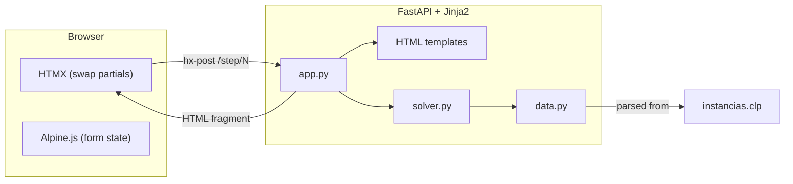

# SBC_IA: Trip Planning Expert System — HTMX + Alpine.js Frontend

## What already exists

- **CLIPS rules** in `[src/main.clp](SBC_IA/src/main.clp)`: 5 modules (MENU, INFERENCIA, LOGIC, RESULTADOS) with city scoring, greedy selection, hotel/transport/activity packing
- **OWL ontology** in `[src/sbc.owl](SBC_IA/src/sbc.owl)` converted to CLIPS classes in `[src/sbc.clp](SBC_IA/src/sbc.clp)`
- **Instance data** in `[src/instancias.clp](SBC_IA/src/instancias.clp)`: dozens of European/world cities, hotels, activities, and hundreds of transport routes (Avion, Tren, Barco)
- Currently runs only in the **CLIPS REPL** — no web UI

## Architecture




**Key design: no JSON API, no JS build step.** The server returns HTML fragments that HTMX swaps into the page. Alpine.js handles small client-side interactions (multi-select chips, validation, animations). All state accumulates in hidden form fields — fully stateless server.

## Backend: Python reimplementation of CLIPS logic

Rather than embedding the CLIPS binary (fragile in Docker, interactive readline), we **reimplement the scoring and selection logic in Python**, keeping the same domain data from `instancias.clp`.

### `web/backend/data.py` — Parse CLIPS instances

Parse the `definstances` block from `[src/instancias.clp](SBC_IA/src/instancias.clp)` into Python dataclasses:

- `City(name, continent, population)`
- `Hotel(name, city, stars, distance_to_center, price_per_night)`
- `Activity(name, city, category, duration_pct, price, for_adults)`
- `Transport(name, from_city, to_city, mode, price, duration)`

The parser reads the parenthesized CLIPS instance format (`[Name] of ClassName (slot value) ...`) with a simple state machine. Data loaded once at startup.

### `web/backend/solver.py` — Expert system logic

Reimplements the rules from `main.clp` INFERENCIA + LOGIC modules:

```python
@dataclass
class UserPrefs:
    ages: list[int]
    trip_type: str          # descanso|diversion|romantico|trabajo|aventura|cultural
    days_min: int
    days_max: int
    days_per_city_min: int
    days_per_city_max: int
    cities_min: int
    cities_max: int
    budget: float
    avoid_transport: list[str]
    min_stars: int
    prefer_unknown: bool
    priority: str           # duracion|calidad|mixto
```

**Inference phase** (from INFERENCIA rules):

- `has_children` / `has_teens` from ages
- `user_type`: individual / pareja / familia / grupo (from headcount + children)
- `same_continent`: True if `days_max < 6`
- `score_cities()`: hard-coded city lists per trip type (same as CLIPS rules) → fitness 50 (match) or 10 (default)

**Logic phase** (from LOGIC rules, in order):

1. **Pick cities** — greedy by fitness, respecting max days, max cities, optional same-continent constraint
2. **Assign days** — distribute days across cities (within per-city min/max)
3. **Pick hotels** — for each city: score by `stars >= min_stars` and `distance_to_center < 5`, pick best within nightly budget
4. **Pick transport** — for each consecutive city pair: find a route whose mode is not in `avoid_transport`, within remaining budget
5. **Pack activities** — for each city: greedily add activities until `sum(duration_pct) <= days * 100` and budget allows
6. **Validate** — check total days >= `days_min`, city count >= `cities_min`, all legs have transport
7. **Compute cost** — hotels (nights x price) + activities + transport

Returns a `TripPlan` with all details + total cost. Supports generating a **second trip** (exclude first trip's cities).

### `web/backend/app.py` — FastAPI + Jinja2

- `GET /` — renders full page with landing/start button
- `POST /step/{n}` — receives accumulated answers as form data, returns next step's HTML partial (swapped by HTMX)
- `POST /plan` — receives all 10 answers, runs `solver.plan_trip()`, returns results partial
- `POST /plan/second` — runs second trip with excluded cities
- Static files for CSS, vendored HTMX/Alpine.js

## Frontend: HTMX wizard + Alpine.js

### 10-step questionnaire (matching CLIPS MENU module)


| Step | Question                    | Input type                                                                |
| ---- | --------------------------- | ------------------------------------------------------------------------- |
| 1    | Ages of participants        | Number inputs (add/remove with Alpine)                                    |
| 2    | Trip type                   | Radio cards (descanso, diversion, romantico, trabajo, aventura, cultural) |
| 3    | Trip duration               | Dual range: min/max days                                                  |
| 4    | Days per city               | Dual range: min/max                                                       |
| 5    | Number of cities            | Dual range: min/max                                                       |
| 6    | Budget                      | Number input with Euro formatting                                         |
| 7    | Transport to avoid          | Checkbox chips (Avion, Tren, Barco, or none)                              |
| 8    | Minimum hotel stars         | Star rating selector                                                      |
| 9    | Prefer lesser-known places? | Yes/No toggle                                                             |
| 10   | Priority                    | Radio cards (duracion, calidad, mixto)                                    |


Each step is a `<form>` with:

- `hx-post="/step/{n+1}"` (or `/plan` for last step)
- `hx-target="#wizard-content"` with `hx-swap="innerHTML transition:true"`
- Hidden `<input>`s carrying all previous answers
- Alpine.js `x-data` for local validation and interactivity
- Progress bar showing step N/10

### Results display

- **Trip summary card**: total days, number of cities, total cost, validity status
- **City-by-city timeline**: vertical timeline with city name, days, hotel (name + stars), activities list, transport to next city
- **"Plan another trip" button** → `hx-post="/plan/second"` for the second itinerary
- **"Start over" button** → reloads wizard from step 1

### Styling

- Reuse the standard dark theme variables (`--bg-primary`, `--bg-card`, `--accent`, etc.)
- Wizard card centered, max-width ~600px
- Step transitions via HTMX `swap` with CSS transitions
- No build step — CSS is a static file

## File structure

```
SBC_IA/
  web/
    backend/
      __init__.py
      data.py                 # Parse instancias.clp → Python objects
      solver.py               # Trip planning logic (inference + selection)
      app.py                  # FastAPI + Jinja2 + static files
      templates/
        base.html             # Dark theme shell, HTMX/Alpine script tags
        index.html            # Landing page with wizard container
        steps/
          ages.html           # Step partials (10 files)
          trip_type.html
          duration.html
          days_per_city.html
          num_cities.html
          budget.html
          transport.html
          hotel_quality.html
          popularity.html
          priority.html
        results.html          # Trip plan display
      static/
        theme.css
        app.css
        htmx.min.js           # Vendored (~14KB)
        alpine.min.js          # Vendored (~15KB)
    requirements.txt          # fastapi, uvicorn, jinja2
  Dockerfile                  # Single-stage Python (no Node/frontend build)
  docker-compose.yml          # Port 8088
  .dockerignore
```

## Docker

Single-stage Dockerfile (no frontend build stage needed — just Python):

```dockerfile
FROM python:3.12-slim
WORKDIR /app
COPY web/requirements.txt .
RUN pip install --no-cache-dir -r requirements.txt
COPY src/instancias.clp ./data/instancias.clp
COPY web/backend/ ./backend/
EXPOSE 8088
CMD ["uvicorn", "backend.app:app", "--host", "0.0.0.0", "--port", "8088"]
```

**Port 8088** (next available after joc_eda on 8087).

## Portfolio integration

- **[`demos.json`](PersonalPortfolio/src/data/demos.json)**: Add entry with slug `sbc-ia`, tags `["HTMX", "Alpine.js", "FastAPI", "Expert System"]`
- **[`frontend_technologies_summary.md`](dev/frontend_technologies_summary.md)**: Add entry #15:

```markdown
## 15. HTMX + Alpine.js (no build step)
**Project:** `SBC_IA` (Trip Planning Expert System)
- **Architecture:** Hypermedia-driven app with FastAPI + Jinja2 backend returning HTML fragments. No SPA, no JSON API, no JavaScript build step.
- **Use Case:** Multi-step wizard for a trip-planning expert system — users answer 10 questions about preferences, then receive a full itinerary (cities, hotels, activities, transport, cost).
- **Key Features:** HTMX hx-post/hx-swap for step-by-step partial HTML replacement; Alpine.js x-data for lightweight client-side form state (dynamic age inputs, chip selectors, star rating); server-rendered Jinja2 templates; hidden form fields for stateless accumulation of answers; CSS transitions on swap; vendored JS (~30KB total); reimplementation of CLIPS expert system rules in Python.
- **Pros:** Zero build tooling (no Node.js, no bundler); server-driven UI keeps logic centralized; HTMX + Alpine.js is ~30KB total vs hundreds of KB for SPA frameworks; fundamentally different paradigm from all other portfolio entries; perfect fit for form-heavy wizard flows.
- **Cons:** Not suited for highly interactive real-time UIs (Canvas, D3); server round-trip on every step adds latency; less ecosystem tooling than SPA frameworks; HTMX debugging requires inspecting network requests rather than component state; Alpine.js lacks a component model for large apps.
```

- **[`PersonalPortfolio/src/pages/demos/sbc-ia.astro`](PersonalPortfolio/src/pages/demos/)**: New page with `LiveAppEmbed` on port 8088
- **[`PersonalPortfolio/Makefile`](PersonalPortfolio/Makefile)** and **[`dev-all-demos.sh`](PersonalPortfolio/scripts/dev-all-demos.sh)**: Add SBC_IA targets

## What makes this distinctive

- **#15 in the portfolio** — the only hypermedia-driven app (no SPA, no JSON API, no JS build)
- **Zero JavaScript build step** — HTMX and Alpine.js are vendored static files
- **Server returns HTML, not JSON** — fundamentally different architecture from entries 1-14
- **Expert system domain** — the only rule-based/knowledge-based system in the portfolio
- **Multi-step wizard** — showcases HTMX's partial swap mechanism perfectly

