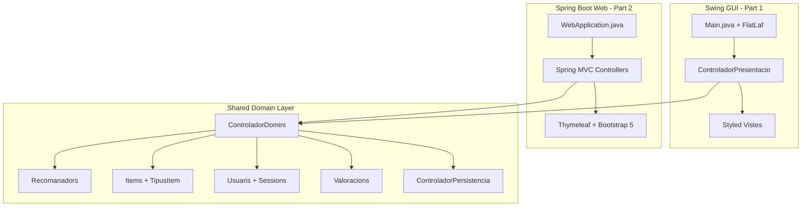

# Style Swing GUI + Create Spring Boot Web Interface

## Context

The project is a Java recommendation system (`subgrup-prop7.1`) with a 3-layer architecture:

- **presentacio/** -- Swing GUI (views + controllers)
- **domini/** -- Business logic (items, users, ratings, recommenders with KNN/KMeans/SlopeOne)
- **persistencia/** -- CSV-based persistence

Currently uses raw `javac` (no Maven/Gradle), JUnit 4.12, and default Swing Metal look-and-feel with no custom styling.

---

## Part 1: Modernize Swing GUI with FlatLaf

[FlatLaf](https://www.formdev.com/flatlaf/) is a modern flat Look and Feel for Swing that requires zero code changes to existing components -- just a single `UIManager.setLookAndFeel()` call before any UI is created.

### Changes

- **Download FlatLaf JAR** to `FONTS/lib/` (e.g., `flatlaf-3.4.1.jar`)
- **Edit [FONTS/Main.java](FONTS/Main.java)**: Set FlatLaf as the L&F before `ControladorPresentacio.obtenirInstancia()`

```java
import com.formdev.flatlaf.FlatDarkLaf;
// or FlatLightLaf, FlatIntelliJLaf, FlatDarculaLaf

public class Main {
    public static void main(String[] args) {
        FlatDarkLaf.setup();
        // ... existing code
    }
}
```

- **Edit [FONTS/Makefile](FONTS/Makefile)**: Add FlatLaf to classpath in compile and run targets

```makefile
# In compile step:
javac -cp lib/flatlaf-3.4.1.jar -d ../EXE -sourcepath . ./Main.java
# In run target:
java -cp ../EXE:lib/flatlaf-3.4.1.jar Main
```

- **Enhance specific views** with custom styling:
  - [VistaMenuPrincipal.java](FONTS/presentacio/vistes/VistaMenuPrincipal.java): Add custom title bar color, larger tabs with icons
  - [VistaMenuUsuaris.java](FONTS/presentacio/vistes/VistaMenuUsuaris.java): Styled form fields, consistent button sizes, proper spacing
  - [VistaMenuItems.java](FONTS/presentacio/vistes/VistaMenuItems.java): Better table styling, alternating row colors
  - [VistaMenuValoracions.java](FONTS/presentacio/vistes/VistaMenuValoracions.java): Same form/table polish
  - [VistaMenuRecomanacions.java](FONTS/presentacio/vistes/VistaMenuRecomanacions.java): Better layout for the recommendation flow
  - All dialog views: Consistent sizing, padding, modern button styling
- **Create a UIEstil.java** utility class with shared constants (colors, fonts, borders, button dimensions) to keep styling DRY across all views.

---

## Part 2: Spring Boot Web Interface

### Project Structure

```
web/
  pom.xml                              (Spring Boot 3.x + Thymeleaf + Bootstrap 5)
  src/main/java/web/
    WebApplication.java                (Spring Boot entry point)
    config/DomainConfig.java           (Initializes ControladorDomini singleton)
    controllers/
      HomeController.java             (Dashboard)
      TipusItemController.java        (Item type CRUD)
      ItemController.java             (Item CRUD)
      UsuariController.java           (User CRUD + login/logout)
      ValoracioController.java        (Rating CRUD)
      RecomanacioController.java      (Recommendation generation + evaluation)
  src/main/resources/
    application.properties
    templates/
      layout.html                     (Thymeleaf layout with sidebar nav + Bootstrap 5)
      fragments/nav.html              (Shared navigation)
      home.html, items.html, users.html, ratings.html, recommendations.html, ...
    static/
      css/style.css                   (Custom overrides for a polished look)
```

### How the web app talks to the domain layer

The `pom.xml` will use `build-helper-maven-plugin` to add `../FONTS/` as an additional source directory (excluding `Main.java` and `presentacio/`). This lets Spring Boot controllers call `ControladorDomini` methods directly:

```xml
<plugin>
  <groupId>org.codehaus.mojo</groupId>
  <artifactId>build-helper-maven-plugin</artifactId>
  <executions>
    <execution>
      <phase>generate-sources</phase>
      <goals><goal>add-source</goal></goals>
      <configuration>
        <sources><source>${project.basedir}/../FONTS</source></sources>
      </configuration>
    </execution>
  </executions>
</plugin>
```

With exclusions for `Main.java` and `presentacio/**` in the compiler plugin.

### Web UI pages (all server-rendered with Thymeleaf + Bootstrap 5)

- **Dashboard**: Overview card showing loaded item types, users count, ratings count
- **Tipus d'item**: List loaded types, select/deselect, create new, load from file
- **Items**: Table of items with search, create/edit/delete, import/export
- **Usuaris**: User management table, login/logout session, import/export
- **Valoracions**: Ratings table, add/edit/delete, import/export
- **Recomanacions**: Select method (Collaborative, Content-Based, Hybrid), configure filter, view results, evaluate with NDCG

### Makefile integration

Add targets to the [root Makefile](Makefile):

```makefile
web:
	cd web && mvn spring-boot:run

web-build:
	cd web && mvn package
```

---

## Architecture Diagram




