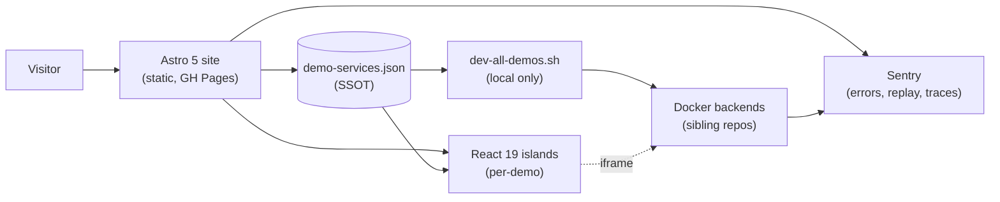

# Architecture overview

One page. Big picture map of what the portfolio is and how the pieces fit
together. Read this **before** the deeper architecture docs — those answer
_why_, this answers _what_.

## The 30-second model



**Read it as:** the static Astro site is the surface area. Each demo card
links to a page that hydrates a React island; the island either renders a
browser-only mock or iframes a Docker backend running on `localhost:<port>`.
The whole thing is observable through one Sentry org.

---

## What lives where

```text
PersonalPortfolio/
├── src/
│   ├── pages/                Astro routes
│   │   ├── index.astro         # Homepage (the section list)
│   │   ├── 404.astro / 500.astro
│   │   ├── [lang]/             # Localized routes (/es/…, /ca/…)
│   │   └── demos/<slug>.astro  # One per demo
│   ├── components/           Astro layout + Swiss-design sections
│   │   └── demos/              React islands (one per demo)
│   ├── data/                 Source of truth JSON
│   │   ├── demo-services.json  ← orchestrator, ports, backends
│   │   ├── demos.json          ← homepage cards (+ .es / .ca parity)
│   │   ├── experience.json, education.json, ...
│   ├── i18n/                 Translation infrastructure
│   │   ├── ui.ts               # Pattern A — flat key/value
│   │   └── demos/              # Pattern C — per-feature TS modules
│   ├── lib/                  Shared utilities
│   │   ├── debug.ts            # Custom event bus
│   │   ├── debug-sentry.ts     # Bus → Sentry forwarder
│   │   └── ...                 # Per-demo algorithms (wpgma, etc.)
│   ├── config/
│   │   ├── section-ids.ts      # Section order SSOT (homepage + nav)
│   │   ├── sections.ts         # ↑ + Astro component bindings
│   │   └── site.ts             # Identity (name, URL, socials)
│   └── styles/               Global CSS + theme token blocks
├── e2e/                      Playwright specs (8 named projects)
├── planner-api/              FastAPI + ENHSP (PDDL planner demo)
├── scripts/                  Orchestrator, log relay, codemods
├── public/                   Static assets (images, PDFs, mock data)
└── docs/
    ├── guides/                 # everyday-tasks, adding-a-demo, i18n, testing
    └── architecture/           # this file, decisions, debugging-architecture, observability
```

---

## Three sources of truth

The codebase is built around three SSOTs. Editing one of these is a
documented "everyday task"; editing things derived from them isn't.

| File                                                              | Drives                                                                                                                                                                                                                                                          |
| ----------------------------------------------------------------- | --------------------------------------------------------------------------------------------------------------------------------------------------------------------------------------------------------------------------------------------------------------- |
| [src/data/demo-services.json](../../src/data/demo-services.json)  | Orchestrator script, log-relay sidecar, `LiveAppEmbed.tsx`'s iframe URLs, Makefile `DEMO_PORTS`, Sentry traced-port list, `live-demos.spec.ts`. Adding a backend means editing this and following the [adding-a-demo.md](../guides/adding-a-demo.md) checklist. |
| [src/data/demos.json](../../src/data/demos.json) (+ `.es`, `.ca`) | Homepage demo grid. Card title, description, accent colors, icon, github link. Schema is enforced by [demo-schema.ts](../../src/i18n/demo-schema.ts) (Zod).                                                                                                     |
| [src/config/section-ids.ts](../../src/config/section-ids.ts)      | Homepage section order, navbar anchor order, scroll-spy targets. Numbered prefixes (`01`, `02`, …) auto-derived from `numbered: true` flags.                                                                                                                    |

The [demo-registry.test.ts](../../src/__tests__/demo-registry.test.ts) and
[structural.test.ts](../../src/__tests__/structural.test.ts) suites police
consistency between these and everything that derives from them.

---

## How a request flows

### Static homepage

1. `astro build` produces `dist/` — pure HTML/CSS/JS, no server.
2. GitHub Pages serves it. No Node runtime in production.
3. The locale prefix in the URL (`/`, `/es/`, `/ca/`) selects which
   translation table renders — see [i18n.md](../guides/i18n.md).

### Demo with a browser-only island

1. Visitor lands on `/demos/<slug>/`.
2. The Astro page imports the React component with `client:visible` (Astro
   only ships JS when the component scrolls into view).
3. The island runs in the browser. Pure JS, no backend.

### Demo with a live backend

1. Locally, `make dev-bare` reads
   [demo-services.json](../../src/data/demo-services.json), starts each
   listed Docker compose service on its declared port.
2. The demo page renders `<LiveAppEmbed slug="…" />`, which derives the
   iframe URL from the registry.
3. The iframe loads `http://localhost:<port>/`. On GitHub Pages it falls
   back to `<MockBanner />` because there's no backend to embed.
4. The iframe app voluntarily emits debug events via
   [debug-iframe-emitter.ts](../../src/lib/debug-iframe-emitter.ts)
   (postMessage); the parent forwards them onto the central debug bus.

---

## The debug bus

A single producer surface
([src/lib/debug.ts](../../src/lib/debug.ts)) every component logs into.
Consumers subscribe independently:

```text
                ┌─ DebugOverlay.tsx (in-page)
                ├─ console mirror (dev only)
debug(ns).info ─┼─ debug-sentry.ts → Sentry SDK
                └─ debug-network.ts (X-Session-Id forwarder)
```

Backend events arrive at the same Sentry org tagged with `service:<slug>`
and the same `session_id` as the browser session, so a Sentry filter
`session_id:<uuid>` reconstructs the full cross-stack trace.

Deep dive: [debugging-architecture.md](./debugging-architecture.md).

---

## i18n model

Three locales — `en` (default), `es`, `ca`. Three patterns coexist, each
the right tool for one kind of content:

| Pattern | Where                           | When to use                                                       |
| ------- | ------------------------------- | ----------------------------------------------------------------- |
| **A**   | `src/i18n/ui.ts`                | Short shared UI strings (button labels, ARIA, nav). Type-checked. |
| **B**   | `*.json` triples                | Structured content (experience, demos, certifications).           |
| **C**   | `src/i18n/demos/<slug>-page.ts` | Page copy with inline HTML or `{0}` placeholders.                 |

The "i18n parity rule" applies to Pattern B: sibling JSON files must stay
lock-step (same length, same field set, same order). Enforced by
[content-parity.test.ts](../../src/__tests__/content-parity.test.ts). Full
walkthrough: [i18n.md](../guides/i18n.md).

---

## Theming

Two orthogonal axes:

- **Theme** — palette tokens. Multiple themes registered in
  [src/lib/themes.ts](../../src/lib/themes.ts), applied via
  `html[data-theme="…"]`. Picker in the Ctrl+K modal.
- **Design** — typography / layout flavor. Applied via
  `html[data-design="…"]` (e.g. `swiss`).

Both persist in `localStorage` and are restored before paint by
[ThemeInit.astro](../../src/components/ThemeInit.astro) so there's no FOUC.

---

## What's _not_ in this overview

- **Why** any of these choices were made — see
  [decisions.md](./decisions.md) for the catalogue of alternatives weighed
  and rejected.
- **How** the observability stack is operated — see
  [observability.md](./observability.md) for DSNs, dashboards, and
  per-stack snippets.
- **How** to add or change things — see [guides/](../guides/):
  [everyday-tasks.md](../guides/everyday-tasks.md),
  [adding-a-demo.md](../guides/adding-a-demo.md),
  [testing.md](../guides/testing.md).

---

## See also

- [decisions.md](./decisions.md) — full decision-rationale catalogue
- [debugging-architecture.md](./debugging-architecture.md) — debug bus +
  Sentry SDK rollout
- [observability.md](./observability.md) — operational manual
- [ui-experiments.md](./ui-experiments.md) — visual / interaction explorations
