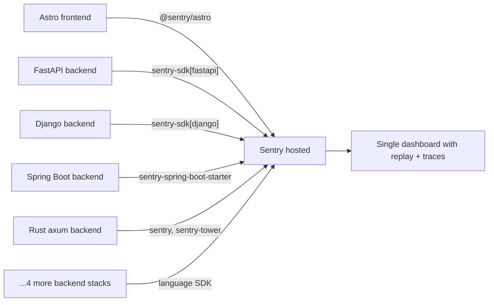

# Debugging architecture

Architectural overview of the chosen observability stack: **what is deployed
and why**.

- For day-to-day operation (which DSN to set, how to start the dashboards,
  troubleshooting), see [`observability.md`](./observability.md).
- For the full decision-rationale catalogue (foundations evaluated, patterns
  weighed, alternatives discarded, migration cost matrices), see
  [`decisions.md`](./decisions.md).

Two orthogonal choices drive the design:

1. **Foundation** — what produces log records.
2. **Pattern** — how those records flow to consumers (overlay, console,
   network sink, Sentry).

The on-screen overlay, network tap, FPS sampler and state inspector are
custom regardless of the foundation chosen.

## Decision guide by need

Pick the row that matches your priority. Detailed rationale, trade-offs and
alternatives live in [`decisions.md`](./decisions.md).

| What you actually need | Best fit | Why |
|---|---|---|
| Just debug while coding on a laptop, nothing else | **In-page overlay only** (custom event bus + `DebugOverlay.tsx`, gated by `import.meta.env.DEV`) | Zero third-party, nothing ships to visitors, ~150 LOC. DevTools covers the rest. |
| Watch a live dashboard on a second monitor while developing | **Local WebSocket-streamed dashboard** (Node server on `localhost:9229` + dashboard page at `/_debug`) | Real-time, no SaaS, persists across reloads, fully local, fun to build. |
| Polished hosted dashboard, easiest path, don't care about owning data | **Sentry hosted free tier** with `@sentry/astro` | ~5 min to first dashboard view. 5K errors / 50 replays / 10K perf events per month free. Most popular tool by far. |
| Hosted dashboard, but you want to own the data / open source | **Highlight.io self-hosted on Hetzner VPS** (~€13/mo, 8 GB RAM) | Apache-2.0, includes session replay, ~1–2 h setup, full data ownership. |
| Custom dashboards, OpenTelemetry standard, no vendor lock-in | **Grafana Faro + Grafana Cloud free tier** (or fully self-hosted Grafana + Loki + Tempo) | Maximum flexibility, you build dashboards. Steepest learning curve. |
| Record real users including DOM replay | **Sentry hosted** (50 replays/mo free) or **LogRocket** (replay-first, paid) | Replay is the only thing that beats reading logs after the fact. |
| Errors only, nothing else | **Sentry hosted**, default config | One file, paste DSN, done. Free tier. |
| Multi-demo portfolio with WebGL / canvas / heavy JS | **Custom event bus + in-page overlay + Sentry hosted** (layered) | Overlay catches FPS/state issues instantly; Sentry catches what escapes your view. |
| Zero third-party deps, zero hosted services | **In-page overlay only** | Pure local, no SaaS, no cloud. |
| Deploy a dashboard to your own cloud / VPS | **Highlight.io self-hosted on Hetzner** (cheap) or **Render / Railway** (managed) | See [`decisions.md` § Hosting on cloud](./decisions.md#hosting-on-cloud). |
| You're a Cursor / Astro developer trying to debug a portfolio | **This project's chosen path:** custom event bus + overlay + `@sentry/astro` (Sentry hosted free) | Matches everything in this row above; see [Recommendation](#recommendation). |

## Recommendation

> **Final priorities:** want a polished dashboard to watch what's happening,
> don't care about complexity or bundle weight, don't care about owning the
> data, and OK with starting locally and flipping on production later.

**`@sentry/astro` (hosted free tier) + custom in-page overlay + custom event
bus.**

Three layers solve three different problems:

1. **Custom event bus** ([`src/lib/debug.ts`](../src/lib/debug.ts)) — single
   producer surface every component logs into. Decouples call sites from
   sinks; trivially mockable in tests.
2. **In-page overlay** (`DebugOverlay.tsx`) — instant feedback while
   debugging at the laptop; no round-trip to a dashboard for the common case.
3. **Sentry hosted** — real dashboard with error grouping, source-mapped
   stack traces, auto-captured breadcrumbs, session replay, performance
   monitoring. Free hobby tier (5K errors / 50 replays / 10K perf events per
   month).

The bus emits to all three sinks, so a `debug('demo:rob').error(...)` call
shows up instantly in the overlay, in the dev console, and in the Sentry
dashboard, with the surrounding session captured for replay.

Full rationale (Why not Highlight? Why not Faro? What got rejected and why?)
in [`decisions.md` § Recommendation rationale](./decisions.md#recommendation-rationale).

---

## Backend observability — Option A (Sentry SDKs everywhere)

The Recommendation above only addresses the **frontend**. Backend observability
is a separate decision because the chosen frontend stack (Sentry hosted) was
driven by **session replay** and **error grouping**, neither of which apply
to backends. Backend traffic also has different characteristics — it only
exists when someone is actively demoing — so options range from "match the
frontend" to "no SDK at all".

The portfolio backends span 9 different language stacks (FastAPI, Django,
Flask, Spring Boot, SvelteKit, Rust/axum, Go, Node, PHP), so any choice has
to cover all of them.

### Lock-in vocabulary

| Lock-in level | Meaning |
|---|---|
| **Hard** | Migrating away requires re-instrumenting every call site (e.g. session replay, error grouping UI). |
| **Medium** | Migrating away means swapping SDKs and rebuilding dashboards but keeping call sites mostly intact. |
| **Soft** | Migrating away means changing one URL or DSN. |
| **None** | Pure stdout / standard formats; portable to anything that can read JSON lines. |

The Sentry SDK's lock-in is "medium" — it's open-source (MIT/BSD), the data
flow is also OSS (you can self-host Sentry or use GlitchTip with the same
SDK), but session replay and error grouping are unique enough that you'd
lose them on full migration to OTel + Grafana.

### Option A — Sentry SDKs in every backend (matches frontend) — **chosen**

**Architecture**: same as the frontend choice, extended through the
backends. One Sentry org, one shared project with `tags.service = <slug>`.
Backends emit errors, breadcrumbs, and traces into the same dashboard the
browser uses.



**Lock-in**: medium (mitigated by the option to self-host Sentry later).

**Free tier**: shared with frontend — 5K errors / 50 replays / 10K spans
per month per Sentry org. For a portfolio this is plenty.

**Per-backend changes** (all approximate):

| Stack | Package | Init lines | Example |
|---|---|---|---|
| FastAPI | `sentry-sdk[fastapi]` | ~5 | `sentry_sdk.init(dsn=DSN, traces_sample_rate=0.1)` then `app.add_middleware(SentryAsgiMiddleware)` |
| Django | `sentry-sdk[django]` | ~3 in `settings.py` | `sentry_sdk.init(dsn=DSN, integrations=[DjangoIntegration()], traces_sample_rate=0.1)` |
| Flask | `sentry-sdk[flask]` | ~5 | Same pattern as FastAPI with `FlaskIntegration()` |
| Spring Boot | `sentry-spring-boot-starter` | ~3 yaml | `sentry.dsn`, `sentry.traces-sample-rate` in `application.properties` |
| SvelteKit | `@sentry/sveltekit` | ~5 | `Sentry.init({...})` in `hooks.server.ts` |
| Rust (axum) | `sentry`, `sentry-tower` | ~10 | `let _guard = sentry::init((DSN, ...))` + `ServiceBuilder::new().layer(NewSentryLayer)` |
| Go | `sentry-go`, `sentry-go-http` | ~10 | `sentry.Init(sentry.ClientOptions{Dsn: DSN})` + `sentryhttp.New()` middleware |
| PHP (Tenda) | `sentry/sentry` | ~5 | `\Sentry\init(['dsn' => DSN])` early in `bootstrap.php` |

### Other options (B, C, D) — discarded

The discarded options are documented for future revisits:

- **Option B — OpenTelemetry + Grafana Cloud (replace frontend Sentry too).**
  Vendor-neutral, but loses session replay and error grouping. Migration cost
  ~6 h. Pick this only if vendor neutrality outranks polish.
- **Option C — Hybrid (Sentry frontend + OTel backends, dual export).**
  Two dashboards to learn, an OTel Collector to maintain. Pick this only if
  you specifically plan to migrate off Sentry and want backends instrumented
  cleanly first.
- **Option D — Structured stdout only (no SDK in any backend).**
  Backends emit JSON lines; the local relay surfaces them in the in-page
  overlay. Production errors stay Sentry-frontend-only. Pick this only if
  you don't care about persistent backend observability.

The full B/C/D analysis was extracted into [`decisions.md`](./decisions.md)
when the architecture doc was slimmed; this section keeps the option matrix
for context.

### What does NOT need to change regardless of option

- The bus pattern in [`src/lib/debug.ts`](../src/lib/debug.ts) — it's the
  producer surface for browser code; it doesn't care what subscribers do
  with the events.
- The local relay in `scripts/log-relay/` — it tails Docker stdout for the
  in-page overlay; that's useful in every option.
- The iframe forwarder in [`src/lib/debug-iframe.ts`](../src/lib/debug-iframe.ts)
  — boundary-only postMessage receiver, agnostic to the backend stack chosen.
- The service registry [`src/data/demo-services.json`](../src/data/demo-services.json) —
  its `stack` field becomes more useful in Options A/B/C because the
  onboarding doc snippets diverge per stack, but the file itself is the same.

---

## Per-stack instrumentation hooks

Directory of where each backend's Sentry init actually lives. The
operational manual referred to these by description; this table makes
them findable. Source of truth for `needsSentry` is
[`src/data/demo-services.json`](../src/data/demo-services.json).

| Backend | Stack | Init hook |
|---|---|---|
| TFG, MPIDS, Phase, CAIM, SBC_IA, DesastresIA, BitsX, planner-api | Python (FastAPI / Flask / Litestar) | [`scripts/sentry-snippets/_sentry_obs.py`](../scripts/sentry-snippets/_sentry_obs.py) — canonical helper, copied verbatim into each backend repo |
| Draculin | Django | [`Draculin-Backend/Draculin/settings.py`](../../Draculin-Backend/Draculin/settings.py) — calls `init_observability("draculin")` from the same canonical helper |
| PROP | Spring Boot | [`subgrup-prop7.1/web/src/main/resources/application.properties`](../../subgrup-prop7.1/web/src/main/resources/application.properties) (`sentry.dsn`, `sentry.tags.service=prop`) and [`subgrup-prop7.1/web/pom.xml`](../../subgrup-prop7.1/web/pom.xml) for the `sentry-spring-boot-starter-jakarta` + `sentry-logback` deps |
| Tenda | PHP | [`tenda_online/includes/observability.php`](../../tenda_online/includes/observability.php) — `\Sentry\init(...)` + `\Sentry\configureScope(...)` to set `service`; emits JSON lines via `tenda_emit_log` |
| joc-eda | Go | [`joc_eda/web/backend-go/observability.go`](../../joc_eda/web/backend-go/observability.go) — `initSentry`, `withSentryHTTP` middleware, `jsonStdoutWriter` |
| pro2 | Rust (axum) | [`pracpro2/web/backend/src/main.rs`](../../pracpro2/web/backend/src/main.rs) `_init_sentry()` — held for the lifetime of `main()` |
| planificacion | SvelteKit | [`Practica_de_Planificacion/web/src/hooks.server.ts`](../../Practica_de_Planificacion/web/src/hooks.server.ts) — `@sentry/sveltekit` init + `sentryHandle()` + `console.*` JSON wrapper |
| PAR / FIB / Grafics / ROB | static frontend (nginx-served) | n/a — `needsSentry: false` in [`src/data/demo-services.json`](../src/data/demo-services.json); browser errors are caught by the parent page's Sentry SDK via the iframe forwarder |

### Why the Python helper has a `before_send` hook and the others don't

The Python helper at
[`_sentry_obs.py`](../scripts/sentry-snippets/_sentry_obs.py) uses a
`before_send` envelope hook to stamp the `service` tag because
`sentry-sdk` 2.0–2.20 ASGI/WSGI integrations fork a fresh isolation scope
per request that doesn't inherit init-time tags — `set_tag` at module
level was unreliable. The hook runs at envelope creation, after every
scope merge.

The non-Python SDKs don't have this exact bug, so each uses its
language-idiomatic init-time scope API:

- **Spring Boot** sets `sentry.tags.service` as a static SDK config option
  in `application.properties` — applied to every event before scope merging.
- **Go** (`sentry-go`) clones the global hub at request boundaries via
  `sentryhttp.New(...)`; the init-time scope tag is inherited by request
  hubs.
- **Rust** (`sentry-rust` + tower middleware) creates per-request hubs from
  the main hub; the init-time scope tag is inherited.
- **SvelteKit** (`@sentry/sveltekit`, OpenTelemetry-backed in v8+) inherits
  tags from the root isolation scope to per-request scopes.
- **PHP** runs each request in a fresh process, so `\Sentry\configureScope`
  applies for the lifetime of the request unconditionally.

If any of these SDKs change their scope-fork behaviour, switch the affected
backend to a language-equivalent of the `before_send` hook. The current setup
uses each language's idiomatic init-time scope API and verifies the `service`
tag lands by filtering on `service:<slug>` in the Sentry UI (see
[`observability.md` § Verifying tag-based filtering](./observability.md#verifying-tag-based-filtering)).

---

## Sketch of the chosen design

```
                ┌────────────────────────────────────────┐
                │         debug('demo:rob').info(...)    │
                │         debug('theme').error(...)      │
                └──────────────────┬─────────────────────┘
                                   │
                                   ▼
                    ┌──────────────────────────────┐
                    │   bus  (EventTarget)         │
                    │   ring buffer, level gate    │
                    └────┬───────┬───────┬─────────┘
                         │       │       │
            ┌────────────┘       │       └─────────────────┐
            ▼                    ▼                         ▼
 ┌──────────────────┐ ┌────────────────────┐ ┌────────────────────────┐
 │ console mirror   │ │ in-page overlay    │ │ @sentry/astro          │
 │ (dev or opt-in)  │ │ Logs/State/Net/Perf│ │ captureException +     │
 └──────────────────┘ └────────────────────┘ │ addBreadcrumb +        │
                                ▲            │ Replay integration     │
                                │            └───────────┬────────────┘
              ┌─────────────────┴────────────────┐       │
              │  fetch/XHR taps emit 'network'   │       ▼
              │  rAF FPS sampler emits 'perf'    │  ┌────────────────────┐
              │  global error/unhandledrejection │  │ Sentry hosted SaaS │
              └──────────────────────────────────┘  │ sentry.io          │
                                                    │ (errors, replays,  │
                                                    │ perf, breadcrumbs) │
                                                    └────────────────────┘
```

State of the system at runtime:

- **Disabled state** → bus is a no-op except for buffering errors; the inline
  init script is ~1 KB. Sentry SDK is loaded by the official Astro integration
  but `Sentry.init()` is gated by env so visitors don't ship traffic to your
  Sentry project unless you flip the flag.
- **Enabled state** → overlay + network tap + Sentry transport all subscribe;
  everything happens live in the overlay and is replayable in Sentry's
  dashboard.
- **Bus is the single producer** → swapping Sentry for Highlight, Faro or a
  local WebSocket sink is a one-line subscriber change.

---

## Testing locally before committing

The chosen path can be exercised end-to-end on a laptop without ever creating
a sentry.io account. Three layers, each with its own local test surface.

### Layer 1 — Pure-code units (bus, overlay, network tap, hook)

Vitest is already configured ([`PersonalPortfolio/package.json`](../package.json),
existing tests in [`PersonalPortfolio/src/__tests__/`](../src/__tests__/)).
`debug.test.ts` covers:

- Namespace filtering (`debug('demo:rob:fk').info(...)` matched by
  `'demo:rob:*'`).
- Level gating.
- Ring-buffer eviction (oldest entries dropped past max).
- `fetch` interception via `vi.stubGlobal('fetch', ...)`.
- Bus event ordering (subscribers fire in registration order).

Runs offline in milliseconds: `npm test`.

### Layer 2 — Integration with Sentry SDK via Sentry Spotlight

[Sentry Spotlight](https://spotlightjs.com) is a free, open-source (MIT) local
dashboard maintained by the Sentry team. It receives the **same events** the
official Astro Sentry integration would send to the cloud, renders them in a
sidecar UI injected into `astro dev`, and never opens a network connection
outside `localhost`.

Setup:

```bash
npm install @sentry/astro @spotlightjs/astro
```

```ts
// astro.config.mjs
import sentry from '@sentry/astro';
import spotlight from '@spotlightjs/astro';

export default defineConfig({
  integrations: [
    sentry({ dsn: 'https://test@test/0', environment: 'local' }),
    spotlight(),  // automatically stripped from production builds
  ],
});
```

What you get locally:

- Sentry-style dashboard at the dev toolbar — no account required.
- Errors, transactions, breadcrumbs, source-mapped stack traces.
- Source maps from Vite work without manual upload.
- Same SDK behaviour as production → no "works locally, breaks in prod"
  surprises.

What's *not* covered by Spotlight (vs hosted Sentry):

- Session replay (Spotlight doesn't render replays).
- Alerts and notifications (no alerting backend locally).
- Issue grouping across releases (single-session view only).
- Team / org / SSO features.

Replay specifically can be verified separately by enabling the Replay
integration once with a real DSN; you only need to do this once to confirm
the wiring.

### Layer 3 — Real Sentry hosted dashboard

When the time comes to verify the actual `sentry.io` dashboard:

1. Free account + new "Astro" project; copy DSN.
2. Replace the fake DSN in `astro.config.mjs` (or move it behind
   `import.meta.env.PUBLIC_SENTRY_DSN` and put the real value in `.env`).
3. Run `astro dev`, trigger a test error → confirm it lands in the hosted UI
   within ~5 s.
4. If unsatisfied: delete the project, restore the fake DSN, back to
   Spotlight only. No data orphaned.

### Local-only test paths for other backends

For the other backends in [`decisions.md` § Migration matrix](./decisions.md#migration-matrix-assuming-the-chosen-path-sentry-hosted):

| Backend | Local-only test path |
|---|---|
| **Sentry hosted** | Sentry Spotlight (this section) |
| **Highlight self-hosted** | `docker compose up` from the Highlight repo — same code as production |
| **Highlight hosted** | Free hobby project at app.highlight.io |
| **PostHog self-hosted** | Single-container `posthog/posthog` Docker image |
| **PostHog Cloud** | Free hobby project at app.posthog.com |
| **Grafana Faro** | Local Grafana + Loki + Tempo stack via `docker compose`, or Grafana Cloud free tier |
| **Custom local WS dashboard** | n/a — it *is* the local stack |
| **In-page overlay only** | `astro dev` — nothing else needed |

So every option has a no-account, no-cloud path that exercises the same SDK
wiring as the production deployment. You're not choosing blind.

---

## Cross-references

- [`observability.md`](./observability.md) — operational manual (DSNs,
  dashboards, troubleshooting, tag conventions).
- [`decisions.md`](./decisions.md) — full decision-rationale catalogue
  (foundations, patterns, alternatives, migration costs).
- [`scripts/sentry-snippets/_sentry_obs.py`](../scripts/sentry-snippets/_sentry_obs.py) —
  canonical Python helper.
- [`src/lib/debug.ts`](../src/lib/debug.ts) — bus.
- [`src/lib/debug-sentry.ts`](../src/lib/debug-sentry.ts) — Sentry forwarder
  (frontend).
- [`src/data/demo-services.json`](../src/data/demo-services.json) — service
  registry; `needsSentry` is the source of truth for which backends have
  an init hook.
