# Demo gallery

<!-- Generated by scripts/demo-gallery.mjs. Do not edit manually. -->

Canonical desktop captures of every registered portfolio demo. Each image links to the live interactive route.

<!-- demo:tenda -->

## [Tenda Online](https://polcasacubertagil.com/demos/tenda/)

Web applications course project: a full e-commerce store built in PHP and MySQL, covering product catalog, shopping cart, and checkout flow.

<!-- demo:draculin -->

## [Draculin](https://polcasacubertagil.com/demos/draculin/)

Health-tracking app with an AI chatbot and computer vision assistance, built in Flutter and Django as a BitsXLaMarató 2023 finalist.

<!-- demo:tfg-polyps -->

## [Bachelor's Thesis — Polyp Detection](https://polcasacubertagil.com/demos/tfg-polyps/)

[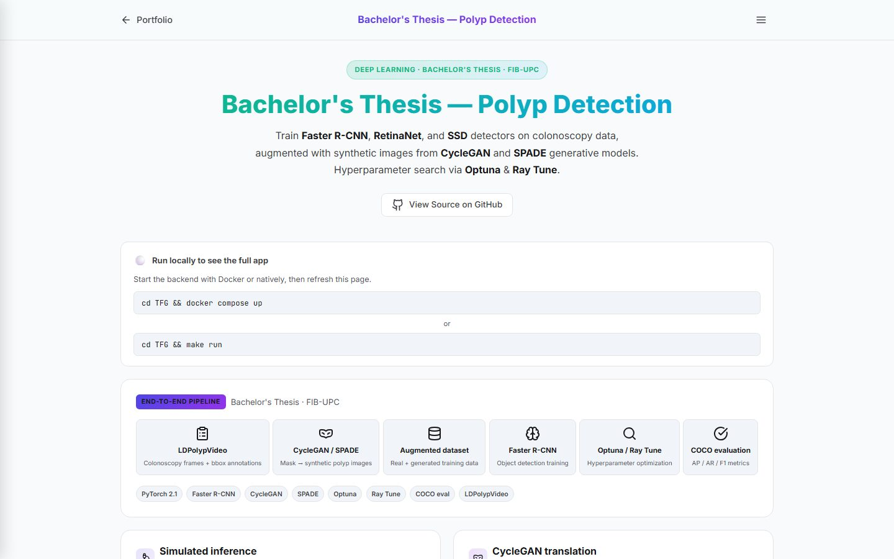](https://polcasacubertagil.com/demos/tfg-polyps/)

Bachelor's thesis on detecting polyps in colonoscopy images with deep learning, using CycleGAN and SPADE to generate synthetic training data when real labels were scarce.

<!-- demo:bitsx-marato -->

## [BitsXLaMarató — Aorta](https://polcasacubertagil.com/demos/bitsx-marato/)

[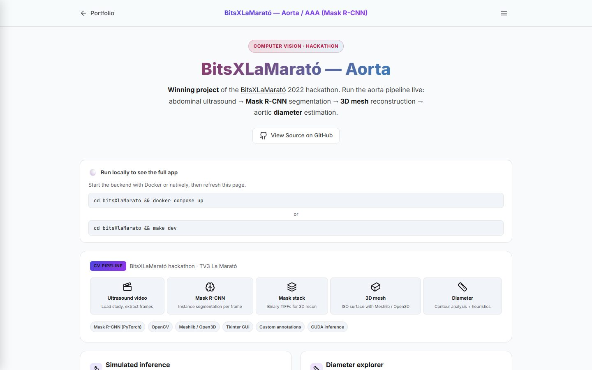](https://polcasacubertagil.com/demos/bitsx-marato/)

BitsXLaMarató 2022 winner: a tool to segment the aorta in ultrasound videos with Mask R-CNN and reconstruct it in 3D to help detect aneurysms.

<!-- demo:desastres-ia -->

## [Desastres IA](https://polcasacubertagil.com/demos/desastres-ia/)

[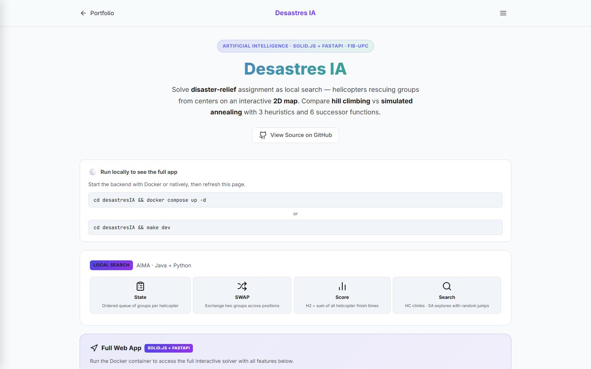](https://polcasacubertagil.com/demos/desastres-ia/)

AI course project framing disaster relief as local search, with helicopters rescuing groups from rescue centers via hill climbing and simulated annealing.

<!-- demo:mpids -->

## [MPIDS Solver](https://polcasacubertagil.com/demos/mpids/)

[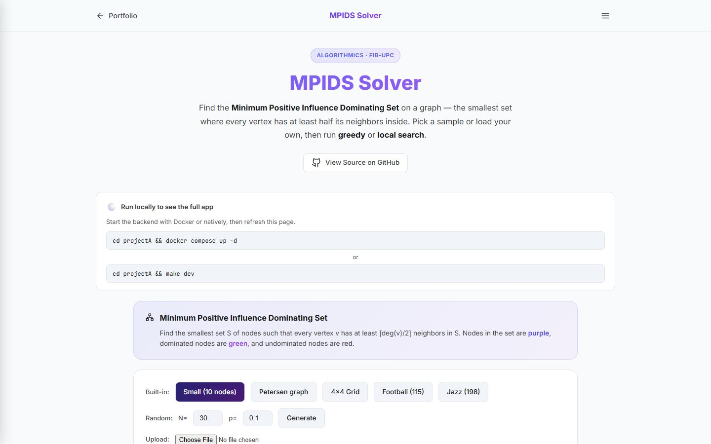](https://polcasacubertagil.com/demos/mpids/)

Algorithms project on the Minimum Positive Influence Dominating Set problem, solved with greedy heuristics and simulated-annealing-style local search.

<!-- demo:phase-transitions -->

## [Graph Phase Transitions](https://polcasacubertagil.com/demos/phase-transitions/)

[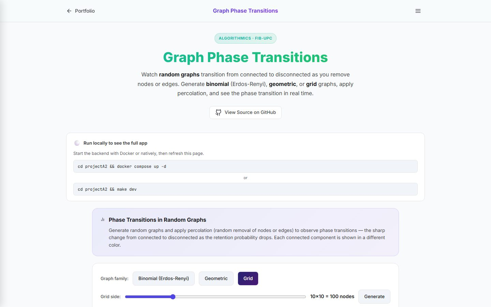](https://polcasacubertagil.com/demos/phase-transitions/)

Algorithms research project studying connectivity and complexity phase transitions on binomial, geometric, and grid random graphs.

<!-- demo:caim -->

## [CAIM IR Explorer](https://polcasacubertagil.com/demos/caim/)

[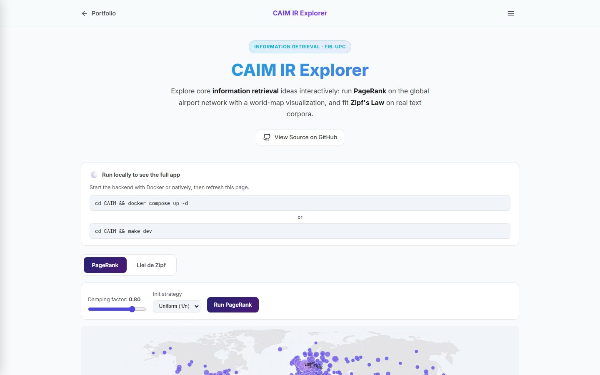](https://polcasacubertagil.com/demos/caim/)

Information retrieval course labs: computing PageRank over the global airport network and verifying Zipf's Law on text corpora.

<!-- demo:joc-eda -->

## [Programming Game Viewer](https://polcasacubertagil.com/demos/joc-eda/)

[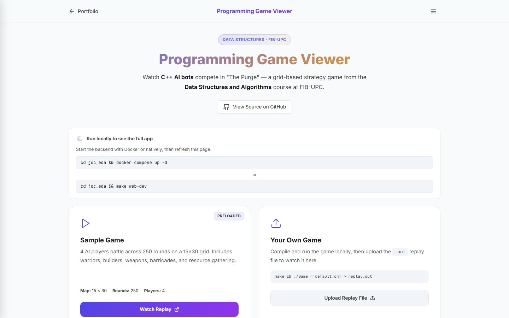](https://polcasacubertagil.com/demos/joc-eda/)

Data structures course project: a grid-based game where C++ bots compete as warriors and builders in a class-wide tournament.

<!-- demo:sbc-ia -->

## [Trip Planner (Expert System)](https://polcasacubertagil.com/demos/sbc-ia/)

Knowledge-based systems course project: an expert system trip planner originally written with CLIPS production rules, reimplemented in Python.

<!-- demo:par-parallel -->

## [Parallel Computing Labs](https://polcasacubertagil.com/demos/par-parallel/)

[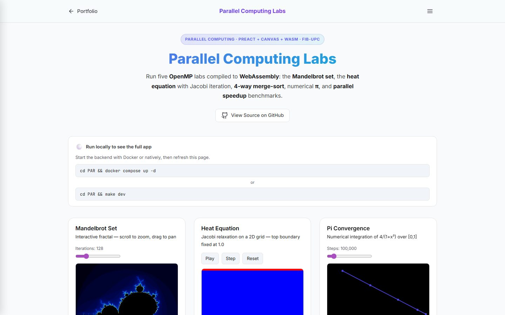](https://polcasacubertagil.com/demos/par-parallel/)

Parallel computing course labs in C with OpenMP: Mandelbrot, heat equation, 4-way merge sort, π estimation, and speedup benchmarks.

<!-- demo:rob-robotics -->

## [Robotics Dashboard](https://polcasacubertagil.com/demos/rob-robotics/)

[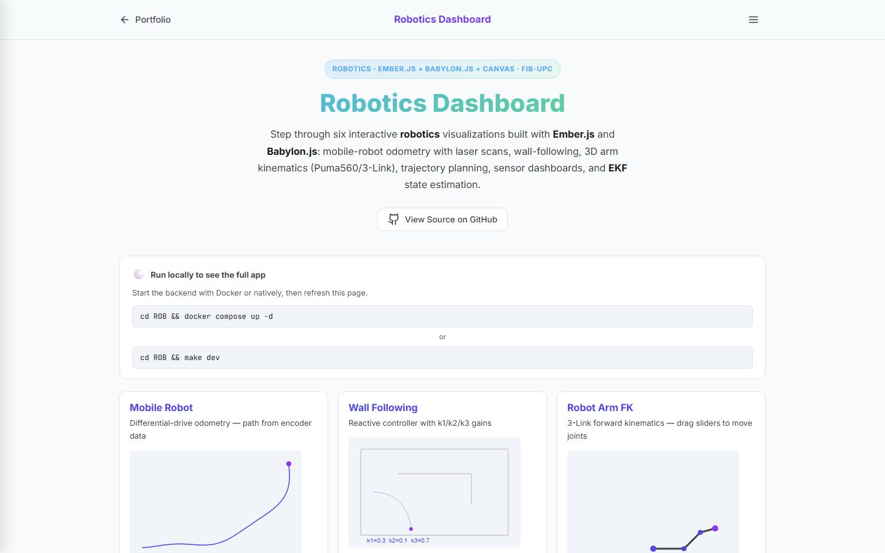](https://polcasacubertagil.com/demos/rob-robotics/)

Robotics course labs covering odometry, wall-following, 3D arm forward kinematics (Puma560 / 3-Link), trajectory planning, sensors, and EKF state estimation.

<!-- demo:algorithms -->

## [Algorithm Visualizer](https://polcasacubertagil.com/demos/algorithms/)

[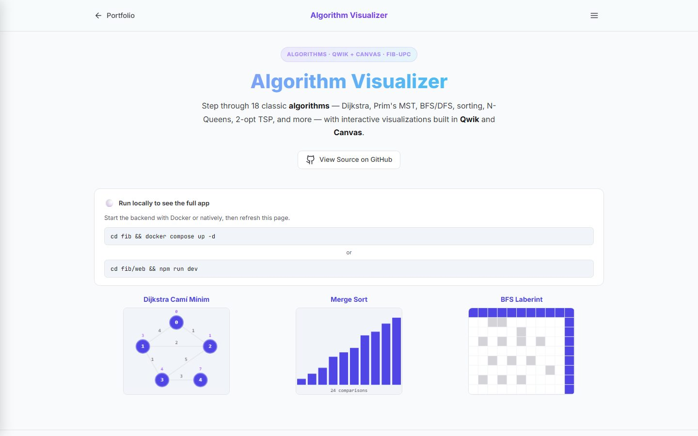](https://polcasacubertagil.com/demos/algorithms/)

Algorithms and data structures coursework covering 18 classical algorithms across graphs, sorting, search, and combinatorial problems.

<!-- demo:grafics -->

## [Computer Graphics Shader Playground](https://polcasacubertagil.com/demos/grafics/)

[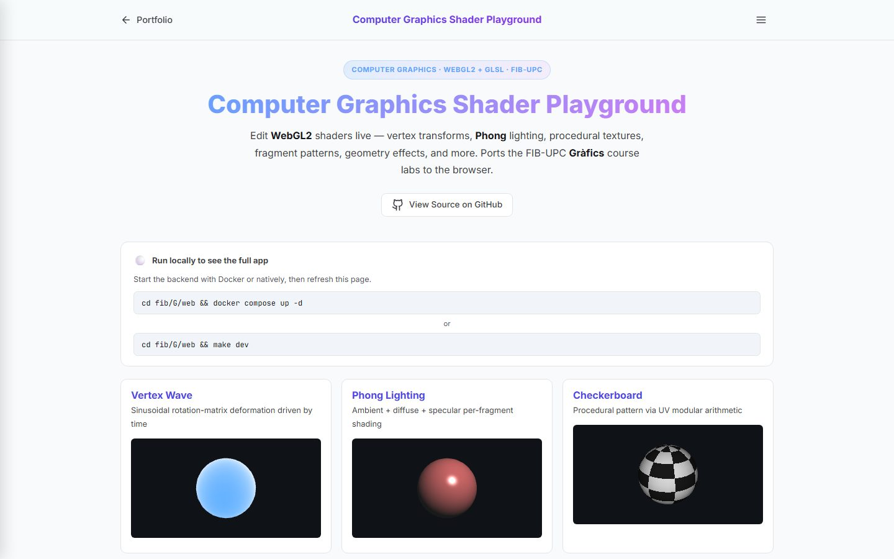](https://polcasacubertagil.com/demos/grafics/)

Computer graphics course labs originally written against desktop OpenGL, covering vertex transforms, Phong lighting, procedural textures, fragment patterns, and geometry shader emulation.

<!-- demo:pro2 -->

## [WPGMA Clustering](https://polcasacubertagil.com/demos/pro2/)

[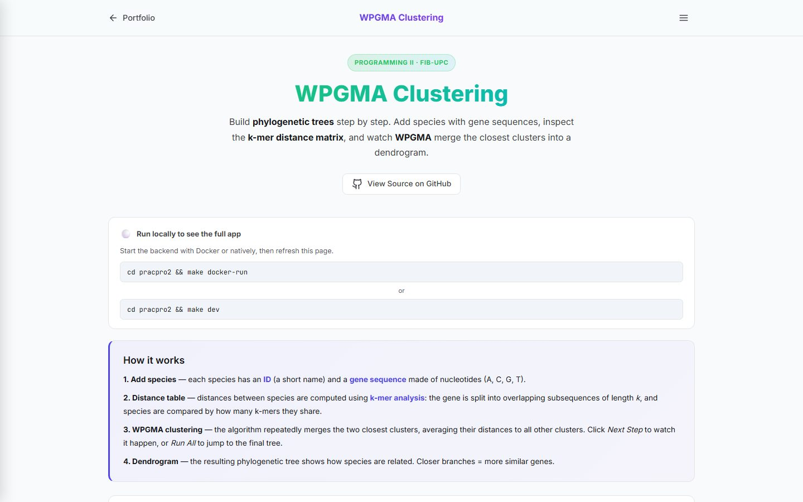](https://polcasacubertagil.com/demos/pro2/)

Programming course project: implementing WPGMA clustering in C++ to build phylogenetic trees from species gene sequences.

<!-- demo:planificacion -->

## [Travel agency (PDDL)](https://polcasacubertagil.com/demos/planificacion/)

Automated planning course project: a PDDL domain for booking trips with flights, hotels, numeric constraints, and metric minimization.

<!-- demo:prop -->

## [Recommendation System](https://polcasacubertagil.com/demos/prop/)

[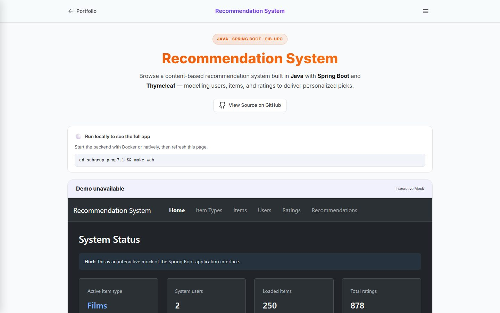](https://polcasacubertagil.com/demos/prop/)

Software engineering course project: a content-based recommendation system built in Java with Spring Boot and Thymeleaf, including a full web interface.

<!-- demo:apa-practica -->

## [Machine Learning — Hypothyroid](https://polcasacubertagil.com/demos/apa-practica/)

[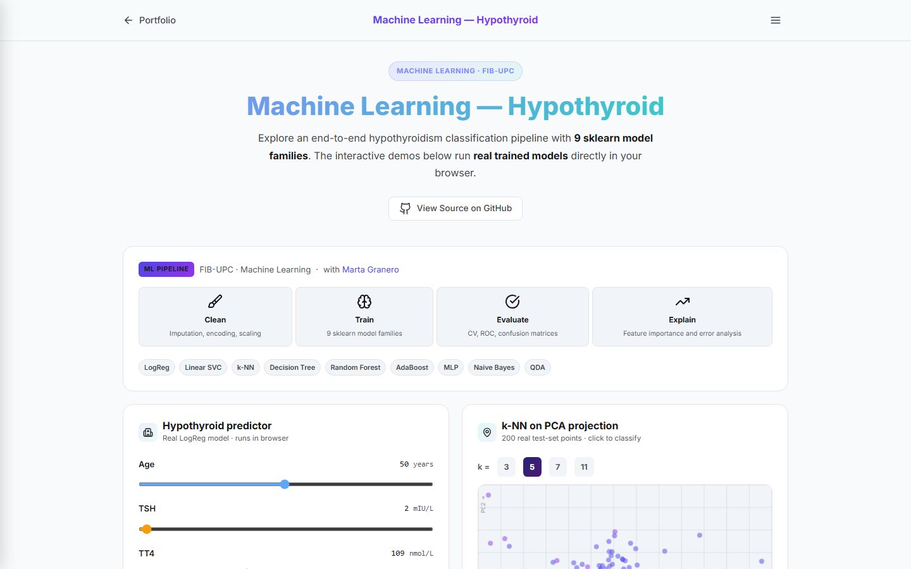](https://polcasacubertagil.com/demos/apa-practica/)

Machine learning course practica: training and comparing nine sklearn model families to predict hypothyroidism from clinical data.

<!-- demo:matriculas -->

## [License Plate Detection](https://polcasacubertagil.com/demos/matriculas/)

[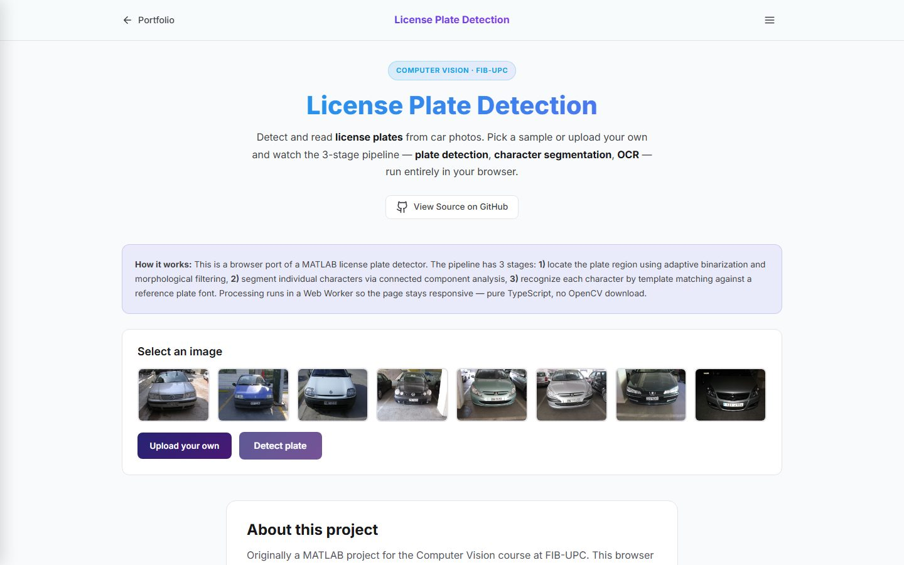](https://polcasacubertagil.com/demos/matriculas/)

Computer vision project to locate and read license plates from car photos, originally built as a classical MATLAB pipeline.

<!-- demo:jsbach -->

## [JSBach Interpreter](https://polcasacubertagil.com/demos/jsbach/)

[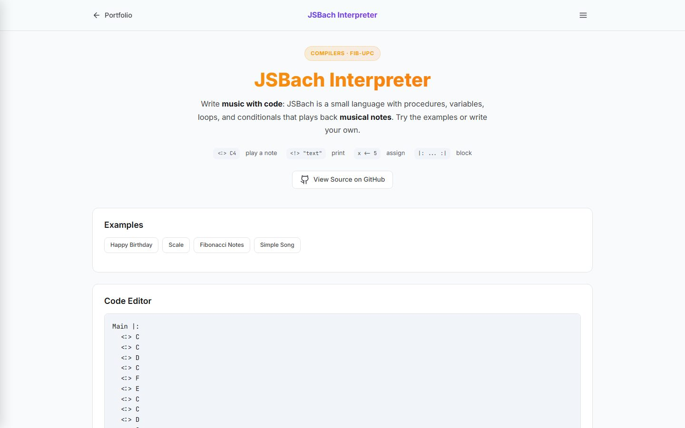](https://polcasacubertagil.com/demos/jsbach/)

Compilers course project: JSBach, a small programming language where you describe musical pieces as code, built with an ANTLR4 grammar.
